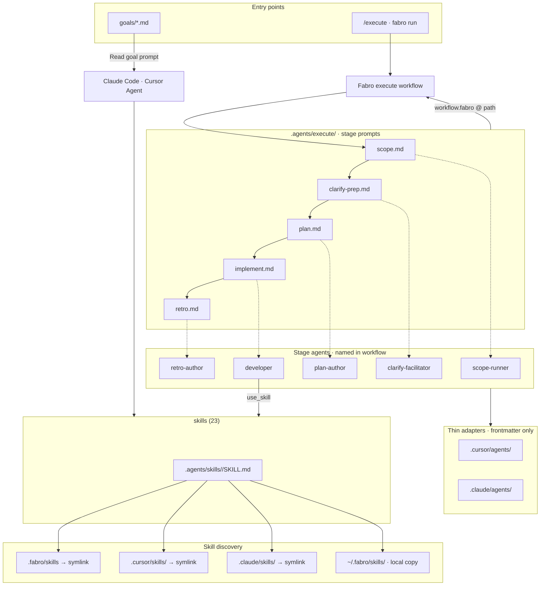

# `.agents/` configuration

How Fabro, Cursor, and Claude Code share prompts, skills, and session goals. **Goals are the entry point for ad-hoc planning**; **`/execute` / `fabro run`** is the entry point for the dark-factory loop.

## Diagram

> **Canonical source:** [execute/partials/configuration-diagram.md](execute/partials/configuration-diagram.md) — edit there first, then sync this block (Fabro cannot `` from outside `execute/`).

## Partial includes — what works where

| Consumer | `` from `execute/*.md` | Notes |
| --- | --- | --- |
| **Fabro stage prompts** (`.agents/execute/*.md`) | **Yes** | Path must stay under `execute/` (Fabro template root) |
| **GitHub / Cursor plain markdown** | **No** | No Jinja — use the mermaid block above or open [execute/partials/configuration-diagram.md](execute/partials/configuration-diagram.md) |
| **Goals** (`goals/*.md`) | **No** | Session entry: `Read .agents/goals/…`; link here for orientation |
| **This file** (`CONFIGURATION.md`) | **No** | Not processed by Fabro — duplicate diagram is intentional |

**Workflow:** edit [execute/partials/configuration-diagram.md](execute/partials/configuration-diagram.md), then sync the fenced block in this file. Stage prompts that `` update automatically on the next Fabro run.

## Quick reference

| Path | Role |
| --- | --- |
| `goals/` | Session entry — paste or `Read` a goal; not Fabro stages |
| `execute/` | Fabro workflow stage prompts (scope → retro) |
| `execute/partials/` | Snippets included by execute prompts (`architecture.md`, `configuration-diagram.md`, `session-scratch.md`) |
| `skills/` | Shared `SKILL.md` catalog — **skills (23)** in diagram, not every name |
| `.local/tmp/{session-id}/` | Optional gitignored scratch (scripts, inventories) — see `session-scratch` partial |
| `.local/findings/` | Scope stage output (`scope.md`) — Clarify input only |

## Runners

| Runner | Stage prompts | Skills |
| --- | --- | --- |
| **Fabro** | `workflow.fabro` → `@../../../.agents/execute/<stage>.md` | `.fabro/skills` symlink; local server: `~/.fabro/skills/` copy |
| **Cursor** | `.cursor/agents/*` → `Read` execute prompt | `.cursor/skills/<name>/` symlink |
| **Claude Code** | `.claude/agents/*` → `Read` execute prompt | `.claude/skills/<name>/` symlink |

See also [README.md](README.md) and [.fabro/workflows/execute/README.md](../.fabro/workflows/execute/README.md).
