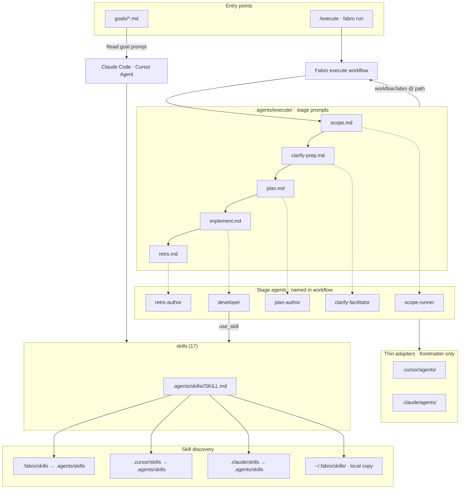

```mermaid
flowchart TB
  subgraph entry["Entry points"]
    goals["goals/*.md"]
    exec["/execute · fabro run"]
  end

  goals -->|"Read goal prompt"| session["Claude Code · Cursor Agent"]
  exec --> workflow["Fabro execute workflow"]

  subgraph prompts[".agents/execute/ · stage prompts"]
    direction TB
    scope_md[scope.md]
    clarify_md[clarify-prep.md]
    plan_md[plan.md]
    impl_md[implement.md]
    retro_md[retro.md]
  end

  workflow --> scope_md --> clarify_md --> plan_md --> impl_md --> retro_md

  subgraph agents["Stage agents · named in workflow"]
    scope_runner[scope-runner]
    clarify_fac[clarify-facilitator]
    plan_author[plan-author]
    developer[developer]
    retro_author[retro-author]
  end

  scope_md -.-> scope_runner
  clarify_md -.-> clarify_fac
  plan_md -.-> plan_author
  impl_md -.-> developer
  retro_md -.-> retro_author

  subgraph adapters["Thin adapters · frontmatter only"]
    cursor_agents[".cursor/agents/"]
    claude_agents[".claude/agents/"]
  end

  agents --> adapters
  prompts -->|"workflow.fabro @ path"| workflow

  subgraph skills_block["skills (17)"]
    skills_root[".agents/skills/<name>/SKILL.md"]
  end

  developer -->|"use_skill"| skills_block
  session --> skills_block

  subgraph skill_discovery["Skill discovery"]
    fabro_sk[".fabro/skills → .agents/skills"]
    cursor_sk[".cursor/skills → .agents/skills"]
    claude_sk[".claude/skills → .agents/skills"]
    fabro_home["~/.fabro/skills/ · local copy"]
  end

  skills_root --> fabro_sk
  skills_root --> cursor_sk
  skills_root --> claude_sk
  skills_root --> fabro_home
```
