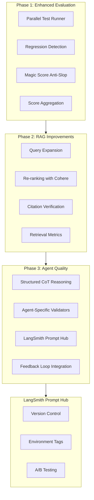

# Storyteller Evaluation & Improvement Plan

## Overview

Comprehensive improvement plan covering evaluation infrastructure, RAG enhancements, and agent quality improvements. Target test runtime: 5-10 minutes with parallel execution.

## Architecture



---

## Phase 1: Enhanced Evaluation Infrastructure

### 1.1 Parallel Evaluation Runner

**File:** `src/evaluation/experiments/parallel-storyteller.ts`**Purpose:** Run evaluations in parallel to achieve 5-10 min runtime.

```typescript
// Key features:
// - Batch examples into parallel workers
// - Mix heuristic (fast) and LLM-as-judge (slow) evaluators
// - Stream results as they complete
// - Aggregate scores with statistical analysis

interface ParallelEvalConfig {
  maxConcurrency: 8,           // Run 8 examples in parallel
  fastEvaluators: [...],       // Heuristic evaluators (run on all)
  slowEvaluators: [...],       // LLM-as-judge (sample 30%)
  sampleRateForLLMEval: 0.3,   // Only LLM-evaluate 30% of examples
}
```


### 1.2 Regression Detection

**File:** `src/evaluation/regression/detector.ts`**Purpose:** Compare current run against baseline and detect quality drops.

```typescript
interface RegressionReport {
  baseline: ExperimentResult
  current: ExperimentResult
  regressions: Array<{
    evaluator: string
    baselineScore: number
    currentScore: number
    delta: number
    significance: 'critical' | 'warning' | 'ok'
  }>
  newFailures: string[]  // Examples that passed before but fail now
}
```


### 1.3 Prompt A/B Testing Framework

**File:** `src/evaluation/ab-testing/prompt-variants.ts`**Purpose:** Test prompt variations systematically.

```typescript
interface PromptVariant {
  id: string
  agentName: string
  promptTemplate: string
  hypothesis: string
}

// Example usage:
const supervisorVariants = [
  { id: 'v1-baseline', promptTemplate: CURRENT_PROMPT },
  { id: 'v2-explicit-routing', promptTemplate: EXPLICIT_ROUTING_PROMPT },
  { id: 'v3-cot-reasoning', promptTemplate: COT_REASONING_PROMPT },
]
```


### 1.4 New Evaluators

| Evaluator | Type | Purpose ||-----------|------|---------|| `retrieval-relevance` | Heuristic | Check if RAG results match query intent || `reasoning-depth` | LLM-judge | Score quality of agent's reasoning || `action-correctness` | Heuristic | Validate actions match expected outcomes || `response-latency` | Metric | Track response times || **`magic-score`** | **LLM + Heuristic** | **Detect AI slop, score creativity** |

### 1.5 Magic Score Evaluator (Anti-AI-Slop) - IMPLEMENTED

**File:** `src/evaluation/evaluators/magic-score.ts` (already created)**Purpose:** Guard against generic, predictable AI outputs. Score creativity, uniqueness, and non-linearity.**Dimensions Scored:**

- **Lexical Diversity** - Vocabulary richness (Type-Token Ratio)
- **Structural Unpredictability** - Non-formulaic structure
- **Dialogue Authenticity** - Natural speech patterns
- **Emotional Specificity** - Specific vs generic emotions
- **Phrase Originality** - Avoiding clichés and AI patterns

**Slop Detection Patterns:**| Category | Red Flags (Slop) | Penalty ||----------|------------------|---------|| Openings | "In a world...", "Once upon a time" | Critical || Emotions | "heart pounded", "tears streaming" | Critical || Structure | "Little did they know", "journey of self-discovery" | Critical || Dialogue | "As you know...", exposition dumps | Warning || Scenes | "smell of coffee filled", generic descriptors | Warning |**Scoring:**

- Score > 70: Strong creative work
- Score 50-70: Average, some issues
- Score < 50: AI slop detected - needs revision

**Usage:**

```typescript
import { magicScoreEvaluator, AntiSlopValidator } from '@/evaluation'

// In evaluation
const result = await magicScoreEvaluator.evaluate({ output: agentResponse })

// As guardrail validator
const validator = new AntiSlopValidator(40) // threshold
```

---

## Phase 2: RAG Improvements

### 2.1 Query Expansion

**File:** `src/infrastructure/ai/rag/query-expander.ts`**Purpose:** Expand vague queries into multiple specific sub-queries.

```typescript
// Before: "Tell me about the main character"
// After expansion:
// - "main character name and role"
// - "main character personality traits"  
// - "main character goals and motivations"
// - "main character relationships"

interface QueryExpansion {
  original: string
  expanded: string[]
  strategy: 'synonym' | 'decomposition' | 'hypothetical'
}
```


### 2.2 Re-ranking with Cross-Encoder

**File:** `src/infrastructure/ai/rag/reranker.ts`**Purpose:** Re-score initial retrieval results for better ordering.Options:

- **Cohere Rerank** (API-based, high quality)
- **Cross-encoder model** (local, faster)
```typescript
interface RerankerConfig {
  provider: 'cohere' | 'cross-encoder'
  topK: 10,           // Retrieve 10 initially
  rerankedTopK: 5,    // Return top 5 after reranking
  minScore: 0.5,      // Filter low-confidence results
}
```


### 2.3 Citation Verification

**File:** `src/evaluation/evaluators/citation-accuracy.ts`**Purpose:** Verify that citations actually support the claims.

```typescript
// Check that:
// 1. Cited document exists
// 2. Cited content is semantically related to claim
// 3. No fabricated citations
```


### 2.4 Retrieval Metrics Dashboard

New metrics to track:

- **Recall@K**: Are relevant docs in top K results?
- **MRR (Mean Reciprocal Rank)**: Where does first relevant doc appear?
- **Citation accuracy**: % of citations that are valid

---

## Phase 3: Agent Quality Improvements

### 3.1 Structured Chain-of-Thought Reasoning

**File:** `src/domains/storyteller/prompts/reasoning-templates.ts`Add structured reasoning to agent prompts:

```typescript
const STRUCTURED_REASONING_TEMPLATE = `
## Reasoning Process

### 1. UNDERSTAND
- What is the user asking for?
- What context is relevant?

### 2. RETRIEVE
- What information do I need from the series bible?
- What past decisions are relevant?

### 3. REASON
- What are the options?
- What are the tradeoffs?
- What aligns with established rules?

### 4. DECIDE
- What action will I take?
- What is my confidence level?

### 5. RESPOND
- Clear explanation of decision
- Next steps for the user
`
```


### 3.2 Agent-Specific Validators

**File:** `src/domains/storyteller/guardrails/agent-validators/`Create specialized validators per agent:| Agent | Validator | Checks ||-------|-----------|--------|| PlotArchitect | `beat-consistency.ts` | Beat follows causality chain || Writer | `dialogue-quality.ts` | Natural dialogue, no exposition dumps || Supervisor | `routing-validity.ts` | Routes to phase-appropriate agent || PremiseArchitect | `world-coherence.ts` | New rules don't contradict existing |

### 3.3 LangSmith Prompt Hub Integration

**Purpose:** Centralized prompt management with version control, A/B testing, and environment tags.**Benefits:**

- Version control for all agent prompts
- Easy rollback if a prompt change causes regressions
- A/B test prompt variants without code changes
- Environment tags (`production`, `staging`, `dev`)
- Collaborative prompt editing in LangSmith UI

**File:** `src/domains/storyteller/prompts/hub-loader.ts`

```typescript
import { pull } from "langchain/hub"

// Pull prompts from LangSmith Hub
export async function loadAgentPrompts(environment: 'production' | 'staging' | 'dev' = 'production') {
  const prompts = {
    supervisor: await pull(`tilemap/storyteller-supervisor:${environment}`),
    plotArchitect: await pull(`tilemap/storyteller-plot-architect:${environment}`),
    writer: await pull(`tilemap/storyteller-writer:${environment}`),
    premiseArchitect: await pull(`tilemap/storyteller-premise-architect:${environment}`),
    characterPsychology: await pull(`tilemap/storyteller-character-psychology:${environment}`),
    devilsAdvocate: await pull(`tilemap/storyteller-devils-advocate:${environment}`),
    scriptEditor: await pull(`tilemap/storyteller-script-editor:${environment}`),
  }
  return prompts
}

// Or pin to specific version
const supervisorPrompt = await pull("tilemap/storyteller-supervisor@abc123")
```

**Workflow:**

1. Edit prompt in LangSmith Playground
2. Test against evaluation dataset
3. Compare scores with current production
4. If better, tag as `staging` for testing
5. If passes staging tests, promote to `production`

**Push Prompts to Hub:**

```typescript
import { push } from "langchain/hub"
import { ChatPromptTemplate } from "@langchain/core/prompts"

const supervisorPrompt = ChatPromptTemplate.fromMessages([
  ["system", SUPERVISOR_SYSTEM_PROMPT],
  ["human", "{input}"],
])

await push("tilemap/storyteller-supervisor", supervisorPrompt, {
  newRepoIsPublic: false,
  tags: ["v2.1", "staging"],
})
```

**A/B Testing with Hub:**

```typescript
// Load multiple variants
const variants = [
  await pull("tilemap/storyteller-supervisor:baseline"),
  await pull("tilemap/storyteller-supervisor:cot-reasoning"),
  await pull("tilemap/storyteller-supervisor:explicit-routing"),
]

// Run evaluation against each
for (const variant of variants) {
  const score = await runEvalWithPrompt(variant, dataset)
  console.log(`Variant score: ${score}`)
}
```


### 3.4 Prompt Optimization Based on Eval Feedback

**Process:**

1. Run evaluation suite
2. Identify lowest-scoring examples
3. Analyze failure patterns
4. Generate prompt improvements in LangSmith Playground
5. A/B test variants using Prompt Hub
6. Promote winners to `production` tag

### 3.5 User Feedback Integration

**File:** `src/domains/storyteller/services/feedback-service.ts`

```typescript
interface UserFeedback {
  runId: string
  type: 'thumbs_up' | 'thumbs_down' | 'correction'
  originalOutput: string
  correctedOutput?: string
  category: 'hallucination' | 'inconsistency' | 'quality' | 'other'
}

// Automatically:
// 1. Store feedback in RAG for future reference
// 2. Add to evaluation dataset
// 3. Track patterns for prompt improvements
```

---

## Implementation Order

### Week 1: Phase 1 - Evaluation

1. `parallel-storyteller.ts` - Parallel test runner
2. `regression/detector.ts` - Regression detection
3. `evaluators/retrieval-relevance.ts` - RAG retrieval evaluator
4. `evaluators/reasoning-depth.ts` - Agent reasoning evaluator

### Week 2: Phase 2 - RAG

5. `rag/query-expander.ts` - Query expansion
6. `rag/reranker.ts` - Re-ranking service
7. `evaluators/citation-accuracy.ts` - Citation verification
8. Update `rag-service.ts` to integrate new components

### Week 3: Phase 3 - Agent Quality

9. `prompts/reasoning-templates.ts` - Structured CoT
10. `guardrails/agent-validators/` - Agent-specific validators
11. `services/feedback-service.ts` - User feedback collection
12. Prompt optimization based on eval results

---

## Success Metrics

| Metric | Current | Target ||--------|---------|--------|| Evaluation runtime | N/A | < 10 min || RAG grounding score | ~0.6 | > 0.8 || Hallucination rate | Unknown | < 5% || Agent routing accuracy | ~0.7 | > 0.9 || **Magic Score (creativity)** | **Unknown** | **> 60** || User satisfaction (thumbs up) | Unknown | > 80% |---

## Files to Create/Modify

### Already Implemented

- `src/evaluation/evaluators/magic-score.ts` - Anti-slop evaluator with AntiSlopValidator

### New Files

- `src/evaluation/experiments/parallel-storyteller.ts`
- `src/evaluation/regression/detector.ts`
- `src/evaluation/regression/baseline.ts`
- `src/evaluation/ab-testing/prompt-variants.ts`
- `src/evaluation/ab-testing/runner.ts`
- `src/evaluation/evaluators/retrieval-relevance.ts`
- `src/evaluation/evaluators/reasoning-depth.ts`
- `src/evaluation/evaluators/citation-accuracy.ts`
- `src/infrastructure/ai/rag/query-expander.ts`
- `src/infrastructure/ai/rag/reranker.ts`
- `src/domains/storyteller/prompts/reasoning-templates.ts`
- `src/domains/storyteller/prompts/hub-loader.ts` - LangSmith Prompt Hub integration
- `src/domains/storyteller/guardrails/agent-validators/beat-consistency.ts`
- `src/domains/storyteller/guardrails/agent-validators/dialogue-quality.ts`
- `src/domains/storyteller/guardrails/agent-validators/routing-validity.ts`
- `src/domains/storyteller/guardrails/agent-validators/anti-slop.ts` - Use AntiSlopValidator
- `src/domains/storyteller/services/feedback-service.ts`

### Modified Files

- `src/domains/storyteller/services/rag-service.ts` - Add query expansion, reranking
- `src/domains/storyteller/agents/supervisor.ts` - Add structured reasoning, pull from Hub
- `src/domains/storyteller/agents/plot-architect.ts` - Add CoT template, pull from Hub
- `src/domains/storyteller/agents/writer.ts` - Add dialogue validator, AntiSlopValidator
- `src/domains/storyteller/graph/writers-room.ts` - Add AntiSlopValidator to guards
- `package.json` - Add new eval scripts

### NPM Scripts to Add

```json
{
  "eval:storyteller:fast": "npx tsx src/evaluation/experiments/parallel-storyteller.ts --fast",
  "eval:storyteller:full": "npx tsx src/evaluation/experiments/parallel-storyteller.ts --full",
  "eval:regression": "npx tsx src/evaluation/regression/detector.ts",
  "eval:ab-test": "npx tsx src/evaluation/ab-testing/runner.ts",
  "prompts:push": "npx tsx src/domains/storyteller/prompts/push-to-hub.ts",
  "prompts:pull": "npx tsx src/domains/storyteller/prompts/pull-from-hub.ts"
}
```

---

## LangSmith Setup Required

1. **Create prompts in LangSmith Hub:**

- `tilemap/storyteller-supervisor`
- `tilemap/storyteller-plot-architect`
- `tilemap/storyteller-writer`
- `tilemap/storyteller-premise-architect`
- `tilemap/storyteller-character-psychology`
- `tilemap/storyteller-devils-advocate`
- `tilemap/storyteller-script-editor`

2. **Environment tags to create:**

- `production` - Current stable prompts
- `staging` - Testing new versions
- `dev` - Development/experimentation

3. **Workflow:**
   ```javascript
         Edit in Playground -> Test against dataset -> Tag as staging -> Test in staging env -> Promote to production
   ```


---

## Todos

- [ ] parallel-eval: Create parallel evaluation runner with 8-worker concurrency
- [ ] regression-detector: Implement regression detection comparing against baseline
- [ ] retrieval-evaluator: Create retrieval-relevance heuristic evaluator
- [ ] reasoning-evaluator: Create reasoning-depth LLM-as-judge evaluator
- [ ] anti-slop-validator: Create AntiSlopValidator guardrail using magic-score
- [ ] query-expander: Implement query expansion for RAG
- [ ] reranker: Add Cohere/cross-encoder re-ranking to RAG pipeline
- [ ] citation-accuracy: Create citation verification evaluator
- [ ] integrate-rag: Update rag-service.ts with query expansion + reranking
- [ ] cot-templates: Create structured Chain-of-Thought reasoning templates
- [ ] agent-validators: Implement beat-consistency, dialogue-quality, routing-validity validators
- [ ] prompt-hub-loader: Create hub-loader.ts for LangSmith Prompt Hub integration