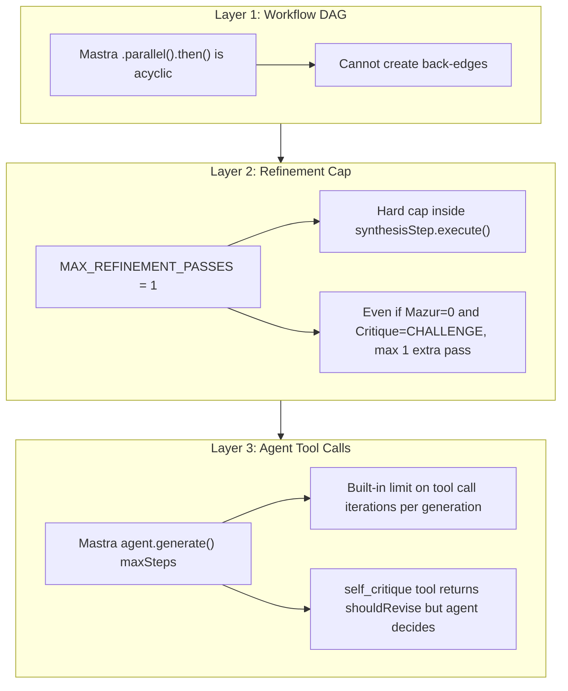
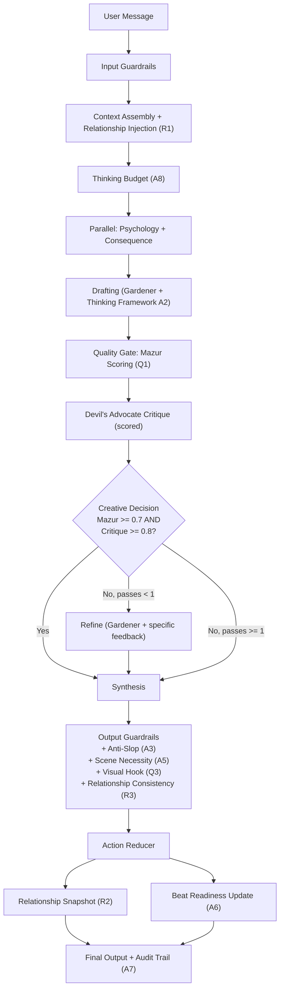
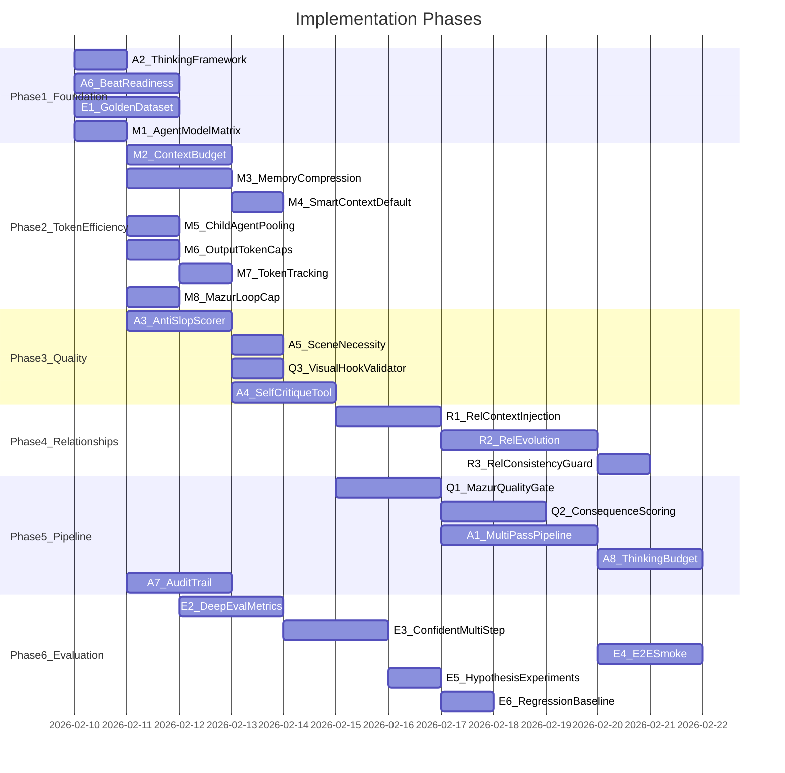
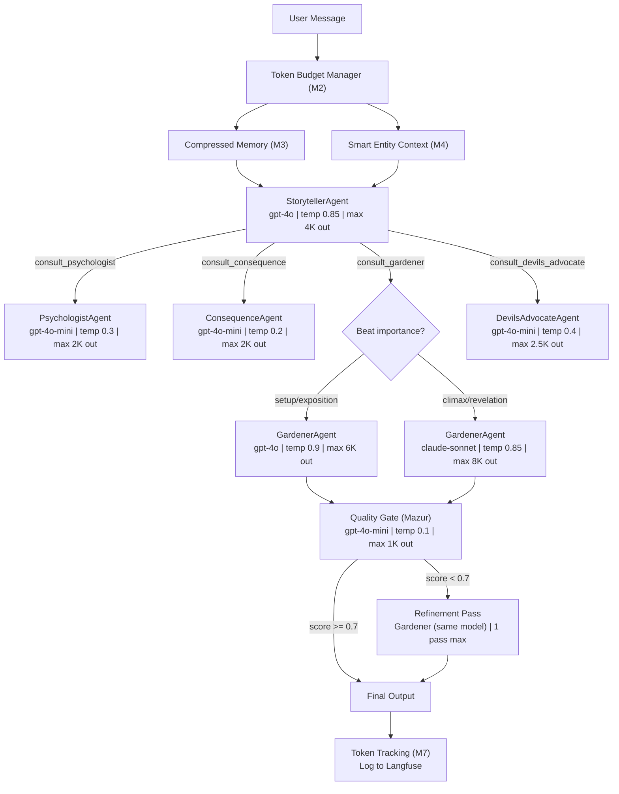
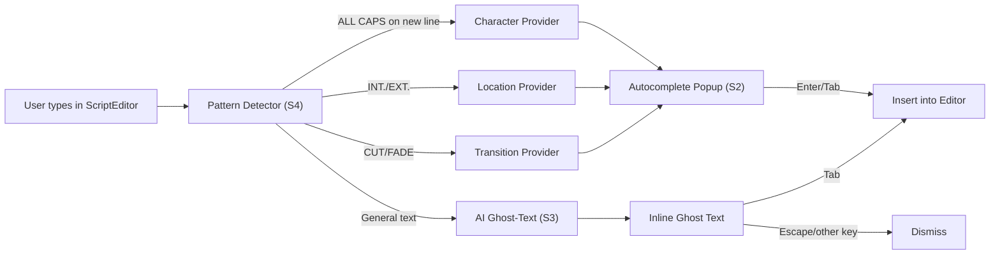
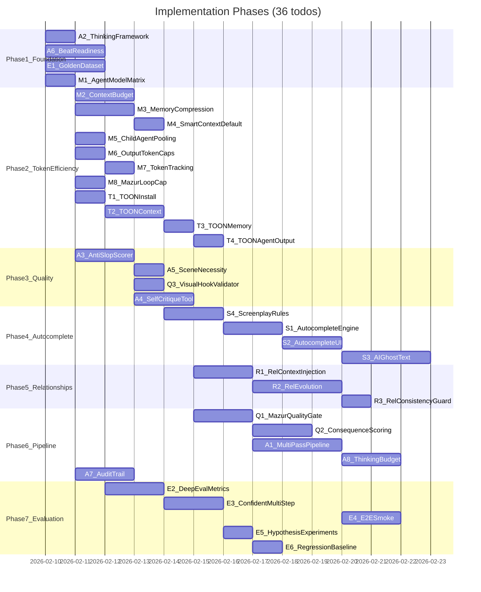

# Storyteller Quality Improvement Plan (v3)

## Current State Summary

### What's scored vs. just mentioned


| Quality Principle                                               | Where It Exists                                                 | Actually Scored?                                  |
| --------------------------------------------------------------- | --------------------------------------------------------------- | ------------------------------------------------- |
| GRRM Depth (gray morality, consequences, texture)               | Mazur Framework `mazur_depth`                                   | Yes, 0-1 -- but only in PremiseArchitect          |
| Gilligan Structure (visual storytelling, transformation, logic) | Mazur Framework `mazur_structure`                               | Yes, 0-1 -- but only in PremiseArchitect          |
| Script Quality                                                  | ScriptReviewAgent (GRRM + Gilligan personas)                    | Yes, 1-10 -- but only when explicitly invoked     |
| Anti-Slop                                                       | Deleted `anti-slop.ts`, exists in DeepEval/Confident AI metrics | Only in offline eval, not in generation pipeline  |
| Consequence Tracking                                            | ConsequenceAgent                                                | Structure only, no quality score                  |
| Character Psychology                                            | PsychologistAgent                                               | State tracking only, no quality score             |
| Creative Direction                                              | CreativeDirectorAgent (GRRM_PROMPT, GILLIGAN_PROMPT)            | Advisory feedback, no numeric score, not blocking |
| Extended Thinking                                               | Optional env flag, `extended-thinking.ts`                       | Guidance only, not enforced                       |
| Relationship Quality                                            | `analyzeRelationshipsTool`, CharacterWeb                        | Inferred dynamically, not used in generation      |


### Key architectural gaps

1. **Mazur scoring only runs at premise level** -- not during beat/scene generation
2. **Creative Director feedback is advisory** -- never blocks or triggers revision
3. **Relationships are computed on-demand** -- not injected into generation context, not persisted across beats, not validated for consistency
4. **Multi-pass pipeline exists for premises** but the main story workflow's `creativeDecisionStep` always returns `approved: true`
5. **Confident AI has `ConversationalTestCase` support** but all current evals flatten multi-turn to single-turn

---

## Track Q: GRRM/Gilligan Quality Enforcement

### Q1. Wire Mazur Framework as Quality Gate in Story Workflow

**Problem**: The Mazur Framework (`src/agent-core/judging/mazur-judge.ts`) scores GRRM depth + Gilligan structure at 0-1, but it's only used in PremiseArchitect. Scene/beat generation has no quality gate.

**Solution**: Add a `qualityGateStep` to the story workflow that runs Mazur scoring on the draft before synthesis.

**Mastra wiring in `[src/domains/storyteller/agents/v2/story-workflow.ts](src/domains/storyteller/agents/v2/story-workflow.ts)**`:

```typescript
import { MazurJudge } from '@/agent-core/judging/mazur-judge'

const qualityGateStep = createStep({
  id: 'quality_gate',
  inputSchema: z.any(),
  outputSchema: z.object({
    mazurDepth: z.number(),       // GRRM score 0-1
    mazurStructure: z.number(),   // Gilligan score 0-1
    mazurOverall: z.number(),     // Combined
    verdict: z.enum(['PASS', 'REFINE', 'REJECT']),
    refinementPriority: z.string().optional(),
  }),
  execute: async (params: any) => {
    const draftRes = params.getStepResult('drafting')
    const judge = new MazurJudge()
    const result = await judge.evaluate(draftRes?.draft || '', context)
    return {
      mazurDepth: result.depth,
      mazurStructure: result.structure,
      mazurOverall: result.overall,
      verdict: result.verdict,      // PASS (>= 0.7), REFINE (0.5-0.7), REJECT (< 0.5)
      refinementPriority: result.refinementPriority,
    }
  }
})

// Updated workflow:
// .parallel([psychologyStep, consequenceStep])
// .then(draftingStep)
// .then(qualityGateStep)       // NEW: Mazur scoring
// .then(critiqueStep)          // Devil's Advocate
// .then(creativeDecisionStep)  // Uses BOTH quality gate + critique
// .then(synthesisStep)
```

The `creativeDecisionStep` now uses both Mazur scores AND Devil's Advocate verdict to decide whether to approve or trigger refinement.

### Q2. Consequence Quality Scoring

**Problem**: ConsequenceAgent tracks setups/payoffs structurally but doesn't score how well consequences are handled (GRRM principle: "actions have weight").

**Solution**: Extend `consequence-agent.ts` to return a consequence quality score alongside structural tracking.

**Changes in `[src/domains/storyteller/agents/v2/consequence-agent.ts](src/domains/storyteller/agents/v2/consequence-agent.ts)**`:

Add to the ConsequenceAgent output schema:

```typescript
{
  // Existing structural tracking...
  setupsAwaitingPayoff: [...],
  danglingThreads: [...],
  // NEW: Quality scoring
  consequenceQuality: {
    score: number,                    // 0-1
    unresolvedSetups: number,         // Chekhov's guns not fired
    cheapResolutions: string[],       // Consequences that feel unearned
    plotArmorInstances: string[],     // Characters avoiding logical consequences
    butterfliesTracked: number,       // Cause-effect chains properly followed
  }
}
```

Update the `CONSEQUENCE_TRACKER_PROMPT` to explicitly score and flag:

- "Does this resolution feel earned or cheap?"
- "Are any characters protected from consequences they should face?"
- "How many levels deep is the cause-effect chain?"

### Q3. Gilligan Visual Hook Validator

**Problem**: Gilligan's "What's the first thing we see?" cold-open principle is mentioned in GILLIGAN_PROMPT but never enforced.

**Solution**: Add a lightweight validator that checks every scene/beat for a concrete opening image.

**New file**: `src/domains/storyteller/guardrails/agent-validators/visual-hook-validator.ts`

```typescript
export function validateVisualHook(content: string): {
  hasVisualHook: boolean
  hookText: string | null       // First sentence/paragraph if visual
  issue: string | null          // What's wrong if no hook
}
```

Detection heuristics:

- First 2 sentences should contain sensory language (sight, sound, smell, touch)
- Should NOT start with dialogue (Gilligan opens with visual, not talk)
- Should NOT start with abstract narration ("It had been three days since...")
- Should contain concrete nouns (specific objects, locations, physical actions)

Integrated into output guardrails alongside prose-quality-scorer.

---

## Track R: Relationship-Driven Storytelling

### R1. Inject Relationship Context into Generation

**Problem**: Relationships are computed by `analyzeRelationshipsTool` and displayed in CharacterWeb, but they're NOT injected into the generation prompts. When the Gardener writes a scene between two characters, it doesn't know their relationship state.

**Solution**: Before generation, fetch relationship data and inject it into the prompt context.

**Changes in `[src/domains/storyteller/context/assembler.ts](src/domains/storyteller/context/assembler.ts)**`:

In the context assembly function, after gathering characters, add:

```typescript
// Fetch relationship context for characters in this scene
const relationships = buildRelationshipMatrix(characters, beats, bible)
const relationshipContext = formatRelationshipsForPrompt(relationships, involvedCharacterIds)

// Inject into context string
context += `\n\n## Active Relationships\n${relationshipContext}`
```

The `formatRelationshipsForPrompt()` function produces:

```
## Active Relationships
- Kael → Lyra: RIVAL (trust: 23, conflict: 78). History: "Kael betrayed Lyra's faction in beat 3", "Lyra discovered Kael's deception in beat 7"
- Kael → Minister Voss: MENTOR (trust: 65, conflict: 12). History: "Voss recruited Kael in beat 1"
```

This gives every agent explicit relationship state when writing scenes.

### R2. Persistent Relationship Evolution

**Problem**: Relationships are computed on-demand from beats. There's no persistent record of HOW relationships changed over time. The `RelationshipState` type has `trust`, `conflict`, `history` but these aren't stored in the database.

**Solution**: Add a `relationship_snapshots` table and update it after each beat.

**Schema change in `[src/domains/storyteller/db/schema.ts](src/domains/storyteller/db/schema.ts)**`:

```typescript
export const relationshipSnapshots = pgTable('relationship_snapshots', {
  id: text('id').primaryKey().$defaultFn(() => createId()),
  projectId: text('project_id').notNull().references(() => projects.id),
  episodeId: text('episode_id'),
  beatId: text('beat_id'),                // Which beat caused this snapshot
  sourceCharacterId: text('source_character_id').notNull(),
  targetCharacterId: text('target_character_id').notNull(),
  relationshipType: text('relationship_type').notNull(), // ally, enemy, rival, etc.
  trust: integer('trust').default(50),     // 0-100
  conflict: integer('conflict').default(0), // 0-100
  tension: integer('tension').default(0),   // 0-100 (NEW: currently never set)
  powerBalance: integer('power_balance').default(50), // 0-100 (NEW: who holds power)
  changeReason: text('change_reason'),     // Why this changed
  createdAt: timestamp('created_at').defaultNow(),
})
```

**Data source for deltas**: The agent must explicitly output relationship changes as part of beat generation. Add a `relationshipShifts` field to the beat action schema:

```typescript
// In agent-schemas.ts, extend CREATE_BEAT / UPDATE_BEAT action payload:
relationshipShifts?: Array<{
  sourceCharacterId: string
  targetCharacterId: string
  trustDelta: number       // e.g., -30 (betrayal discovered)
  conflictDelta: number    // e.g., +40
  tensionDelta: number
  reason: string           // "Aldric discovered Theron's funding of the rebellion"
}>
```

The EXTENDED_THINKING_FRAMEWORK (A2) already includes "RELATIONSHIP CHECK -- How does each relationship in this scene shift?" which primes the agent to produce these outputs. The action-reducer reads `relationshipShifts` from the action payload and inserts snapshots into the table.

**Trigger**: After action-reducer processes a `CREATE_BEAT` or `UPDATE_BEAT` with `relationshipShifts`, insert relationship snapshots. This gives a per-beat timeline of how every relationship evolved.

### R3. Relationship Consistency Guardrail

**Problem**: `consistency-guardrails.ts` checks character existence and faction membership but NOT relationship consistency. A scene could have two sworn enemies suddenly cooperating without explanation.

**Solution**: Add relationship validation to the consistency check.

**Changes in `[src/domains/storyteller/guardrails/consistency-guardrails.ts](src/domains/storyteller/guardrails/consistency-guardrails.ts)**`:

```typescript
function checkRelationshipConsistency(
  beat: BeatData,
  relationships: RelationshipSnapshot[],
): ConsistencyIssue[] {
  const issues: ConsistencyIssue[] = []
  
  // Check: Characters with conflict > 70 cooperating without explanation
  // Check: Trust suddenly jumping > 30 points without a scene justifying it
  // Check: Relationship type flipping (enemy → ally) without intermediate beats
  // Check: Characters who've never met acting familiar
  
  return issues
}
```

---

## Track A: Extended Thinking & Multi-Pass (updated)

### A2. Extended Thinking Framework

Same as previous plan -- inject `EXTENDED_THINKING_FRAMEWORK` into Gardener + Storyteller agent `instructions`. The framework explicitly references GRRM and Gilligan principles at each step:

```typescript
export const EXTENDED_THINKING_FRAMEWORK = `
<thinking_framework>
Before writing, complete these steps internally:

1. CHARACTER AUDIT (GRRM: "The human heart in conflict with itself")
   - What does each character WANT in this scene?
   - What do they NEED (that they don't know)?
   - What are they HIDING from other characters?
   - What is their INTERNAL CONTRADICTION?

2. SCENE PURPOSE CHECK (Gilligan: "Every scene earns its place")
   - What is the state BEFORE this scene?
   - What changes by the end? (If nothing changes, cut this scene)
   - What information is revealed (or withheld)?
   - What's the VISUAL HOOK? (First thing we see)

3. CONSEQUENCE TRACE (GRRM: "Actions have weight")
   - What previous events led to this moment?
   - What future events does this enable?
   - Who pays a COST in this scene? (No free actions)
   - What would happen if this character had plot armor? (Then remove the armor)

4. RELATIONSHIP CHECK
   - How does each relationship in this scene shift?
   - Is the power dynamic visible in dialogue/action?
   - Are characters acting consistently with their relationship history?

5. VOICE VERIFICATION (Gilligan: "Specificity over generic")
   - Can you identify each speaker without dialogue tags?
   - Replace generic emotions with SPECIFIC physical actions
   - Replace telling with showing: "He was angry" → what does anger LOOK like for THIS character?

Only AFTER completing this analysis should you write.
</thinking_framework>
`
```

**Files**: `[src/domains/storyteller/prompts/index.ts](src/domains/storyteller/prompts/index.ts)`, `[src/domains/storyteller/agents/v2/storyteller-agent.ts](src/domains/storyteller/agents/v2/storyteller-agent.ts)`, `[src/domains/storyteller/agents/v2/gardener-agent.ts](src/domains/storyteller/agents/v2/gardener-agent.ts)`

### A3. Anti-Slop Scorer

Same as previous plan. Uses pattern lists matching the existing `ANTI_SLOP_METRIC` criteria from `[src/evaluation/confident-ai/metrics.ts](src/evaluation/confident-ai/metrics.ts)` (9 slop categories already defined there).

### A5. Scene Necessity Validator

Same as previous plan.

### A4. Self-Critique Tool

Same as previous plan -- `createTool()` registered in Gardener + Storyteller `toolsMap`.

### A1. Multi-Pass Pipeline with Circuit Breaker

Updated to use both Mazur quality gate (Q1) AND Devil's Advocate critique for the decision:

```typescript
const creativeDecisionStep = createStep({
  id: 'creative_decision',
  execute: async (params: any) => {
    const qualityGate = params.getStepResult('quality_gate')
    const critique = params.getStepResult('critique')
    
    const mazurPasses = qualityGate?.mazurOverall >= 0.70
    const critiquePasses = critique?.verdict === 'PASS' || critique?.score >= 0.80
    
    return {
      approved: mazurPasses && critiquePasses,
      direction: mazurPasses && critiquePasses ? 'proceed' : 'refine',
      mazurScore: qualityGate?.mazurOverall ?? 0,
      critiqueScore: critique?.score ?? 0,
      refinementFocus: !mazurPasses 
        ? qualityGate?.refinementPriority   // Mazur tells us what to fix
        : critique?.weaknesses?.[0],         // Critique tells us what to fix
    }
  }
})
```

**Circuit breaker**: `MAX_REFINEMENT_PASSES = 1` inside `synthesisStep`. Refinement prompt includes the specific `refinementFocus` so the Gardener knows exactly what to fix.

### A8. Thinking Budget

`inferEffortFromBeat()` returns `{ effort, requiresMultiPass }`.

**Chicken-and-egg fix for NEW beats**: When creating a new beat, the beat type doesn't exist yet (it's determined during generation). For new beats, fall back to **message-level heuristic**:

```typescript
export function inferEffortFromMessage(message: string): { effort: ModelEffort; requiresMultiPass: boolean } {
  const climaxSignals = /\b(climax|climactic|confrontation|final|reveal|death|betray|twist|peak)\b/i
  const highStakes = climaxSignals.test(message)
  return highStakes
    ? { effort: 'high', requiresMultiPass: true }
    : { effort: 'medium', requiresMultiPass: false }
}

// Usage: inferEffortFromBeat() for EXISTING beats, inferEffortFromMessage() for NEW beat creation
```

This means the user's own words ("Write the climactic scene") determine the investment level.

### A6. Beat Readiness + A7. Audit Trail

Same as previous plan.

---

## Track E: Evaluation & Testing

### E1. Human-Curated Golden Dataset

**New file**: `src/evaluation/datasets/extended-thinking-golden.ts`

This follows the existing `StorytellerExample` interface from `[src/evaluation/datasets/storyteller-golden.ts](src/evaluation/datasets/storyteller-golden.ts)` but adds quality-specific expected scores and **human-written reference outputs**.

```typescript
export interface QualityGoldenExample extends StorytellerExample {
  input: StorytellerEvalInput & {
    seriesBible?: Partial<SeriesBible>    // Pre-populated world context
    characters?: CharacterState[]          // Pre-populated characters
    relationships?: RelationshipSnapshot[] // Pre-populated relationships
    existingBeats?: BeatData[]            // Story so far
  }
  expected: {
    // Existing fields
    shouldDelegate?: boolean
    expectedActions?: string[]
    // Quality floor scores (human-assessed)
    minMagicScore?: number           // e.g., 0.7
    minAntiSlopScore?: number        // e.g., 0.6
    minConsistencyScore?: number     // e.g., 0.8
    minCharacterVoice?: number       // e.g., 0.65
    minGilliganMartin?: number       // e.g., 0.7
    // Structural expectations
    expectsVisualHook?: boolean
    expectsStateChange?: boolean
    expectsConsequence?: boolean
    expectsRelationshipShift?: boolean
    // Feature-specific
    expectsSelfCritiqueCalled?: boolean
    expectsMultiPassRefinement?: boolean
    expectsRelationshipContext?: boolean
  }
  referenceOutput?: string   // Human-written "gold standard" output for comparison
}
```

**15 examples organized by quality principle**:


| #   | ID      | Scenario                                        | Primary Test                                 | GRRM/Gilligan Principle                                     |
| --- | ------- | ----------------------------------------------- | -------------------------------------------- | ----------------------------------------------------------- |
| 1   | `gq-01` | King discovers advisor is traitor               | Consequence tracing, moral complexity        | GRRM: "No pure villains" -- advisor must have valid reasons |
| 2   | `gq-02` | Hero arrives just in time                       | Anti-slop, deus ex machina detection         | Gilligan: "Consequences are king" -- timing must be earned  |
| 3   | `gq-03` | Two old friends reunite after betrayal          | Relationship context injection               | GRRM: "Human heart in conflict" -- trust vs. resentment     |
| 4   | `gq-04` | Villain explains their philosophy               | Anti-villain-monologue, character voice      | Gilligan: "No one sees themselves as the villain"           |
| 5   | `gq-05` | Quiet scene: cooking dinner before battle       | Scene necessity, visual hook                 | Gilligan: "Radiator effect" -- mundane heightens tension    |
| 6   | `gq-06` | Character makes moral choice with real cost     | Consequence quality, no plot armor           | GRRM: "Decisions reveal character"                          |
| 7   | `gq-07` | Power dynamics shift in a negotiation           | Relationship evolution, power balance        | GRRM: "Political reality"                                   |
| 8   | `gq-08` | Climactic confrontation (episode climax)        | Thinking budget (should use high effort)     | Gilligan: "Earned tension"                                  |
| 9   | `gq-09` | Two characters with different backgrounds argue | Voice verification, character specificity    | Gilligan: "Specificity over generic"                        |
| 10  | `gq-10` | Aftermath of a major death                      | Emotional truth, no generic grief            | GRRM: "Consequences are permanent"                          |
| 11  | `gq-11` | Setup scene with foreshadowing                  | Consequence tracking (Chekhov's gun planted) | Gilligan: "Foreshadowing payoffs"                           |
| 12  | `gq-12` | Reveal scene: identity twist                    | Multi-pass refinement (should trigger)       | GRRM: "Subverted expectations -- surprising but inevitable" |
| 13  | `gq-13` | Scene with 3+ characters, mixed relationships   | Relationship consistency check               | All: Complex multi-character dynamics                       |
| 14  | `gq-14` | Exposition needed for worldbuilding             | Anti "as you know Bob", show don't tell      | Gilligan: "Mystery vs confusion"                            |
| 15  | `gq-15` | Filler scene (nothing happens) -- negative test | Scene necessity (should be flagged)          | Gilligan: "Every scene earns its place"                     |


Each example includes:

- Pre-populated world context (bible, characters, relationships, prior beats)
- Expected minimum quality scores per metric
- Human-written reference output (the "this is what good looks like")
- Metadata tagging which GRRM/Gilligan principles it tests

### E2. New DeepEval Metrics

**Changes in `[scripts/deepeval/metrics.py](scripts/deepeval/metrics.py)**`: Add 3 new metrics:

1. **Scene Necessity Score** -- Does the scene change something? (Based on Gilligan "earned" principle)
2. **Thinking Quality Score** -- Does the output show evidence of structured reasoning? (Character audit, consequence trace)
3. **Relationship Coherence Score** -- Are character interactions consistent with established relationship dynamics?

**Changes in `[src/evaluation/deepeval/types.ts](src/evaluation/deepeval/types.ts)**`: Add to `DEEPEVAL_METRICS`:

```typescript
export const DEEPEVAL_METRICS = [
  // ... existing 6 metrics
  'Scene Necessity Score',
  'Thinking Quality Score',
  'Relationship Coherence Score',
] as const
```

### E3. Multi-Step Confident AI Evaluation

**Problem**: All 6 metrics have `multiTurn: false`. The conversation simulator flattens multi-turn to single-turn in `simulationToTestCase()`. The `ConversationalTestCase` interface exists in the client but is never used.

**Changes required** (4 files):

1. `**[src/evaluation/confident-ai/metrics.ts](src/evaluation/confident-ai/metrics.ts)**`: Create multi-turn versions of key metrics:

```typescript
export const CONSISTENCY_MULTI_TURN_METRIC: CreateMetricRequest = {
  name: 'EQ-Bench Consistency (Multi-Turn)',
  multiTurn: true,   // KEY CHANGE
  criteria: `Evaluate CONSISTENCY ACROSS CONVERSATION TURNS...
  
  MULTI-TURN SPECIFIC CHECKS:
  1. Does turn N contradict facts established in turn M?
  2. Do character voices remain consistent across turns?
  3. Are relationship dynamics coherent from one turn to the next?
  4. Does worldbuilding stay consistent across the full conversation?
  
  Evaluate the FULL conversation history, not just the last turn.`,
  evaluationParams: ['actualOutput', 'context'],
}

// Similarly for CHARACTER_VOICE_MULTI_TURN, NARRATIVE_COHERENCE_MULTI_TURN
```

1. `**[src/evaluation/confident-ai/setup.ts](src/evaluation/confident-ai/setup.ts)**`: Create a separate multi-turn collection:

```typescript
// Create multi-turn collection alongside existing single-turn
await client.createMetricCollection({
  name: 'Storyteller Multi-Turn Quality',
  metrics: multiTurnMetricNames,
  multiTurn: true,   // KEY CHANGE
})
```

1. `**[src/evaluation/hypothesis/conversation-simulator.ts](src/evaluation/hypothesis/conversation-simulator.ts)**`: Fix `simulationToTestCase()` to preserve turn structure:

```typescript
export function simulationToConversationalTestCase(
  simulation: SimulationResult
): ConversationalTestCase {
  return {
    turns: simulation.turns.map(t => ({
      role: t.planned.role,
      content: t.planned.role === 'user' 
        ? t.planned.content 
        : t.response || '',
    })),
    scenario: simulation.hypothesis.name,
    expectedOutcome: simulation.hypothesis.prediction,
  }
}
```

1. `**[src/evaluation/hypothesis/run-experiment.ts](src/evaluation/hypothesis/run-experiment.ts)**`: When the experiment config has `multiTurn: true`, use `conversationalTestCases` instead of `llmTestCases`:

```typescript
const evalRequest: EvaluateRequest = config.multiTurn
  ? { metricCollection: 'Storyteller Multi-Turn Quality', conversationalTestCases: [conversationalTestCase] }
  : { metricCollection: 'Storyteller Quality', llmTestCases: [singleTurnTestCase] }
```

### E4. E2E Smoke Tests

**Changes in `[e2e/scenarios/storyteller-smoke.test.ts](e2e/scenarios/storyteller-smoke.test.ts)**`: Add Layer 5:

```typescript
// LAYER 5: Quality Pipeline Tests
{
  name: 'Self-critique tool fires on scene writing',
  test: async () => {
    const events = await sendChatMessage('Write a dramatic confrontation scene')
    const toolCalls = findEvents(events, 'tool_call')
    assert(toolCalls.some(e => e.name === 'self_critique'), 'self_critique should be called')
  }
},
{
  name: 'Relationship context included in generation',
  test: async () => {
    // Create two characters with a relationship, then request a scene
    await sendChatMessage('Create character: Lord Harren, ambitious ruler')
    await sendChatMessage('Create character: Lady Mira, his rival advisor')
    const events = await sendChatMessage('Write a scene where Harren and Mira negotiate')
    // Verify relationship context was assembled
    const textContent = findEvents(events, 'text').map(e => e.content).join('')
    // Should reference their dynamic (not mandatory, but contextual)
  }
},
{
  name: 'Beat readiness metadata present',
  test: async () => {
    const events = await sendChatMessage('Create a beat: The council convenes')
    const actions = findEvents(events, 'action')
    const createBeat = actions.find(e => e.actionType === 'CREATE_BEAT')
    assert(createBeat?.readiness !== undefined)
  }
},
{
  name: 'Quality gate scores included in workflow output',
  test: async () => {
    const events = await sendChatMessage('Write the climactic scene where the traitor is revealed')
    // Check that quality metadata is emitted
    const metadata = findEvents(events, 'metadata')
    // Should include mazur scores
  }
}
```

### E5. Hypothesis Experiment Configs

**3 new experiment config files** in `src/evaluation/hypothesis/experiments/`:

1. `**hyp-extended-thinking.json**`: A/B test baseline (no thinking framework) vs variant (with framework)
  - Target metrics: Magic Score, Anti-Slop, Character Voice
  - Message flow: 3-turn conversation (create world → write scene → continue scene)
  - `multiTurn: true`
2. `**hyp-relationship-context.json**`: A/B test without vs with relationship injection
  - Target metrics: Consistency, Character Voice, Narrative Coherence
  - Message flow: 4-turn (create 2 characters → set relationship → write confrontation → write aftermath)
  - `multiTurn: true`
3. `**hyp-multi-pass.json**`: A/B test single-pass vs multi-pass pipeline
  - Target metrics: Magic Score, Gilligan-Martin Quality, Anti-Slop
  - Message flow: 2-turn (create premise → write climactic scene)
  - Measures: Score improvement (lift) from first-pass to refined

### E6. Regression Baseline

Run baseline evaluation using the golden dataset (E1) and save scores as the regression floor. Future CI runs compare against this floor.

**Script**: `npm run eval baseline-capture`

- Runs all 15 golden examples through current pipeline
- Evaluates with all DeepEval metrics
- Saves results JSON to `src/evaluation/results/baseline-YYYY-MM-DD.json`
- Pushes to Confident AI as "Baseline" identifier

---

## Loop Protection (3 Layers)




1. **Workflow graph is a DAG** -- Mastra's `.parallel().then()` chain cannot loop back
2. `**MAX_REFINEMENT_PASSES = 1**` inside `synthesisStep` -- refinement creates a new GardenerAgent and calls `writeScene()` once, then proceeds regardless
3. **Agent-level `maxSteps**` -- if `self_critique` says "revise," the agent uses its existing tools to improve, bounded by Mastra's built-in tool call limit

---

## Full Pipeline After All Changes




---

## Phasing




---

## Track M: Model Assignment & Token Efficiency

### Current State: Everything Uses GPT-4o

Every agent defaults to `openai:gpt-4o`. No differentiation by task:


| Agent                  | Current Model       | Tokens/Call (est.)            | Role                   | Needs Creativity? |
| ---------------------- | ------------------- | ----------------------------- | ---------------------- | ----------------- |
| StorytellerAgent       | gpt-4o              | 10K-28K                       | Orchestrator + writing | Yes (high)        |
| GardenerAgent          | gpt-4o              | 500-3K                        | Scene writing          | Yes (highest)     |
| DevilsAdvocateAgent    | gpt-4o              | 500-2K                        | Critique               | No (analysis)     |
| PsychologistAgent      | gpt-4o              | 500-2K                        | Psychology analysis    | No (analysis)     |
| ConsequenceAgent       | gpt-4o              | 500-2K                        | Causality tracking     | No (analysis)     |
| CreativeDirectorAgent  | gpt-4o              | 500-2K                        | Style review           | Moderate          |
| PremiseArchitectAgent  | gpt-4o              | 2K-5K (x20 Mazur iterations!) | Premise generation     | Yes (high)        |
| Quality Gate (new Q1)  | gpt-4o              | 1K-2K                         | Scoring                | No (judging)      |
| Self-Critique (new A4) | N/A (pattern match) | 0                             | Scoring                | No                |


**Problem**: Analysis agents (Devil's Advocate, Psychologist, Consequence) don't need gpt-4o's creative capacity. The Mazur loop runs up to 20 iterations at full model cost. No output token caps are enforced despite having them defined.

### M1. Agent-Model Assignment Matrix

See **"Updated M1: Agent-Model Matrix with Real Pricing"** section below for the single, definitive 5-tier model assignment with actual 2026 pricing.

**NOTE on Q2 + M1 interaction**: ConsequenceAgent has two modes: `consequence.track()` (structural tracking) runs on gpt-4o-mini. `consequence.scoreQuality()` (nuanced quality judging from Q2) escalates to gpt-4o for that specific call. This avoids the problem of asking a cheap model to make subjective quality judgments.

**Wire into each agent**: Each agent constructor reads from `AGENT_MODEL_MATRIX[agentId]` instead of hardcoding `'openai:gpt-4o'`.

### M2. Context Window Budget Manager

**Problem**: The main StorytellerAgent gets 10K-28K tokens of context with no budget. If a project grows large (many characters, beats, world rules), context bloats silently.

**New file**: `src/domains/storyteller/context/token-budget.ts`

```typescript
const TOKEN_BUDGETS = {
  systemPrompt: 3000,      // Fixed
  projectContext: 4000,     // Bible, rules, factions (summarize if over)
  characters: 2000,         // Top N most relevant characters
  beats: 2000,             // Last N beats (summarized)
  memory: 4000,            // Compressed conversation history
  rag: 1500,              // RAG results
  userMessage: 500,        // Current message
  // Total budget: ~17,000 tokens (leaves room for output within 128K window)
}

export function budgetContext(rawContext: RawContextParts): BudgetedContext {
  // 1. Estimate tokens per section (4 chars/token)
  // 2. If section exceeds budget, truncate by relevance or recency
  // 3. Return budgeted context with metadata showing what was trimmed
  // 4. Log trimming to Langfuse for monitoring
}
```

**Integration**: Called in the stream route before passing context to the StorytellerAgent.

### M3. Memory Compression (50 messages -> Rolling Summary + Last 10)

**Problem**: Last 50 messages = ~5K-15K tokens of raw conversation history. Most of it is redundant (earlier turns are superseded by later context).

**Solution**: Replace raw 50-message memory with a compressed format:

```typescript
// Instead of storing 50 raw messages:
const memory = new Memory({
  storage,
  options: {
    lastMessages: 10,  // CHANGED from 50 to 10 (recent messages for immediate context)
  },
})
```

Plus a rolling summary that's updated every 10 messages:

```typescript
// New: summarize older messages into a paragraph
async function compressMemory(messages: Message[]): Promise<string> {
  // Use gpt-4o-mini to summarize messages 1-40 into a 500-token summary
  // Keep messages 41-50 as raw
  // Total: ~500 (summary) + ~2500 (10 messages) = ~3000 tokens
  // Savings: ~7K-12K tokens per call
}
```

**Files**: `[src/domains/storyteller/agents/v2/storyteller-agent.ts](src/domains/storyteller/agents/v2/storyteller-agent.ts)` (memory config), new `src/domains/storyteller/context/memory-compressor.ts`

### M4. Default to Smart Entity Context

**Problem**: The full context dump sends ALL characters, ALL factions, ALL world rules every call. `assembleContextWithSmartEntities` exists but isn't the default -- it limits to 25-30 relevant entities using GraphRAG relevance scoring.

**Change**: Make `assembleContextWithSmartEntities` the default in `[src/app/api/storyteller/chat/stream/route.ts](src/app/api/storyteller/chat/stream/route.ts)`:

```typescript
// BEFORE: full context dump
const context = assembleContext(projectData, episodeData, beats)

// AFTER: smart entity context (only relevant entities)
const context = await assembleContextWithSmartEntities(
  projectData, episodeData, beats, userMessage,
  { maxEntities: 25, minRelevance: 0.3 }
)
```

**Savings**: Reduces character/faction/rule context from ~4K-8K tokens to ~1K-3K tokens (only entities relevant to the current message).

### M5. Child Agent Instance Pooling

**Problem**: Every `consult_*` tool call creates a new agent instance (`createGardenerAgent()`, `createDevilsAdvocateAgent()`, etc.). This involves instantiating Mastra Agent, setting up tools, and creating connections -- repeated per call.

**Solution**: Cache agent instances per trace/session:

```typescript
// In agent-tools.ts
const agentCache = new Map<string, { agent: any, createdAt: number }>()
const CACHE_TTL = 60_000 // 1 minute

function getOrCreateAgent(key: string, factory: () => Promise<any>) {
  const cached = agentCache.get(key)
  if (cached && Date.now() - cached.createdAt < CACHE_TTL) {
    return cached.agent
  }
  const agent = factory()
  agentCache.set(key, { agent, createdAt: Date.now() })
  return agent
}
```

**Savings**: Eliminates ~50-100ms setup time per child agent call. Not a token saving but reduces latency.

**Deployment caveat**: This cache uses an in-memory `Map`. On serverless (Vercel), each invocation may be a fresh process, making the cache useless. Only effective on long-lived Node.js processes. If deployed on Vercel, skip M5 or use Redis/KV for cross-invocation caching.

### M6. Enforce Output Token Caps

**Problem**: `agent-guardrails.ts` defines `maxOutputTokens` per role (e.g., Writer: 6000, DevilsAdvocate: 2500) but these are NEVER passed to `agent.generate()`. The agent can output unlimited tokens.

**Solution**: Pass `maxTokens` to every `generate()` call:

```typescript
// In each agent's generate/run method:
const config = AGENT_MODEL_MATRIX[this.agentId]
const response = await this.agent.generate(prompt, {
  maxTokens: config.maxOutputTokens,  // NEW: enforce cap
  temperature: config.temperature,
  topP: config.topP,
})
```

**Savings**: Prevents runaway generation. A Devil's Advocate critique that should be 2500 tokens won't accidentally output 8000. Estimated ~20% output token reduction across all agents.

### M7. Per-Request Token Tracking

**Problem**: No cost visibility. Langfuse traces record that agents ran but not how many tokens they consumed or what it cost.

**Solution**: After each `agent.generate()` call, record token usage:

```typescript
// In traced-agent-base or each agent's generate method:
const response = await this.agent.generate(prompt, options)

// Record to Langfuse
langfuse.generation({
  traceId,
  name: `${agentId}.generate`,
  model: config.model,
  input: prompt,
  output: response.text,
  usage: {
    promptTokens: response.usage?.promptTokens,
    completionTokens: response.usage?.completionTokens,
    totalTokens: response.usage?.totalTokens,
  },
  // Cost estimation
  metadata: {
    estimatedCostUsd: estimateCost(config.model, response.usage),
  },
})
```

**Cost estimation function**:

```typescript
function estimateCost(model: string, usage: { promptTokens: number, completionTokens: number }): number {
  const rates: Record<string, { input: number, output: number }> = {
    'openai:gpt-4o':        { input: 2.50, output: 10.00 },  // per 1M tokens
    'openai:gpt-4o-mini':   { input: 0.15, output: 0.60 },
    'anthropic:claude-sonnet-4-20250514': { input: 3.00, output: 15.00 },
  }
  const rate = rates[model] || rates['openai:gpt-4o']
  return (usage.promptTokens * rate.input + usage.completionTokens * rate.output) / 1_000_000
}
```

### M8. Reduce Mazur Loop Cap

**Problem**: PremiseArchitect Mazur loop has `maxIterations: 20`. At ~3K-5K tokens per iteration, worst case is 60K-100K tokens for a single premise. In practice it rarely needs more than 3-5 iterations.

**Solution**: Reduce `maxIterations` from 20 to 5 and improve early exit:

**Changes in `[src/agent-core/models.ts](src/agent-core/models.ts)**`:

```typescript
export const IMPROVEMENT_LOOP = {
  maxIterations: 5,                    // CHANGED from 20 to 5
  qualityThreshold: 0.85,
  minImprovementDelta: 0.02,
  earlyExitOnRegression: true,
  earlyExitOnPlateau: true,            // NEW: exit if score doesn't improve by minDelta for 2 consecutive iterations
  plateauWindow: 2,                     // NEW: how many flat iterations before exit
} as const
```

**Savings**: 75% reduction in worst-case premise generation cost. If average iterations drop from ~8 to ~3-4, savings of ~50%.

---

### Token Budget Summary (Before vs After)


| Component                   | Before (tokens) | After (tokens)         | Savings        |
| --------------------------- | --------------- | ---------------------- | -------------- |
| Memory (50 msgs)            | 5K-15K          | 3K (summary + 10 msgs) | ~60-80%        |
| Context (full dump)         | 4K-10K          | 1K-3K (smart entities) | ~60-70%        |
| Analysis agents (4x gpt-4o) | 4x cost         | 4x gpt-4o-mini cost    | ~90% per agent |
| Mazur loop (20 iters)       | 60K-100K worst  | 15K-25K worst          | ~75%           |
| Output (no caps)            | Unbounded       | Capped per role        | ~20%           |
| **Total per user message**  | **~20K-45K**    | **~10K-20K**           | **~50%**       |


### Model Assignment Flow




---

## Updated M1: Agent-Model Matrix with Real Pricing

### 2026 Model Pricing (per 1M tokens)


| Model             | Input | Output | Cached Input | Context | Best For                             |
| ----------------- | ----- | ------ | ------------ | ------- | ------------------------------------ |
| gpt-4o-mini       | $0.15 | $0.60  | -            | 128K    | Analysis, scoring, structured output |
| Gemini 2.5 Flash  | $0.30 | $2.50  | -            | 1M      | Fast creative, large context         |
| gpt-4o            | $2.50 | $10.00 | -            | 128K    | Balanced creative + reasoning        |
| GPT-5.2           | $1.75 | $14.00 | $0.175       | 400K    | Best reasoning, complex scenes       |
| Claude Sonnet 4.5 | $3.00 | $15.00 | -            | 200K    | Best prose quality, character voice  |


### Agent-Model Assignment (Specific)

```typescript
export const AGENT_MODEL_MATRIX = {
  // =============================================
  // TIER 1: CHEAP + FAST (analysis, scoring, structured output)
  // Use gpt-4o-mini ($0.15/$0.60) -- 90% cheaper than gpt-4o
  // =============================================
  'psychologist': {
    model: 'openai:gpt-4o-mini',
    temperature: 0.3,               // Low: consistent psych analysis
    maxOutputTokens: 2000,
    rationale: 'Structured JSON output (metrics, goals, fears). No creativity needed.',
  },
  'consequence': {
    model: 'openai:gpt-4o-mini',
    temperature: 0.2,               // Very low: logical tracking
    maxOutputTokens: 2000,
    rationale: 'Causality tracking = structured logic, not prose.',
  },
  'quality-gate': {
    model: 'openai:gpt-4o-mini',
    temperature: 0.1,               // Minimal: scoring should be deterministic
    maxOutputTokens: 1000,
    rationale: 'Mazur scoring is structured evaluation. Consistency > creativity.',
  },
  'creative-director': {
    model: 'openai:gpt-4o-mini',
    temperature: 0.5,
    maxOutputTokens: 2000,
    rationale: 'Advisory review = analysis + suggestions, not prose generation.',
  },

  // =============================================
  // TIER 2: FAST CREATIVE (drafts, critique, non-critical writing)
  // Use Gemini 2.5 Flash ($0.30/$2.50) -- fast, cheap, good creativity
  // =============================================
  'devils-advocate': {
    model: 'google:gemini-2.5-flash',
    temperature: 0.6,
    maxOutputTokens: 2500,
    rationale: 'Critique requires some creative thinking (alternatives) but mostly analysis. Flash is fast + creative enough.',
  },
  'gardener-standard': {
    model: 'google:gemini-2.5-flash',
    temperature: 0.85,              // High: creative prose
    maxOutputTokens: 6000,
    rationale: 'Standard scene writing (setup, complication beats). Flash handles well at 2x cheaper than gpt-4o.',
  },
  'autocomplete': {
    model: 'openai:gpt-4o-mini',
    temperature: 0.4,               // Moderate: predictive but not wild
    maxOutputTokens: 200,            // Short: inline completions
    rationale: 'Ghost-text completions must be FAST (<500ms). Mini is fastest. Short output.',
  },

  // =============================================
  // TIER 3: FULL CREATIVE POWER (important scenes, orchestration)
  // Use gpt-4o ($2.50/$10.00) or GPT-5.2 ($1.75/$14.00)
  // =============================================
  'storyteller': {
    model: 'openai:gpt-4o',
    temperature: 0.85,
    maxOutputTokens: 4000,
    rationale: 'Orchestrator needs tool calling + reasoning + creativity. GPT-4o is the best balance.',
  },
  'premise-architect': {
    model: 'openai:gpt-4o',
    temperature: 0.8,
    maxOutputTokens: 8000,
    rationale: 'Premise generation needs structural + creative power. Each Mazur iteration uses this.',
  },

  // =============================================
  // TIER 4: PRESTIGE (climactic scenes, refinement passes)
  // Use Claude Sonnet 4.5 ($3.00/$15.00) -- best prose quality
  // =============================================
  'gardener-climax': {
    model: 'anthropic:claude-sonnet-4-20250514',
    temperature: 0.85,
    maxOutputTokens: 8000,
    rationale: 'Climactic scenes (resolution, revelation, decision beats in final 20%) deserve best prose model.',
  },
  'gardener-refinement': {
    model: 'anthropic:claude-sonnet-4-20250514',
    temperature: 0.8,
    maxOutputTokens: 6000,
    rationale: 'Refinement passes after failed quality gate. Claude excels at targeted rewrites.',
  },

  // =============================================
  // TIER 5: REASONING (complex planning, multi-step logic)
  // Use GPT-5.2 ($1.75/$14.00) -- best reasoning, 400K context
  // =============================================
  'storyteller-complex': {
    model: 'openai:gpt-5.2',
    temperature: 0.7,
    maxOutputTokens: 4000,
    rationale: 'Multi-step planning, complex tool chains, long-horizon reasoning. GPT-5.2 has best reasoning + cached input discount.',
  },
}
```

### Cost Comparison (Per User Message, Typical Flow)


| Flow Step           | Current (all gpt-4o) | Optimized                 |
| ------------------- | -------------------- | ------------------------- |
| Psychology analysis | $0.025 (gpt-4o)      | $0.0015 (gpt-4o-mini)     |
| Consequence check   | $0.025 (gpt-4o)      | $0.0015 (gpt-4o-mini)     |
| Drafting (standard) | $0.050 (gpt-4o)      | $0.015 (gemini flash)     |
| Quality gate        | $0.025 (gpt-4o)      | $0.001 (gpt-4o-mini)      |
| Critique            | $0.025 (gpt-4o)      | $0.005 (gemini flash)     |
| Synthesis           | $0.075 (gpt-4o)      | $0.075 (gpt-4o)           |
| **Total**           | **~$0.225**          | **~$0.099**               |
| **Climax override** | same                 | +$0.06 (claude for draft) |


**Result: ~~56% cost reduction per workflow step. Note: total pipeline cost is higher because the workflow runs 6-7 LLM calls sequentially (psychology + consequence + drafting + quality gate + critique + synthesis + optional refinement). Actual total per user message through the full workflow: ~$0.15-0.20 optimized vs. ~$0.35-0.45 current. Not all user messages trigger the full workflow -- simple questions/approvals hit only the orchestrator (~~$0.05). Climactic scenes cost ~$0.25 but get Claude-quality prose.**

---

## Track T: TOON Format Adoption

### Why TOON for Storyteller

TOON achieves ~40% fewer tokens than JSON for structured data while maintaining 74% LLM comprehension accuracy (vs JSON's 70%). Our context assembly sends characters, beats, world rules, and factions as structured arrays -- exactly TOON's sweet spot.

**Estimated savings on context alone**: Characters (15 items x 8 fields) + beats (10 items x 6 fields) + world rules (10 items x 3 fields) currently consume ~3K-6K tokens as formatted text. TOON would reduce this by ~20-30% (conservative -- our data has long text fields with commas/quotes that require escaping, reducing savings vs. TOON's published 40% on clean tabular data). T4 benchmark will confirm actual savings before full adoption.

### T1. Install and Create Wrapper

**Install**: `npm install @toon-format/toon`

**New file**: `src/domains/storyteller/context/toon-encoder.ts`

```typescript
import { encode } from '@toon-format/toon'

/**
 * Encode structured story data as TOON for LLM context injection.
 * Falls back to JSON.stringify if TOON encoding fails.
 */
export function encodeForContext(data: unknown, label?: string): string {
  try {
    const toon = encode(data)
    return label ? `## ${label}\n\`\`\`toon\n${toon}\n\`\`\`` : toon
  } catch {
    return JSON.stringify(data, null, 2)
  }
}

/**
 * Encode an array of uniform objects (characters, beats, rules) as TOON.
 * This is where the biggest token savings are -- tabular arrays.
 */
export function encodeArrayForContext(
  items: Record<string, unknown>[],
  label: string,
  fields?: string[]  // Optional: only include these fields
): string {
  const filtered = fields
    ? items.map(item => Object.fromEntries(fields.map(f => [f, item[f]])))
    : items
  return encodeForContext({ [label]: filtered })
}
```

### T2. TOON for Context Assembly

**Changes in `[src/domains/storyteller/context/assembler.ts](src/domains/storyteller/context/assembler.ts)**`:

Replace text formatting of characters, beats, world rules, factions with TOON encoding:

```typescript
import { encodeArrayForContext } from './toon-encoder'

// BEFORE (current): string concatenation
function summarizeCharacters(characters: Character[]): string {
  return characters.map(c => `- ${c.name} (${c.role}): ${c.description}`).join('\n')
}

// AFTER: TOON encoding
function summarizeCharacters(characters: Character[]): string {
  return encodeArrayForContext(
    characters,
    'characters',
    ['name', 'role', 'description', 'goals', 'fears', 'factionId']
  )
}
// Output:
// characters[15]{name,role,description,goals,fears,factionId}:
//   King Aldric,protagonist,Paranoid ruler...,["Maintain order"],["Betrayal"],faction-1
//   Lord Theron,antagonist,Rebel sympathizer...,["Free the people"],["Becoming tyrant"],faction-2
```

Apply to: `summarizeBeats()`, `formatWorldRules()`, `formatFactions()`, `formatInspirations()`.

### T3. TOON for Memory and RAG

**Memory messages**: Encode the rolling summary + recent messages as TOON:

```typescript
// Memory format
const memoryToon = encodeForContext({
  summary: compressedSummary,
  recentMessages: last10Messages.map(m => ({
    role: m.role,
    content: m.content.slice(0, 200), // Truncate for context
    timestamp: m.timestamp,
  })),
})
```

**RAG results**: Encode retrieved chunks as TOON:

```typescript
const ragToon = encodeArrayForContext(
  ragResults,
  'retrievedContext',
  ['content', 'relevanceScore', 'entityType']
)
```

### T4. TOON Benchmark on Real Data

**Important**: TOON is designed for LLM INPUT, not OUTPUT. LLMs are trained to generate JSON, not TOON. We will NOT ask agents to return TOON -- they keep returning JSON. TOON is only for encoding context sent TO agents.

**Why a benchmark is needed**: TOON's published 40% savings are measured on clean tabular data. Our story data has long text fields with commas, quotes, and newlines (character descriptions, beat loglines) that require TOON escaping, eating into savings. We need to measure actual savings on real project data before committing.

**Benchmark script**: `scripts/benchmark-toon.ts`

- Load a real project's data (characters, beats, world rules, factions)
- Encode with current text format, JSON, and TOON
- Count tokens with gpt-tokenizer (o200k_base encoding)
- Report actual savings per data type
- Expected: 20-30% savings (not 40-50%) due to long text fields
- If savings are below 15%, skip T2/T3 and keep current format

---

## Track S: Script Autocomplete (Cursor-like)

### Architecture

Two completion systems, both lightweight on the existing `contentEditable` ScriptEditor:

1. **Static completions** (instant, no LLM): Character names, locations, transitions, scene headings
2. **AI ghost-text** (streamed, gpt-4o-mini): Cursor-like inline continuation, Tab to accept




### S1. Script Autocomplete Engine

**New file**: `src/domains/storyteller/components/ScriptEditor/autocomplete-engine.ts`

```typescript
export interface CompletionItem {
  label: string           // Display text
  insertText: string      // Text to insert
  kind: 'character' | 'location' | 'transition' | 'parenthetical' | 'ai'
  detail?: string         // Secondary info (role, episode)
  sortOrder: number       // Priority in list
}

export interface CompletionProvider {
  trigger: RegExp                      // When to activate
  getCompletions: (
    prefix: string,
    context: ScriptContext
  ) => CompletionItem[] | Promise<CompletionItem[]>
}

export interface ScriptContext {
  characters: { name: string; role: string }[]
  locations: string[]
  currentScene?: string
  recentDialogue?: string[]
  projectId: string
}
```

**Built-in providers**:

```typescript
// CHARACTER PROVIDER: Triggers when typing ALL CAPS at line start
export const characterProvider: CompletionProvider = {
  trigger: /^[A-Z]{2,}$/,  // 2+ uppercase chars at line start
  getCompletions: (prefix, ctx) => {
    return ctx.characters
      .filter(c => c.name.toUpperCase().startsWith(prefix))
      .map(c => ({
        label: c.name.toUpperCase(),
        insertText: c.name.toUpperCase(),
        kind: 'character',
        detail: c.role,
        sortOrder: 0,
      }))
  },
}

// SCENE HEADING PROVIDER: Triggers on INT. or EXT.
export const sceneHeadingProvider: CompletionProvider = {
  trigger: /^(INT|EXT)\.\s*/i,
  getCompletions: (prefix, ctx) => {
    return ctx.locations.map(loc => ({
      label: `${prefix.split('.')[0].toUpperCase()}. ${loc} - DAY`,
      insertText: `${prefix.split('.')[0].toUpperCase()}. ${loc} - DAY`,
      kind: 'location',
      sortOrder: 0,
    }))
  },
}

// TRANSITION PROVIDER: Triggers on CUT, FADE, SMASH, DISSOLVE
export const transitionProvider: CompletionProvider = {
  trigger: /^(CUT|FADE|SMASH|DISSOLVE|MATCH|WIPE)/i,
  getCompletions: (prefix) => {
    const transitions = [
      'CUT TO:', 'FADE TO:', 'FADE IN:', 'FADE OUT.',
      'SMASH CUT TO:', 'DISSOLVE TO:', 'MATCH CUT TO:',
      'WIPE TO:', 'JUMP CUT TO:',
    ]
    return transitions
      .filter(t => t.startsWith(prefix.toUpperCase()))
      .map(t => ({ label: t, insertText: t, kind: 'transition', sortOrder: 0 }))
  },
}

// PARENTHETICAL PROVIDER: After character name, typing (
export const parentheticalProvider: CompletionProvider = {
  trigger: /^\(/,
  getCompletions: () => {
    const common = [
      '(beat)', '(sotto)', '(continuing)', '(O.S.)', '(V.O.)',
      '(whispering)', '(angry)', '(to self)', '(into phone)',
      '(laughing)', '(sarcastically)', '(pause)',
    ]
    return common.map(p => ({ label: p, insertText: p, kind: 'parenthetical', sortOrder: 0 }))
  },
}
```

### S2. Autocomplete Popup UI

**New file**: `src/domains/storyteller/components/ScriptEditor/AutocompletePopup.tsx`

Lightweight popup positioned at cursor, matching existing dark theme:

```typescript
interface AutocompletePopupProps {
  items: CompletionItem[]
  selectedIndex: number
  position: { x: number; y: number }
  onSelect: (item: CompletionItem) => void
  onDismiss: () => void
}
```

- Keyboard navigation: Arrow Up/Down to move, Enter/Tab to accept, Escape to dismiss
- Fuzzy filtering as user types more characters
- Max 8 items visible, scrollable
- Positioned below cursor (or above if near bottom)
- Reuses styling from existing ChatInput mention popover

### S3. AI Ghost-Text (Cursor-like Inline Completion)

**New file**: `src/domains/storyteller/components/ScriptEditor/GhostText.tsx`

The key feature -- like Cursor/Copilot, shows dimmed continuation text that the user can Tab to accept.

**How it works**:

1. **Trigger**: After 500ms of no typing (debounced), if cursor is at end of a line
2. **Request**: Send last ~500 chars of script + current line to gpt-4o-mini with streaming
3. **Display**: Render completion as dimmed text (`opacity: 0.4`) inline after cursor
4. **Accept**: Tab inserts the ghost text
5. **Dismiss**: Any other keystroke dismisses and starts new completion cycle
6. **Cancel**: If user starts typing, abort the in-flight request

```typescript
const GHOST_TEXT_CONFIG = {
  model: 'openai:gpt-4o-mini',   // Fastest, cheapest
  maxTokens: 150,                  // Short completions only
  temperature: 0.4,                // Predictive, not wild
  debounceMs: 500,                 // Wait 500ms after last keystroke
  contextChars: 500,               // Send last 500 chars as context
}

const GHOST_TEXT_PROMPT = `You are a screenplay autocomplete engine. 
Complete the next 1-3 lines of this screenplay. Follow standard screenplay format:
- Scene headings: INT./EXT. LOCATION - TIME
- Character names: ALL CAPS, centered
- Dialogue: Under character name
- Action: Present tense, visual
- Parentheticals: (direction)

RULES:
- Complete the current thought/sentence first
- Stay in the current scene unless a transition is natural
- Match the tone and style of the existing text
- Keep completions SHORT (1-3 lines max)
- If in dialogue, continue as that character
- If in action, continue describing the visual

Context from this project:
{characters}
{currentScene}

Script so far:
{lastNChars}

Continue from here (DO NOT repeat any existing text):`
```

**API route**: New lightweight endpoint `/api/storyteller/autocomplete` that:

- Uses gpt-4o-mini with streaming
- Max 150 tokens output
- Injects character names and current scene as context
- **Uses Next.js edge runtime** (`export const runtime = 'edge'`) to minimize cold start latency
- Target latency: <800ms to first visible ghost character (500ms debounce + ~300ms TTFT)
- Fallback: Stream directly from client to OpenAI API (skip server hop) if edge runtime isn't fast enough

### S4. Screenplay Format Rules Engine

**New file**: `src/domains/storyteller/components/ScriptEditor/screenplay-rules.ts`

Detects what the user is currently writing and adjusts behavior:

```typescript
export type ScriptElement = 
  | 'scene_heading'    // INT./EXT. lines
  | 'character_name'   // ALL CAPS on own line
  | 'dialogue'         // Lines after character name
  | 'parenthetical'    // (direction) after character name
  | 'action'           // Everything else
  | 'transition'       // CUT TO:, FADE TO:, etc.

export function detectCurrentElement(
  text: string,
  cursorPosition: number
): { element: ScriptElement; lineText: string; lineIndex: number }

export function getElementRules(element: ScriptElement): {
  autocompleteProvider: CompletionProvider | null  // Which provider to use
  ghostTextEnabled: boolean                        // Whether to show AI suggestions
  formatting: {                                     // CSS classes to apply
    fontWeight?: string
    textAlign?: string
    textTransform?: string
    color?: string
  }
}
```

Detection heuristics:

- `scene_heading`: Line starts with `INT.` or `EXT.`
- `character_name`: Line is ALL CAPS, 2+ characters, not a transition keyword
- `dialogue`: Line immediately after a `character_name` or `parenthetical` line
- `parenthetical`: Line starts with `(` after a `character_name`
- `transition`: Line matches `CUT TO:`, `FADE TO:`, etc.
- `action`: Everything else

---

## Updated Phasing




## Appendix: E2E Test Scenarios (Input -> Expected Output)

### Format A: E2E Smoke Tests (HTTP-based, matching existing `storyteller-smoke.test.ts`)

These go in `e2e/scenarios/storyteller-quality.test.ts` as Layer 5.

**Flakiness note**: LLMs are non-deterministic. Tests asserting on specific tool calls (e.g., `self_critique` must be called) will be flaky. Strategy: (1) use soft assertions with fallback checks (already done in Test 2), (2) run quality tests 3x and pass if 2/3 succeed, (3) output-based assertions (checking text content) are more stable than tool-call assertions.

---

#### TEST 1: Anti-Slop Detection

```typescript
async function test_QUALITY_AntiSlopDetection() {
  // INPUT: Deliberately sloppy prompt that invites generic AI writing
  const events = await sendChatMessage(
    'Write a scene: The tension was palpable as the hero arrived just in time to save everyone. Her heart pounded.',
    TEST_PROJECT_ID
  )

  // EXPECTED OUTPUT: Agent should NOT parrot the sloppy input back.
  // The output should rewrite away from "tension was palpable" and "heart pounded".
  const textContent = findEvents(events, 'text').map(e => e.content || '').join('')

  // Assert: output does NOT contain the exact slop phrases from input
  const slopPhrases = ['tension was palpable', 'heart pounded', 'just in time']
  const foundSlop = slopPhrases.filter(p => textContent.toLowerCase().includes(p))

  if (foundSlop.length > 0) {
    throw new Error(`Anti-slop FAILED: Output contains slop phrases: ${foundSlop.join(', ')}`)
  }

  // Assert: output is substantive (not just a refusal)
  if (textContent.length < 100) {
    throw new Error('Output too short - agent may have refused instead of rewriting')
  }

  console.log('  ✓ Agent rewrote sloppy input without reproducing slop phrases')
}
```

---

#### TEST 2: Self-Critique Tool Fires on Scene Writing

```typescript
async function test_QUALITY_SelfCritiqueToolFires() {
  // INPUT: Request a scene that requires quality checking
  const events = await sendChatMessage(
    'Write the scene where Commander Voss discovers that his most trusted lieutenant has been feeding intelligence to the enemy faction.',
    TEST_PROJECT_ID
  )

  // EXPECTED OUTPUT: The self_critique tool should be called during generation
  const toolResults = findEvents(events, 'tool_result')
  const selfCritique = toolResults.find(t => t.toolName === 'self_critique')

  if (!selfCritique) {
    // Soft check: agent might use it via consult_gardener internally
    const gardenerCall = toolResults.find(t => t.toolName === 'consult_gardener')
    if (!gardenerCall) {
      throw new Error('Neither self_critique nor consult_gardener tool was called for scene writing')
    }
    console.log('  ✓ Agent used consult_gardener (includes internal critique)')
    return
  }

  // Assert: self_critique returned a score
  const critiqueResult = selfCritique.result
  if (typeof critiqueResult === 'string') {
    const parsed = JSON.parse(critiqueResult)
    if (typeof parsed.proseScore !== 'number') {
      throw new Error('self_critique result missing proseScore')
    }
    console.log(`  ✓ self_critique called, proseScore: ${parsed.proseScore}`)
  } else {
    console.log('  ✓ self_critique tool was called')
  }
}
```

---

#### TEST 3: Visual Hook Present in Scene Output

```typescript
async function test_QUALITY_VisualHookPresent() {
  // INPUT: Request a scene (Gilligan: "What's the first thing we see?")
  const events = await sendChatMessage(
    'Write the opening of Episode 3 where the rebellion begins.',
    TEST_PROJECT_ID
  )

  const textContent = findEvents(events, 'text').map(e => e.content || '').join('')

  // EXPECTED OUTPUT: First 2 sentences should contain concrete sensory detail, not abstract narration
  const firstTwoSentences = textContent.split(/[.!?]/).slice(0, 2).join('. ')

  // Assert: Does NOT start with abstract narration
  const abstractStarters = [
    /^it had been/i, /^things were/i, /^the situation/i,
    /^everyone knew/i, /^time passed/i, /^in the days since/i,
  ]
  const startsAbstract = abstractStarters.some(p => p.test(firstTwoSentences.trim()))

  if (startsAbstract) {
    throw new Error(`Visual hook FAILED: Scene starts with abstract narration: "${firstTwoSentences.slice(0, 80)}..."`)
  }

  // Assert: Contains at least one sensory word in opening
  const sensoryWords = /\b(light|dark|shadow|sound|smell|cold|warm|rain|dust|smoke|blood|stone|metal|glass|silence|crack|flicker|echo|rust|damp)\b/i
  if (!sensoryWords.test(firstTwoSentences)) {
    console.log(`  ⚠️  Opening may lack sensory detail: "${firstTwoSentences.slice(0, 80)}..."`)
    // Soft warning, not hard fail
  } else {
    console.log('  ✓ Scene opens with concrete sensory visual hook')
  }
}
```

---

#### TEST 4: Distinct Character Voices

```typescript
async function test_QUALITY_DistinctCharacterVoices() {
  // SETUP: Create two characters with very different backgrounds
  await sendChatMessage(
    'Create a character: Professor Helena Ashworth. Oxford-educated historian, speaks in precise academic prose, dry wit, never uses contractions.',
    TEST_PROJECT_ID
  )
  await sendChatMessage(
    'Create a character: Rook. Street orphan turned smuggler, uses slang, short sentences, distrusts authority.',
    TEST_PROJECT_ID
  )

  // INPUT: Request dialogue between them
  const events = await sendChatMessage(
    'Write a dialogue scene where Professor Ashworth interrogates Rook about a stolen artifact.',
    TEST_PROJECT_ID
  )

  const textContent = findEvents(events, 'text').map(e => e.content || '').join('')

  // EXPECTED OUTPUT: Their speech patterns should be distinguishable
  // Ashworth: formal, no contractions, longer sentences
  // Rook: informal, contractions, short punchy lines

  // Assert: output contains dialogue (has quotation marks)
  const dialogueLines = textContent.match(/"[^"]+"/g) || textContent.match(/\"[^\"]+\"/g) || []
  if (dialogueLines.length < 4) {
    throw new Error(`Expected at least 4 dialogue lines, got ${dialogueLines.length}`)
  }

  // Assert: NOT all lines sound the same length/style (basic variance check)
  const lineLengths = dialogueLines.map(l => l.length)
  const avgLength = lineLengths.reduce((a, b) => a + b, 0) / lineLengths.length
  const variance = lineLengths.reduce((sum, l) => sum + Math.pow(l - avgLength, 2), 0) / lineLengths.length

  if (variance < 100) {
    console.log(`  ⚠️  Low dialogue length variance (${variance.toFixed(0)}) - characters may sound similar`)
  } else {
    console.log(`  ✓ Dialogue shows variance (${variance.toFixed(0)}) - distinct voice patterns detected`)
  }
}
```

---

#### TEST 5: Consequence Tracking (No Plot Armor)

```typescript
async function test_QUALITY_ConsequenceTracking() {
  // SETUP: Establish a world rule
  await sendChatMessage(
    'Add a world rule: "Magic costs life force. Any spell drains years from the caster\'s lifespan. No exceptions." Use update_world_bible.',
    TEST_PROJECT_ID
  )

  // INPUT: Request a scene that should trigger the rule
  const events = await sendChatMessage(
    'Write a scene where the mage casts a massive spell to save the city.',
    TEST_PROJECT_ID
  )

  const textContent = findEvents(events, 'text').map(e => e.content || '').join('')

  // EXPECTED OUTPUT: The scene MUST include the cost of magic (life force drain)
  // It should NOT have the mage cast freely without consequence
  const hasCost = /\b(cost|price|drain|years|lifespan|age|weaken|toll|sacrifice|paid|pay)\b/i.test(textContent)

  if (!hasCost) {
    throw new Error('Consequence FAILED: Mage cast spell without any mention of the established magic cost (life force drain)')
  }

  // Assert: no "felt fine afterwards" or plot armor
  const plotArmor = /\b(felt fine|no ill effects|unscathed|without consequence|perfectly fine)\b/i.test(textContent)
  if (plotArmor) {
    throw new Error('Plot armor detected: Character avoided established consequences')
  }

  console.log('  ✓ Scene respects world rule: magic has a cost')
}
```

---

#### TEST 6: Scene Necessity (Negative Test -- Filler Detection)

```typescript
async function test_QUALITY_SceneNecessityRejectssFiller() {
  // INPUT: Ask for a scene that should be flagged as unnecessary filler
  const events = await sendChatMessage(
    'Write a scene where two characters have small talk about the weather while waiting for a meeting.',
    TEST_PROJECT_ID
  )

  const textContent = findEvents(events, 'text').map(e => e.content || '').join('')

  // EXPECTED OUTPUT: Agent should either:
  // a) Transform the filler into something meaningful (add subtext, reveal character), OR
  // b) Flag/warn that this scene needs more purpose

  // Check for meta-commentary about purpose (the agent pushes back on filler)
  const pushesBack = /\b(purpose|stakes|change|tension|subtext|reveal|advance|earn|matter|necessary)\b/i.test(textContent)

  // Check if scene was elevated (contains character-revealing subtext, not just weather talk)
  const hasSubtext = /\b(avoid|mask|hide|beneath|really mean|unsaid|between the lines|nervous|lie|deflect)\b/i.test(textContent)

  if (!pushesBack && !hasSubtext) {
    console.log(`  ⚠️  Agent wrote filler without elevating it or pushing back`)
  } else if (pushesBack) {
    console.log('  ✓ Agent addressed scene necessity - suggested adding purpose')
  } else {
    console.log('  ✓ Agent elevated filler into meaningful scene with subtext')
  }
}
```

---

#### TEST 7: Relationship Context Injection

```typescript
async function test_QUALITY_RelationshipContextUsed() {
  // SETUP: Create characters with established relationship
  await sendChatMessage(
    'Create character: King Aldric, paranoid ruler who trusts no one after surviving an assassination.',
    TEST_PROJECT_ID
  )
  await sendChatMessage(
    'Create character: Sera, Aldric\'s spymaster. She saved his life during the assassination but Aldric suspects she orchestrated it.',
    TEST_PROJECT_ID
  )

  // INPUT: Request a scene between them
  const events = await sendChatMessage(
    'Write a scene where Aldric gives Sera a new assignment. He must rely on her but doesn\'t trust her.',
    TEST_PROJECT_ID
  )

  const textContent = findEvents(events, 'text').map(e => e.content || '').join('')

  // EXPECTED OUTPUT: Scene should reflect the trust/suspicion dynamic
  const trustTension = /\b(trust|suspect|watch|careful|guard|doubt|betray|loyalty|test|prove|assassin|poison)\b/i.test(textContent)

  if (!trustTension) {
    throw new Error('Relationship context FAILED: Scene does not reflect established trust/suspicion dynamic')
  }

  // Assert: Aldric shows paranoia (established trait)
  const showsParanoia = /\b(eyes|glance|studied|watch|careful|hesitat|pause|measure|scrutin)\b/i.test(textContent)

  if (showsParanoia) {
    console.log('  ✓ Scene reflects established relationship dynamic (trust/suspicion)')
  } else {
    console.log('  ⚠️  Relationship tension present but paranoia trait not strongly shown')
  }
}
```

---

#### TEST 8: Multi-Pass Refinement on Climactic Scene

```typescript
async function test_QUALITY_MultiPassTriggersOnClimax() {
  // INPUT: Request a high-stakes climactic scene (should trigger high effort + multi-pass)
  const events = await sendChatMessage(
    'Write the CLIMACTIC scene of the episode: Aldric finally confronts Sera with proof of her betrayal. This is the emotional peak of the entire story.',
    TEST_PROJECT_ID
  )

  // EXPECTED OUTPUT: Should see evidence of the multi-pass pipeline
  // Check for workflow metadata or multiple draft events
  const toolResults = findEvents(events, 'tool_result')
  const metadata = findEvents(events, 'metadata')

  // Look for quality gate scores in metadata
  const qualityMetadata = metadata.find(m =>
    m.mazurScore !== undefined || m.qualityGate !== undefined || m.refinementCount !== undefined
  )

  if (qualityMetadata) {
    console.log(`  ✓ Quality gate metadata present: ${JSON.stringify(qualityMetadata).slice(0, 100)}`)
  } else {
    console.log('  ⚠️  No quality gate metadata found (multi-pass may not be active yet)')
  }

  // Assert: output is substantial (climactic scenes should be longer/richer)
  const textContent = findEvents(events, 'text').map(e => e.content || '').join('')
  if (textContent.length < 500) {
    console.log(`  ⚠️  Climactic scene seems short (${textContent.length} chars) - expected rich output`)
  } else {
    console.log(`  ✓ Climactic scene is substantial (${textContent.length} chars)`)
  }
}
```

---

#### TEST 9: Creative Audit Trail (Reasoning Visible)

```typescript
async function test_QUALITY_AuditTrailPresent() {
  // INPUT: Generate a beat that requires creative decisions
  const events = await sendChatMessage(
    'Create a new beat: A major character must choose between saving their family and saving the kingdom. Make it a decision beat.',
    TEST_PROJECT_ID
  )

  // EXPECTED OUTPUT: Action events should include reasoning field
  const actionEvents = findEvents(events, 'action')
  const beatAction = actionEvents.find(a =>
    a.action?.type === 'CREATE_BEAT' || a.action?.type === 'ADD_BEAT'
  )

  if (!beatAction) {
    throw new Error('No CREATE_BEAT action emitted')
  }

  // Assert: action has reasoning
  const hasReasoning = beatAction.action?.reasoning || beatAction.action?.payload?.reasoning
  if (hasReasoning) {
    console.log(`  ✓ Audit trail present: "${String(hasReasoning).slice(0, 80)}..."`)
  } else {
    console.log('  ⚠️  No reasoning field on action (audit trail not yet implemented)')
  }
}
```

---

#### TEST 10: Beat Readiness Tracking

```typescript
async function test_QUALITY_BeatReadinessData() {
  // INPUT: Create a beat and check readiness data
  const events = await sendChatMessage(
    'Create a setup beat: The council of lords gathers as news of the northern invasion arrives.',
    TEST_PROJECT_ID
  )

  const actionEvents = findEvents(events, 'action')
  const beatAction = actionEvents.find(a =>
    a.action?.type === 'CREATE_BEAT' || a.action?.type === 'ADD_BEAT'
  )

  if (!beatAction) {
    throw new Error('No beat creation action found')
  }

  // EXPECTED OUTPUT: Beat should include readiness metadata
  const readiness = beatAction.action?.readiness || beatAction.action?.payload?.readiness

  if (readiness) {
    console.log(`  ✓ Beat readiness: logline=${readiness.hasLogline}, script=${readiness.hasScript}, image=${readiness.hasImage}`)
    // New beat should have logline but not script/image yet
    if (!readiness.hasLogline) {
      throw new Error('New beat should have hasLogline=true')
    }
  } else {
    console.log('  ⚠️  No readiness metadata on beat action (feature not yet implemented)')
  }
}
```

---

### Format B: Golden Dataset Entries (for DeepEval + Confident AI)

These go in `src/evaluation/datasets/extended-thinking-golden.ts`.

---

#### GOLDEN 1: Betrayal Discovery (GRRM Moral Complexity)

```typescript
{
  id: 'gq-01',
  input: {
    message: 'Write the scene where King Aldric discovers his trusted Hand has been secretly funding the rebellion.',
    phase: 'writing',
    characters: [
      { id: 'c1', name: 'King Aldric', role: 'protagonist',
        psychology: { goals: ['Maintain order'], fears: ['Betrayal'], delusions: ['I am a just ruler'] } },
      { id: 'c2', name: 'Lord Theron', role: 'antagonist',
        psychology: { goals: ['Free the common folk'], fears: ['Becoming what he fights'], delusions: ['The ends justify the means'] } },
    ],
    relationships: [
      { sourceCharacterId: 'c1', targetCharacterId: 'c2', relationshipType: 'ally', trust: 85, conflict: 10, tension: 5 },
    ],
  },
  expected: {
    shouldDelegate: true,
    minMagicScore: 0.65,
    minAntiSlopScore: 0.7,
    minCharacterVoice: 0.6,
    minGilliganMartin: 0.65,
    expectsVisualHook: true,
    expectsStateChange: true,
    expectsRelationshipShift: true,
  },
  referenceOutput: `The ledger lay open on the oak desk, its columns precise as surgical cuts. Aldric traced a line of figures with his index finger — twenty thousand crowns routed through a grain merchant in the Shallows, a merchant who had been dead for six months.

He did not look up when Theron entered. Did not need to. Twenty years of shared council chambers had taught him the weight of those footsteps — the slight drag of the left boot where an old wound never healed right.

"The Morrow accounts," Aldric said. His voice held the same tone he used for discussing crop yields. "Tell me about the grain merchant."

Theron's pause lasted exactly one breath too long. "Which merchant, Your Grace?"

"The dead one."

Silence. Aldric finally raised his eyes. Theron stood in the doorway, and for the first time in two decades, Aldric saw a man he did not recognize — or perhaps, he saw the man clearly for the first time.

"They were starving, Aldric." No title. The first name landed like a blade laid on the table between them. "Thirty villages. Children eating bark soup while we debated tariff adjustments."

"You funded an army."

"I funded kitchens. The army came later. The army always comes later when you let people get hungry enough."

Aldric closed the ledger. The leather cover made a sound like a door shutting.`,
  metadata: {
    category: 'grrm_moral_complexity',
    description: 'Betrayal must have valid reasons from both sides. No pure villain.',
    principle: 'GRRM: "The villain is the hero of their own story"',
    qualityChecks: [
      'Lord Theron must have a valid, sympathetic justification',
      'King Aldric must not be purely righteous',
      'Scene must show the relationship breaking, not just state it',
      'Dialogue must carry subtext (what is NOT said matters)',
    ],
  },
}
```

---

#### GOLDEN 2: Hero Saves Day (Anti-Pattern -- Should Elevate)

```typescript
{
  id: 'gq-02',
  input: {
    message: 'Write a scene where the hero arrives just in time to save everyone from the collapsing building.',
    phase: 'writing',
  },
  expected: {
    shouldDelegate: true,
    minMagicScore: 0.55,
    minAntiSlopScore: 0.6,
    minGilliganMartin: 0.55,
    expectsConsequence: true,    // Saving should have a COST
    expectsStateChange: true,
  },
  referenceOutput: `Maya reached the foundry thirty seconds after the first support beam gave way. Not in time. Never in time. The corrugated roof sagged inward like a drunk leaning on a friend, shedding rivets that pinged off concrete like hail.

Fourteen people. She could see them through the loading bay — huddled against the far wall where Foreman Castellan had herded them, his bad arm hanging useless at his side. The exit was behind forty feet of groaning steel.

She went in through the service hatch. The heat was a physical thing, pressing against her face like a hand. Her left leg — the one she'd broken in the Northside collapse three months ago, the one the physical therapist said needed another eight weeks — screamed when she braced against a fallen I-beam to lever it sideways.

She got eleven of them out before the mezzanine came down.

Castellan and two welders were still inside when the building folded. Maya stood in the parking lot, her broken leg re-broken, holding a child who wouldn't stop shaking, and counted. Eleven. She'd saved eleven.

"You saved them," someone said.

She didn't answer. She was counting the three she hadn't.`,
  metadata: {
    category: 'anti_pattern_elevation',
    description: 'System must NOT write a clean save. There must be cost, failure, consequence.',
    principle: 'GRRM: "Consequences are permanent" + Gilligan: "Earned tension"',
    qualityChecks: [
      'Hero does NOT arrive perfectly in time',
      'Saving has a physical/emotional cost',
      'NOT everyone is saved (consequences matter)',
      'No "tension was palpable" or "heart pounding" slop phrases',
      'Specific sensory details, not generic action',
    ],
  },
}
```

---

#### GOLDEN 3: Enemies Forced to Cooperate (Relationship Dynamics)

```typescript
{
  id: 'gq-03',
  input: {
    message: 'Write a scene where Kael and Lyra must work together to escape the flooding mines, despite Kael having betrayed her faction.',
    phase: 'writing',
    characters: [
      { id: 'c3', name: 'Kael', role: 'deuteragonist',
        psychology: { goals: ['Survive'], fears: ['Being alone'], delusions: ['The betrayal was necessary'] } },
      { id: 'c4', name: 'Lyra', role: 'protagonist',
        psychology: { goals: ['Avenge her faction'], fears: ['Trusting again'], delusions: ['Strength means independence'] } },
    ],
    relationships: [
      { sourceCharacterId: 'c3', targetCharacterId: 'c4', relationshipType: 'enemy', trust: 12, conflict: 85, tension: 90 },
    ],
    existingBeats: [
      { id: 'b1', sequence: 1, logline: 'Kael sells information about Lyra\'s faction to the Mining Guild', beatType: 'complication' },
      { id: 'b2', sequence: 2, logline: 'Lyra discovers Kael\'s betrayal when her people are ambushed', beatType: 'revelation' },
    ],
  },
  expected: {
    shouldDelegate: true,
    minMagicScore: 0.65,
    minConsistencyScore: 0.8,
    minCharacterVoice: 0.65,
    expectsRelationshipShift: true,
    expectsRelationshipContext: true,
  },
  referenceOutput: `Water was rising past their ankles when Lyra saw him. Kael. Pressed against the tunnel wall with a dislocated shoulder and the expression of a man calculating whether drowning was preferable to what she'd do to him.

"Don't," he said, before she could speak. "I know."

"You know nothing." Her voice echoed off wet stone. "You know what twenty crowns buys? My people bled for twenty crowns."

The water reached their knees. Cold enough to make her teeth ache.

"The junction box," Kael said, nodding toward the wall panel with his good arm. "Drain controls. I need two hands to open it."

"Use your own."

"One's dislocated."

She stood there, water climbing, and weighed it. Not the math — the math was simple: cooperate or drown. She weighed whether she could live with the memory of helping him breathe for one more day.

"I hold. You turn," she said. She braced the panel while he wrenched the valve with his good arm, his face white, and she did not help him when he gasped. The drains opened with a sound like the mines exhaling.

In the silence after, standing in receding water, she turned to him.

"This changes nothing."

"I know," he said. And she hated that he sounded like he meant it.`,
  metadata: {
    category: 'relationship_dynamics',
    description: 'Enemies cooperating must maintain tension. Trust does NOT magically reset.',
    principle: 'GRRM: "Human heart in conflict" + Gilligan: "Character logic"',
    qualityChecks: [
      'The betrayal is NOT forgiven or forgotten',
      'Cooperation is grudging, not warm',
      'Trust level remains low despite cooperation',
      'Physical action reveals emotional state (show, don\'t tell)',
      'Both characters have distinct voices',
    ],
  },
}
```

---

#### GOLDEN 4: Villain Philosophy (Anti-Monologue)

```typescript
{
  id: 'gq-04',
  input: {
    message: 'Write a scene where the antagonist, General Maren, explains to a captured soldier why the war is necessary.',
    phase: 'writing',
  },
  expected: {
    minMagicScore: 0.6,
    minAntiSlopScore: 0.7,
    minCharacterVoice: 0.7,
    minGilliganMartin: 0.65,
  },
  referenceOutput: `Maren poured two cups of tea. Set one in front of the prisoner. Pushed the sugar bowl toward him with two fingers.

"You won't drink it," Maren said. "That's fine. My mother always said you can tell a man's character by whether he accepts tea from his enemy."

The soldier — Corporal Dennet, according to his tags — stared at the cup. His wrists were raw from the cuffs.

"Your unit burned the Kessler bridge," Maren said. Not a question. "Forty-six tons of limestone. Took my grandfather's generation eleven years to build."

"It was a military target."

"It was a road. Farmers used it to bring grain to Oldmarket. The grain will rot now. The farmers will go hungry. Their children will go hungry." Maren sipped his tea. "Who do you think those hungry children will blame? You, for burning it? Or me, for promising to rebuild it?"

Dennet said nothing.

"That's the war, Corporal. Not generals. Not flags. Hungry children choosing who to believe."

Maren stood, buttoned his coat. At the door he paused.

"Drink the tea. It's cold in here."`,
  metadata: {
    category: 'anti_villain_monologue',
    description: 'Villain must NOT monologue. Should persuade through specific detail, not speeches.',
    qualityChecks: [
      'No "You see, my plan is..." exposition dumps',
      'Villain uses specific concrete examples, not abstract philosophy',
      'Villain is calm, not ranting',
      'The soldier/audience should partially understand the villain\'s logic',
      'Action and detail carry the message (tea, bridge, children)',
    ],
  },
}
```

---

#### GOLDEN 5: Filler Scene -- Negative Test

```typescript
{
  id: 'gq-15',
  input: {
    message: 'Write a scene where two guards chat while on night watch. Nothing important happens.',
    phase: 'writing',
  },
  expected: {
    minGilliganMartin: 0.5,
    expectsStateChange: true,   // Agent SHOULD transform this or push back
  },
  referenceOutput: null,  // No gold standard -- we expect the agent to REJECT or TRANSFORM this
  metadata: {
    category: 'scene_necessity_negative',
    description: 'Agent should either elevate this into a meaningful scene or explicitly flag it as lacking purpose.',
    principle: 'Gilligan: "Every scene earns its place"',
    qualityChecks: [
      'Agent does NOT write pure filler without comment',
      'Either: transforms into character-revealing moment, OR pushes back on scene purpose',
      'If written: guards\' conversation reveals character, foreshadows, or shifts dynamic',
      'If refused: agent explains Gilligan principle and suggests alternative',
    ],
  },
}
```

---

### Format C: Multi-Turn Hypothesis Scenario (for Confident AI ConversationalTestCase)

This is a full 4-turn conversation flow evaluated as a whole.

```typescript
// src/evaluation/hypothesis/experiments/hyp-extended-thinking.json
{
  "hypothesis": {
    "id": "hyp-extended-thinking-001",
    "name": "Extended thinking framework improves scene quality",
    "description": "Adding structured pre-generation reasoning (character audit, consequence trace, voice verification) should improve Magic Score and reduce slop",
    "variable": {
      "type": "prompt",
      "baseline": "Standard agent prompts without thinking framework",
      "variant": "Agent prompts with EXTENDED_THINKING_FRAMEWORK injected"
    },
    "prediction": "Magic Score improves by >= 10%, Anti-Slop improves by >= 15%",
    "targetMetrics": ["EQ-Bench Magic Score", "Anti-Slop Score", "Mazur Character Voice", "Gilligan-Martin Quality"]
  },
  "messageFlow": [
    {
      "role": "user",
      "content": "Create a dark fantasy world. A kingdom where magic is powered by human memory - every spell erases a memory from the caster. The ruling class hoards illiterate peasants as 'fuel'. Use update_world_bible.",
      "phase": "premise",
      "expectedToolCalls": ["update_world_bible"]
    },
    {
      "role": "user",
      "content": "Create two characters: 1) Magistrate Venn, who runs the memory farms but has been secretly shielding a child from harvesting. 2) The child, Pip, 12 years old, who has started to learn forbidden reading in secret.",
      "phase": "premise",
      "expectedToolCalls": ["create_character"]
    },
    {
      "role": "user",
      "content": "Write the scene where Pip accidentally casts a spell using a word she read, and Venn must decide whether to report her or hide the evidence. This is a decision beat.",
      "phase": "writing",
      "expectedToolCalls": ["consult_gardener"]
    },
    {
      "role": "user",
      "content": "Now write the consequence: someone witnessed what happened. Write the next scene.",
      "phase": "writing",
      "expectedToolCalls": ["consult_gardener"]
    }
  ],
  "outputScope": ["worldBible", "beats", "messages"],
  "multiTurn": true
}
```

**Expected evaluation targets per turn:**


| Turn | Input              | Expected Quality Signals                                                                                                                                                                                        |
| ---- | ------------------ | --------------------------------------------------------------------------------------------------------------------------------------------------------------------------------------------------------------- |
| 1    | World creation     | World rules have consequences. Magic system is specific, not generic.                                                                                                                                           |
| 2    | Character creation | Characters have contradictions (Venn: enforcer who protects). Psychology populated.                                                                                                                             |
| 3    | Scene writing      | Visual hook. Venn's internal conflict visible. Pip acts age-appropriate. Consequence trace (spell = memory loss). Voice distinction (Venn formal, Pip childlike). No slop.                                      |
| 4    | Consequence scene  | Follows from turn 3. New character or witness introduced with valid motivation. Stakes escalate. Relationship between Venn and Pip shifts (trust/fear). No plot armor (witness is not conveniently dealt with). |


**Multi-turn consistency checks (across all 4 turns):**

- Magic system established in turn 1 is respected in turn 3 (spell costs a memory)
- Character traits from turn 2 are consistent in turns 3-4
- Relationship between Venn and Pip evolves logically across turns 3-4
- World rules don't contradict between turns

---

## Risk Considerations

- **Cost**: Full story workflow = 6-7 LLM calls per scene. Optimized: ~$0.15-0.20 per workflow run, ~$0.25 for climax scenes. Mitigate: only trigger full workflow for scene generation, not simple questions.
- **Latency**: Worst case ~15s extra for refined scenes. Mitigate: stream draft immediately, show refinement as a "polishing" phase.
- **Relationship data source (R2)**: Agents must output `relationshipShifts` in beat actions. May not always do so reliably. Fallback: infer from beat content via `buildRelationshipMatrix()` if agent omits shifts.
- **Anti-slop false positives**: "Very" in dialogue may be intentional. Mitigate: only flag in narration, not in quoted dialogue. Severity threshold: 3+ flags = needs work.
- **TOON savings uncertainty**: Published 40% may be 20-30% on our data. T4 benchmark gates adoption -- skip T2/T3 if savings < 15%.
- **Evaluation cost**: Each hypothesis experiment: ~$5-10 (2 simulations x 6+ metrics). Budget 3 experiments = ~$30.
- **Multi-turn Confident AI**: Requires separate metric collection with `multiTurn: true`. Keep single-turn collection for quick regression checks.
- **Ghost-text latency (S3)**: 500ms debounce + ~300ms TTFT = ~800ms. Acceptable (Cursor/Copilot similar). Use edge runtime for autocomplete endpoint.
- **E2E test flakiness (E4)**: LLM non-determinism means tool-call assertions may fail. Use soft assertions and 2/3 pass threshold.
- **M5 agent pooling**: Only works on long-lived Node.js processes. Skip or use Redis on serverless deployments.
- **A8 new beat type unknown**: For new beats, fall back to message-level heuristic. Quality gate (Q1) catches under-invested scenes as safety net.

