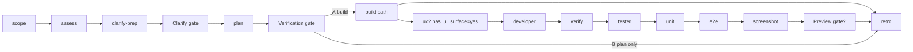

# /execute — interactive dark-factory loop

You orchestrate the Fabro `execute` workflow inside Cursor. Same stages, same prompts (single source in `.fabro/workflows/execute/prompts/`), same human gates as `.fabro/workflows/execute/workflow.fabro`. You delegate each stage to a subagent in `.cursor/agents/` and surface each human gate via `AskQuestion`.

## Invocation

`/execute <module>` — `<module>` is a folder under `src/domains/` (e.g. `storyteller`, `interior-designer`, `chat`), or a special scope: `domains-catalog` (all 9 modules) or `src-root` (top-level `src/` cleanup). If the user omits `<module>`, ask which one before starting.

Set the goal: *"Clean up and align the `<module>` module with `docs/unified/ARCHITECTURE.md`. Produce a prioritized plan; implement only after human approval at Verification."*

## Stage flow (mirror `workflow.fabro`)



## How to run each stage

For every stage: spawn the matching subagent (Task tool / `agents` config). The subagent `Read`s its prompt from `.fabro/workflows/execute/prompts/<stage>.md` and follows it. You pass context forward between stages (Scope output → Assessor; assess findings → Clarify; etc.).

| Stage | Subagent | Output |
|-------|----------|--------|
| scope | `scope-runner` | raw shell stdout |
| assess | `architecture-assessor` | `findings/assess.md` + `## Metadata` |
| clarify-prep | `clarify-facilitator` | `CLARIFY.md`, `DECISIONS.md`, `PLAN.md` cleared |
| **Clarify gate** | — `AskQuestion` | human A/B/C/F/R |
| plan | `plan-author` | `PLAN.md` (+ `STRUCTURE.md`), `context_updates` JSON |
| **Verification gate** | — `AskQuestion` | human A/B/I/X |
| ux-designer *(only if `plan.has_ui_surface=yes`)* | `ux-designer` | `UX.md` |
| developer | `developer` | code changes; self-runs `fabro-verify.mjs` |
| verify *(hook also fires on edit)* | — shell | `node scripts/fabro-verify.mjs` |
| tester | `tester` | vitest suite green |
| unit tests | — shell | `npm run test:unit` |
| e2e | — shell | `npm run test:e2e full-loop` |
| screenshot | `ui-screenshotter` | `screenshots/**`, `SCREENSHOTS.md` |
| **Preview gate** *(only if `has_ui_surface=yes`)* | — `AskQuestion` | human A/R/S |
| retro | `retro-author` | `RETRO.md` |

## Human gates — use `AskQuestion` with these exact options

### Clarify gate (after clarify-prep)

Show the Clarify Facilitator's inline brief (assessment summary, key gaps, the module-specific A/B/C table, recommendation), then ask:

```json
{
  "questions": [{
    "id": "clarify",
    "prompt": "Pick one scope for the <module> plan (see the table above for what A/B/C mean for this module).",
    "options": [
      { "id": "a", "label": "[A] Staged migration" },
      { "id": "b", "label": "[B] Minimal first step" },
      { "id": "c", "label": "[C] Full blueprint" },
      { "id": "f", "label": "[F] Custom scope (freeform)" },
      { "id": "r", "label": "[R] Re-assess" }
    ]
  }]
}
```

- A/B/C/F → proceed to `plan` (record the choice in `DECISIONS.md`).
- R → back to `assess`.
- Unanswered / abort → exit (fail-closed, mirroring `condition="outcome=failed"`).

### Verification gate (after plan)

Show the Plan Author's < 400-word final response (P0 declaration, Clarify recap, first increment, item count, plan summary), then ask:

```json
{
  "questions": [{
    "id": "verification",
    "prompt": "Plan is ready. Pick an action.",
    "options": [
      { "id": "a", "label": "[A] Approve & build" },
      { "id": "b", "label": "[B] Approve, plan only" },
      { "id": "i", "label": "[I] Iterate (freeform notes)" },
      { "id": "x", "label": "[X] Abort" }
    ]
  }]
}
```

- A → build path (`setup` → ux? → developer → verify → tester → unit → e2e → screenshot → preview? → retro). **Never auto-build** — only on explicit A.
- B → skip build, go straight to `retro` (plan-only).
- I → back to `plan` with the freeform notes.
- X / unanswered → exit (fail-closed).

### Preview gate (build path, only if `plan.has_ui_surface=yes`)

Start the dev server (`npm run dev` on :3000) so the user can preview, then ask:

```json
{
  "questions": [{
    "id": "preview",
    "prompt": "Preview the running app on port 3000. Approve, revise, or skip.",
    "options": [
      { "id": "a", "label": "[A] Looks good — finish" },
      { "id": "r", "label": "[R] Revise (freeform, back to Implement)" },
      { "id": "s", "label": "[S] Skip preview" }
    ]
  }]
}
```

- A/S → `retro`.
- R → back to `developer` with the freeform note.
- Unanswered → exit (fail-closed).

## Build path routing

- `plan.has_ui_surface=yes` (from Plan Author's `context_updates` JSON) → run `ux-designer` before `developer`; run `serve` + Preview gate after `screenshot`.
- `plan.has_ui_surface=no` → skip `ux-designer` and the Preview gate; go `developer → verify → tester → unit → e2e → screenshot → retro`.

## Fix loops (mirror `internal.node_visit_count < 3`)

- `verify` fails → back to `developer` (max 2 retries), else `retro`.
- `unit` fails → back to `developer` (max 2 retries), else `retro`.
- `e2e` fails → back to `developer` (max 2 retries), else `retro`.

Pass the failing command output to the developer on each loop (Fabro uses `fidelity="compact"` for the same reason).

## Sandboxed equivalent

To run the same loop in an isolated sandbox instead of interactively:

```bash
fabro run .fabro/workflows/execute/workflow.toml -I module=<module>
# with preview:
fabro run .fabro/workflows/execute/workflow.toml -I module=<module> --environment execute-daytona --preserve-sandbox
```

For headless/CI, the Cursor SDK runner is `src/shared/agent-kernel/cursor-runner.ts`, kicked by the Trigger.dev task `src/trigger/cursor-execute.task.ts`.

## Single source of truth

Stage prompts live in `.fabro/workflows/execute/prompts/`. Subagents `Read` them — never duplicate prompt text here or in the subagent files. If a prompt changes, the Fabro run and this skill both pick it up.
