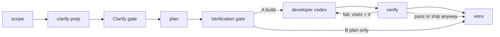

# /execute — interactive dark-factory loop

You orchestrate the Fabro `execute` workflow inside Cursor. Same stages, same prompts (single source in `.fabro/workflows/execute/prompts/`), same human gates as `.fabro/workflows/execute/workflow.fabro`. You delegate each stage to a subagent in `.cursor/agents/` and surface each human gate via `AskQuestion`.

## Invocation

`/execute <module>` — `<module>` is a folder under `src/domains/` (e.g. `storyteller`, `interior-designer`, `chat`), or a special scope: `domains-catalog` (all 9 modules) or `src-root` (top-level `src/` cleanup). If the user omits `<module>`, ask which one before starting.

Set the goal: *"Clean up and align the `<module>` module with `docs/unified/ARCHITECTURE.md`. Produce a prioritized plan; implement only after human approval at Verification."*

## Stage flow (mirror `workflow.fabro`)



## How to run each stage

For every stage: spawn the matching subagent (Task tool / `agents` config). The subagent `Read`s its prompt from `.fabro/workflows/execute/prompts/<stage>.md` and follows it. You pass context forward between stages.

| Stage | Subagent | Output |
|-------|----------|--------|
| scope | `scope-runner` | `.local/findings/scope.md` (inventory + decision axes; Clarify only) |
| clarify-prep | `clarify-facilitator` | `CLARIFY.md`, `DECISIONS.md`, `PLAN.md` cleared |
| **Clarify gate** | — `AskQuestion` | human A/B/C/F/R |
| plan | `plan-author` | `PLAN.md` (+ `STRUCTURE.md`), `context_updates` JSON (metadata only — no separate UX stage) |
| **Verification gate** | — `AskQuestion` | human A/B/I/X |
| developer | `developer` (**codex**) | code changes; self-runs `fabro-verify.mjs` |
| verify | — shell | `node scripts/fabro-verify.mjs` (module gates + husky pre-commit parity) |
| retro | `retro-author` | evidence-based `RETRO.md` (git diff verified) |

## Human gates — use `AskQuestion` with these exact options

### Clarify gate (after clarify-prep)

Show the Clarify Facilitator's inline brief (inventory facts, **3 module-specific questions**, the A/B/C table with meanings generated from scope — not generic labels), then ask:

```json
{
  "questions": [{
    "id": "clarify",
    "prompt": "Pick one scope for the <module> (see the module-specific table above — A/B/C meanings change each run).",
    "options": [
      { "id": "a", "label": "[A] — see table" },
      { "id": "b", "label": "[B] — see table" },
      { "id": "c", "label": "[C] — see table" },
      { "id": "f", "label": "[F] Custom scope (freeform)" },
      { "id": "r", "label": "[R] Re-scope" }
    ]
  }]
}
```

- A/B/C/F → proceed to `plan` (record the choice in `DECISIONS.md`).
- R → back to `scope` (re-run inventory).
- Unanswered / abort → exit (fail-closed).

### Verification gate (after plan)

Show the Plan Author's < 400-word final response (P0 declaration, Clarify recap, first increment, item count, plan summary), then ask:

```json
{
  "questions": [{
    "id": "verification",
    "prompt": "Plan is ready. Pick an action.",
    "options": [
      { "id": "a", "label": "[A] Approve & build" },
      { "id": "b", "label": "[B] Approve, plan only" },
      { "id": "i", "label": "[I] Iterate (freeform notes)" },
      { "id": "x", "label": "[X] Abort" }
    ]
  }]
}
```

- A → build path (`setup` → developer → verify → retro). **Never auto-build** — only on explicit A.
- B → skip build, go straight to `retro` (plan-only).
- I → back to `plan` with the freeform notes.
- X / unanswered → exit (fail-closed).

## Fix loops (verify → developer, max 3 retries)

- `verify` fails → back to `developer` while `internal.node_visit_count < 4` (1 initial + 3 fix turns).
- After 3 fix attempts, `verify` still failing → **ship anyway** to `retro` (does not block PR).
- Pass the failing `fabro-verify.mjs` output to the developer on each loop.

## Sandboxed equivalent

```bash
fabro run .fabro/workflows/execute/workflow.toml -I module=<module>
```

For headless/CI: `src/shared/agent-kernel/cursor-runner.ts`, kicked by Trigger.dev task `cursor-execute`.

## Single source of truth

Stage prompts live in `.fabro/workflows/execute/prompts/`. Subagents `Read` them — never duplicate prompt text here or in the subagent files.
