# Nomos — Architecture Diagrams: Current and Target

Current-state diagrams describe `refactor` @ `b409539` as verified. Target-state diagrams
describe the **honest floor** in `target-architecture.md`: three critic scopes, three
workflows (heavy / light / sweep), host persist, Humanizer after verdict. Schedule:
[phases.md](./phases.md).

Legend: **red** = broken or unenforced · **amber** = present but incomplete · **green** =
correct, do not regress · **blue** = deterministic host code · **purple** = model call.

Eleven diagrams: two of what exists, five of the system, three of how it gets measured, then the
writer journey (Premise → Beats → Draft).

---

## 1. Current — three chat entry points, three safety properties

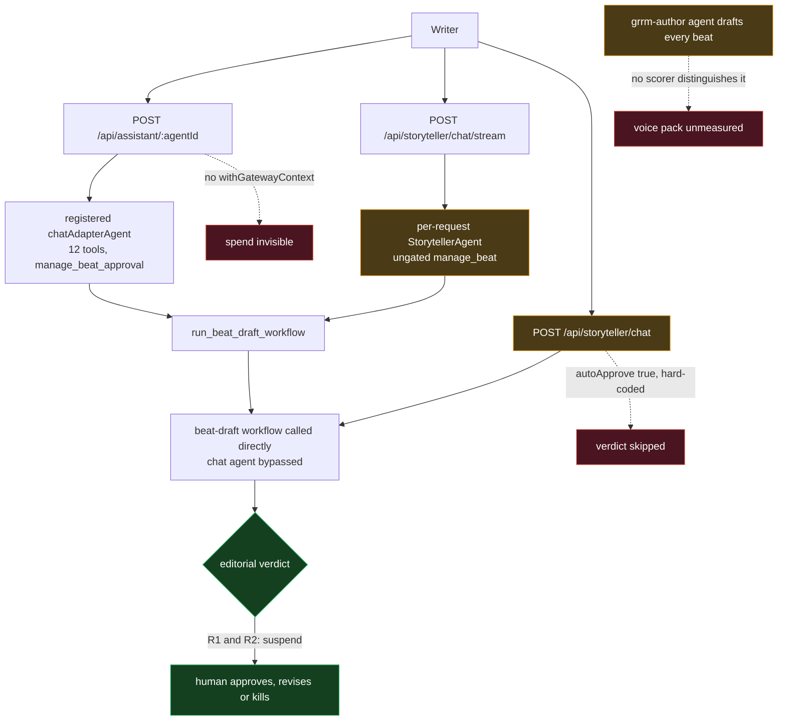

**Reading it.** The editorial gate is a property of the URL. The George agent *is* reached —
it drafts every beat through `beat-draft-default-deps` — but nothing measures whether its
skills help, so the vibe ships on faith. The dead thing is the `GrrmAuthorAgent` wrapper class
in the domain barrel, which is unused code rather than an unused capability.

---

## 2. Current — the beat pipeline that exists today

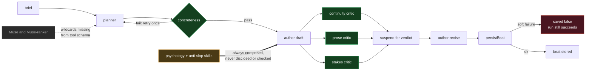

**Reading it.** Three critics really do run in parallel; the verdict really does suspend.
Muse is one missing schema field in the *tool* — the workflow contract has it. The George
skills are not dead: `statelessGrrmAuthor` is the author for both `draft` and `revise`, so
psychology and anti-slop shape every beat already. Their defect is different and quieter — they
load unconditionally on every call, nothing checks that a rewrite preserved the facts, and no
scorer can tell a beat written with them from one written without.

---

## 3. Target — the whole honest-floor system on one page

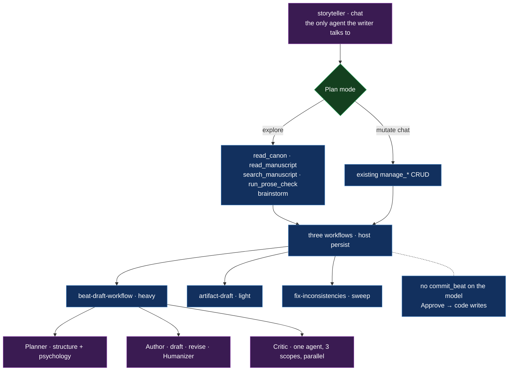

**Reading it.** One chat agent. Plan-mode withholds mutating chat writes. Persist is host after
Approve. Three workflows, same shape, different budget. The critic is one agent run three
times. The Author *is* the GRRM agent — already true on `refactor` — so the vibe needs no new
personality: `masterPrompt` rides in its drafting prompt and Humanizer is a second Author pass
after the verdict.

---

## 4. Target — `beat-draft-workflow`, and where the two halves of the vibe sit

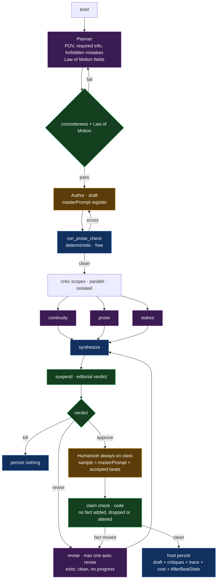

**Reading it.** Cheap checks first. **Three** scopes, not five and not seven. Extra scopes
(`cognition`, `dialogue`) load when ablation says they earn tokens. The two gold boxes sit at
opposite ends on purpose: **tone goes in at drafting**, from the project's `masterPrompt`;
**de-slop comes out at the end**, after Approve, because you cannot remove machine tells from
prose that does not exist yet. Humanizer takes the master prompt as its writing sample. The
claim check is code — it may re-cadence, never re-fact. Martin governs the plan, not the
cadence. Latency: one auto-revise, 180s window split by the suspend.

---

## 5. Target — why a critic is a subagent

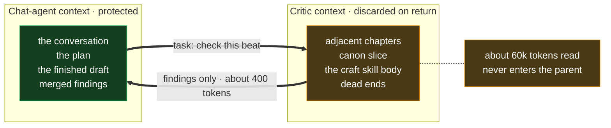

**Reading it.** The only justification for a subagent: it reads far more than it returns.

---

## 6. Target — four-layer canon, the structural half of the George vibe

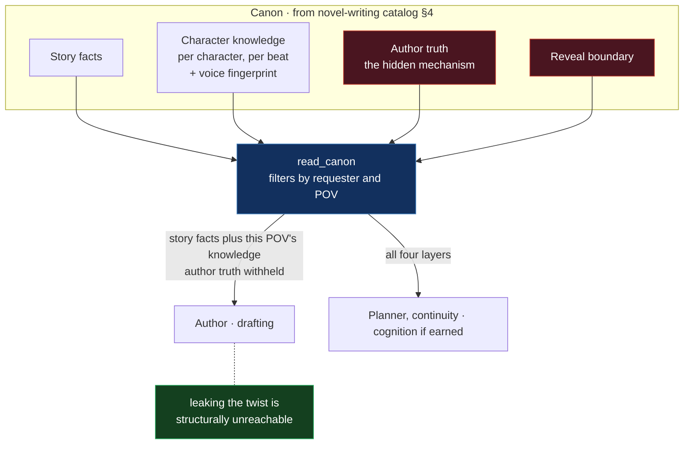

**Reading it.** Dramatic irony is a retrieval **partition** first (Phase 1): the Author never
receives author-truth. A ledger table is Phase 4 if paraphrases leak. Fingerprints on the
character card are Phase 3. Twenty voices in one prompt is how voices blur; the scene cast is
how they stay separate.

---

## 7. Target — the novel-writing catalog with progressive disclosure

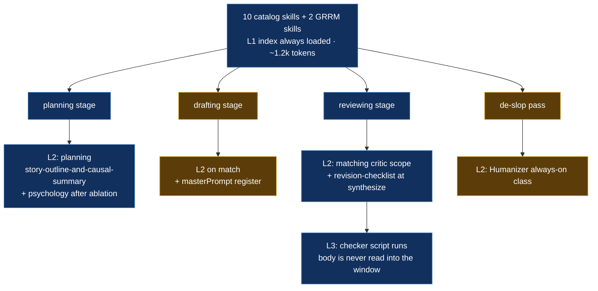

**Reading it.** Using the catalog is not expensive. Loading every body on every call is —
which is exactly what `compose-instructions.ts` does with the two GRRM skills today. The fix is
to make them ordinary L2 loads at the stage that actually needs each one: **psychology at
planning**, because it decides what characters want and what it costs them, and **Humanizer at
the de-slop pass**, because a defect filter needs prose to filter. Drafting keeps the craft floor
plus the project's declared register — nothing that encodes a fixed taste.

---

## 8. Target — four evaluation tiers

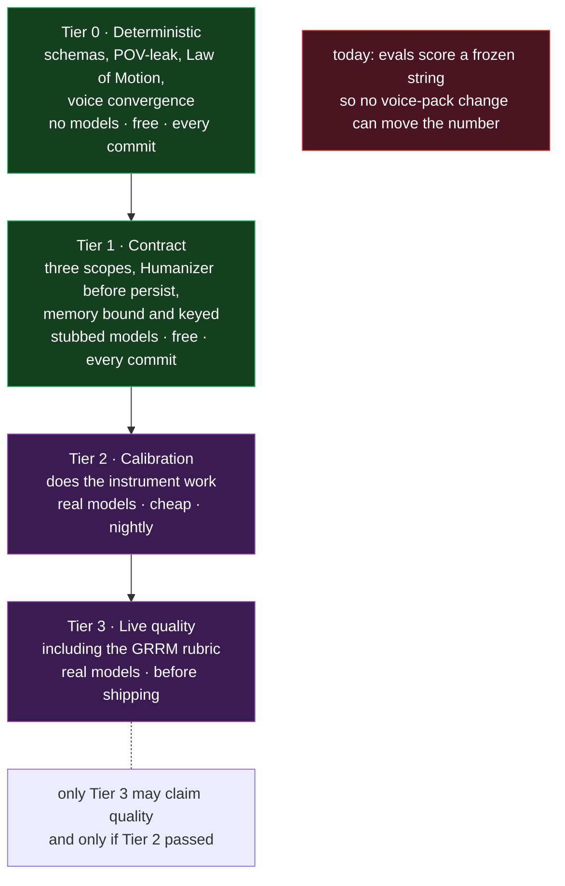

**Reading it.** The vibe has a rubric in Tier 3. Without it you are grading the answer key
and calling it Martin.

---

## 9. Target — ablation decides what grows past the floor

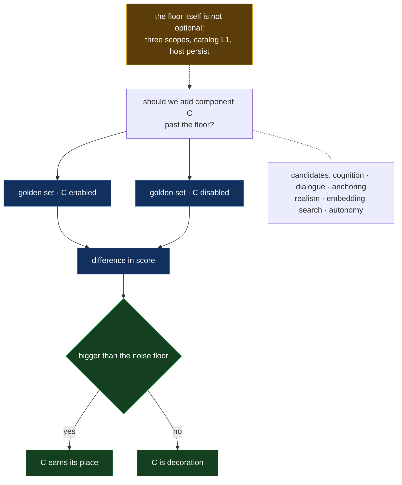

**Reading it.** Ablation decides *additions*. It does not get to delete the three critics or
host persist. If the current pack loses an ablation, you fix the pack — you do not drop
structure. The overdue run is the voice pack itself: it has shipped in every draft without
ever being measured.

---

## 10. Target — making a judge trustworthy, including the GRRM rubric

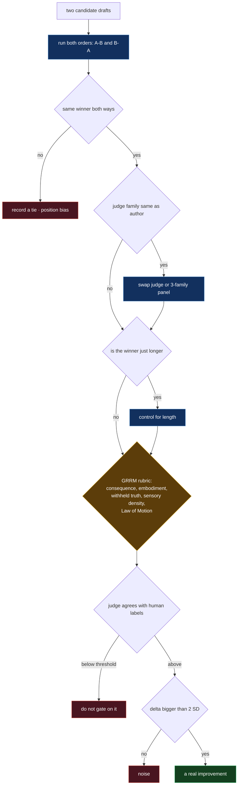

**Reading it.** Four known biases, then a rubric that names the vibe in checkable pieces.
"It feels like Martin" is not a scorer.

---

## 11. Target — Premise → Beats → Draft

The navigator already has these three steps. Chat is not the manuscript.

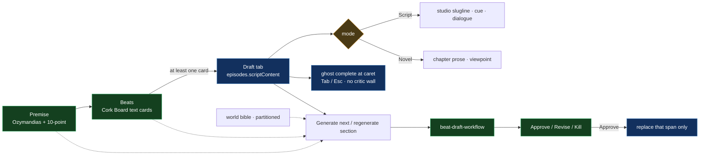

**Reading it.** Cork Board must not call the compiler. Empty beats cannot Draft. Ghost text is
the cheap Cursor habit; the heavy workflow is opt-in per section. Format is a skill, not a
new agent. Spec: `target-architecture.md` §7.5.
