# Learning Materials — Backend Fundamentals, Explained Through This Repo

**Who this is for.** A developer who is comfortable writing application code but has not yet
built a mental model for database design, security boundaries, reliability, and the trade-offs
behind them — and who is about to build an agentic fiction pipeline without having been a
novelist. Backend ideas are taught through real files in this repo. Craft ideas are taught
through [wgwtest/novel-writing](https://github.com/wgwtest/novel-writing) and
`src/mastra/agents/grrm-author/`.

**How to use it.** Part 1 is the story of what was recently refactored and why. Part 2 teaches
backend fundamentals, each anchored to real code, then the agentic writing system (craft catalog,
George vibe, evaluation). **Part 2A is a short Phase 1 picture.** **Part 6 (the last chapter
in this file)** is the system: platform boxes, request flows, and graphs for that same Phase 1
work and nothing else. Part 3 walks the thirty-two actions as a syllabus. Part 4 lists accepted
trade-offs. Part 5 asks whether the direction is good. **Build order:** [phases.md](./phases.md).
Implementation tickets: the Phase 1 plan (`phase_1_architecture`).

A note on honesty: this document points at real weaknesses in code you wrote. That is not
criticism, it is the only way the material is useful. Every codebase of this size has these
issues; most teams never find them.

---

# Part 1 — What was refactored recently, by whom, and why

## The facts

All 35 commits on the `refactor` branch (`b409539`) were authored by **Jacek Sroga**, between
**23 and 28 August 2026**. They cluster into five numbered work packages. `origin/main` is 35
commits behind, so this work has not merged yet.

| Package | Commits | What it did | The problem it solved |
|---|---:|---|---|
| **SPEC-12** | 2 | One validated environment module; nothing else reads `process.env` | Configuration was read from anywhere, unvalidated. A typo in a variable name failed at 3am in production instead of at startup. |
| **SPEC-13** | 1 (+ ~8 related) | An AI gateway that records what every model call cost | You could not answer "what are we spending, and on what". LangChain was removed in the same arc. |
| **SPEC-14** | 8 | A task factory: every background job declares a schema, a queue, and a nonce | Background jobs were defined ad hoc. Some could be submitted twice; some had no ownership check. |
| **SPEC-15** | 1 | An evaluation gate that can refuse a regression | Quality was measured but nothing acted on the measurement. |
| **SPEC-16** | 1 | Contracts: parse once at the edge, piloted on 3D Asset Exporter | Data from the database and the network was reconstructed by guesswork at every read site. |

Two smaller but important fixes landed at the end: `bc06f2f` made a **missing price stop
discarding the whole usage record**, and `b409539` stopped the Writers Room refreshing sections
mid-turn.

## Why this was the right order

Look at the sequence: **configuration → cost visibility → job safety → quality gate →
data contracts**. That is not arbitrary. Each one is a *foundation* the next depends on.

You cannot meter model spend if configuration is scattered, because you do not know which key or
model was used. You cannot make jobs safe to retry until you know which ones cost money. You
cannot gate on quality until you can measure. This is a good instinct and it is worth naming:
**build the thing that makes the next thing measurable, before building the next thing.**

## The pattern to be aware of

There is one recurring shape in this work, and recognizing it is the single most valuable thing
in this document.

> **Every package built a real mechanism. Several of them do not yet enforce what their name
> promises.**

The eval gate is genuinely written and genuinely exits non-zero on a regression — but the
harness it guards scores frozen text and never calls the model. The quality ratchet has 21
counters — but 7 have no code that reads them, and any threshold can be raised in the same
commit that adds the violation. The import policy is written correctly in source — but a later
config block silently replaced it, so the cross-domain rule does not fire at all.

This is not carelessness. It is what happens when you build a mechanism and then move on
before writing the test that proves the mechanism is reachable. The lesson generalizes far
beyond this repo:

> **A guarantee you have not tried to break is a hope, not a guarantee.**

---

# Part 2 — The concepts

## 2.1 Trust boundaries and authentication

**The idea.** A trust boundary is the line where data stops being yours and starts being the
user's. Inside it, you can trust a value. Outside it, you must verify. The single most common
security bug in web applications is trusting something across that line because it *looks*
trustworthy.

**Authentication** answers "who is this?" **Authorization** answers "may they do this?" They
are different questions and beginners routinely fuse them. You can be perfectly authenticated
and still not be allowed to touch a particular row.

**In our repo.** `src/shared/auth/auth.ts` establishes identity like this:

```ts
const { data: { session } } = await supabase.auth.getSession()
```

`getSession()` reads the JWT out of the cookie and decodes it **locally**. It does not ask the
authentication server whether that token is real. `getUser()` does — it makes a network call
and revalidates. Supabase's guidance for server code is explicit: on the server, use
`getUser()`; `getSession()` is a client-side convenience.

The practical consequence: a token that is merely *shaped* like a valid session satisfies this
check. And because `requireAuth` and `withAuth` sit under **110 of our 116 API routes**, one
line decides the trust boundary for almost the entire backend.

**What good looks like.** One function establishes identity, it revalidates, and it returns a
typed object that the rest of the code can trust. Everything downstream takes that object
rather than re-deriving identity. If a value came from the client, it is *evidence*, never
*fact*, until the server has checked it.

## 2.2 Authorization and multi-tenancy

**The idea.** Multi-tenancy means many customers share one database. The whole game is making
sure tenant A can never see or touch tenant B's rows. There are three layers of defence and
you want all three:

1. **The application check** — the code asks "does this user own this project?"
2. **Row Level Security (RLS)** — the database itself refuses to return rows the user should
   not see, even if the application forgets to filter.
3. **Least privilege** — the database role the app connects as can only do what it needs.

**In our repo — the good news.** All three exist. Six migrations enable RLS across public
tables, and `20260819224600_revoke_anon_public_table_grants.sql` revokes everything from the
`anon` role so unauthenticated clients cannot even discover the tables. That is genuinely good
practice and better than most projects at this stage.

**In our repo — the catch.** RLS protects queries made *as the user*. Our server code frequently
connects as `service_role`, which **bypasses RLS entirely** — that is what the role is for. We
have 23 service-role call sites. At every one of them, RLS is not protecting you and the
application check is the only thing standing between tenant A and tenant B.

So: RLS is your seatbelt, not your brakes. It saves you when you make a mistake. It is not the
plan.

**The subtle part — ownership needs a join.** Look at the schema in
`src/db/schema-parts/core-tables.ts`:

```
projects
  └── episodes   (episode.project_id → projects.id)
        └── beats  (beat.episode_id → episodes.id)
  └── characters (character.project_id → projects.id)
```

A **beat has no `project_id`**. It only knows its episode. So "does this user own this beat?"
cannot be answered by looking at the beat. You must walk `beat → episode → project → owner`.
That is why ownership checks here are real work and easy to get subtly wrong, and it is why
the audit found routes that check *access to the existing row* but not the *shape of the
update*.

**The bug this produces.** In `src/app/api/storyteller/beats/[beatId]/route.ts`:

```ts
const body = await req.json()
await db.update(beats).set(body).where(eq(beats.id, beatId))
```

The route checks you may touch *this* beat. Then it writes whatever you sent. Send
`{"episodeId": "<someone else's episode>"}` and you have **moved the beat into another user's
episode**. The row you were allowed to edit became a row you were not allowed to create.

This class of bug — **mass assignment** — is why the rule exists:

> Never spread a request body into an update. Name the columns you allow.

Our own `episodes` route already does this correctly with an explicit allowlist that excludes
`projectId`. The pattern was there; it just was not applied everywhere.

And note the deeper principle: **changing a row's parent is not an edit, it is a move.** A move
requires authorization on *both* the source and the destination. That is a different operation
and deserves a different endpoint.

## 2.3 Database design

**Our shape.** Roughly 30 tables. The storyteller core is a clean hierarchy —
`projects → episodes → beats`, with `characters` hanging off projects. UUID primary keys with
`defaultRandom()`, `created_at`/`updated_at` on everything. This is a sound, conventional
design and there is nothing clever about it, which is a compliment.

**Indexes — mostly right, with a wrinkle.** A foreign key in Postgres is **not automatically
indexed**. This surprises nearly everyone. If `beats.episode_id` has no index, then "give me
the beats for this episode" scans the whole table, and it gets slower every day.

Checking the migrations: the indexes exist, including well-chosen composite ones:

```sql
CREATE INDEX idx_beats_episode_id  ON beats(episode_id)
CREATE INDEX idx_beats_sequence    ON beats(episode_id, sequence)
CREATE INDEX idx_episodes_sequence ON episodes(project_id, sequence)
```

**Composite column order matters, and it has a consequence people miss.** An index on
`(episode_id, sequence)` also serves queries that filter on `episode_id` alone, because
`episode_id` is the **leading column**. An index on `(sequence, episode_id)` would not. The
order chosen here is correct.

The consequence: once you have `(episode_id, sequence)`, a separate index on `(episode_id)` is
**redundant** — the composite already covers it.

**The wrinkle — a worked example worth studying.** Tracing every index on these three tables to
the migration that created it:

| Migration | Index | Column(s) |
|---|---|---|
| `20251203000000_storyteller_schema.sql` | `idx_beats_episode` | `beats(episode_id)` |
| `20260116120000_add_performance_indexes.sql` | `idx_beats_episode_id` | `beats(episode_id)` |
| `20260116120000_add_performance_indexes.sql` | `idx_beats_sequence` | `beats(episode_id, sequence)` |

Three indexes; one is enough. The same pattern repeats for `characters` and `episodes`. Two
things went wrong, and both are instructive:

1. A later "add performance indexes" migration re-created indexes that already existed **under
   different names**. `CREATE INDEX IF NOT EXISTS` protects against a duplicate *name*, not a
   duplicate *column set* — so the guard did not help.
2. That same migration added both a composite index and a single-column index on the composite's
   leading column, which is redundant by the rule above.

Every redundant index is paid for on **every insert and update**, forever, and buys nothing on
reads. Worth a cleanup migration — and worth remembering that `IF NOT EXISTS` is not a check for
"does this index already do this job."

**A real trap: the Drizzle schema has drifted from the database.** In `core-tables.ts` the
foreign keys are declared as:

```ts
projectId: uuid('project_id').references(() => projects.id).notNull(),
```

No `onDelete`. No indexes anywhere in the file — zero. But the actual database, built by raw
SQL migrations, has **33 `ON DELETE CASCADE` clauses, 91 indexes, and 58 `CHECK` constraints**.

So the TypeScript schema and the physical database disagree. This matters for two reasons.
First, anyone reading `core-tables.ts` to understand the system builds a wrong mental model —
they will think deleting a project fails, when in fact it cascades and deletes the episodes and
beats. Second, if anyone ever generates a migration *from* the Drizzle schema, it will propose
dropping the cascades and indexes that the migrations added.

The lesson: **decide which artifact is the source of truth for your schema, and make the other
one derived or verified.** Two hand-maintained descriptions of the same thing will always drift.

**`jsonb` — the trade-off you have already taken.** Look at how much of the schema is `jsonb`:
`psychology`, `arcStatus`, `storyPlan`, `tenPointsPlan`, `charactersInvolved`,
`emotionalShifts`, `causalDependencies`, `setupsPayoffs`.

`jsonb` is genuinely useful for data whose shape is still moving, which describes a creative
tool exactly. But it moves the schema from **write time to read time**. Postgres will not stop
you writing `{"foo": 1}` into `psychology`, so every single read site has to cope with
"whatever might be in there." That is precisely where the ratchet's **1148 untyped JSON reads**
come from. They are not sloppiness — they are the invoice for the `jsonb` decision.

That does not make `jsonb` wrong. It makes it a choice with a bill attached, and SPEC-16's
contracts pattern is how you pay it: parse the blob **once**, at the boundary, into a real type,
then pass the type around. That is the whole idea behind "parse, don't validate."

**Constraints belong in the database when they are invariants.** `episodes.status` is
`text` defaulting to `'planning'`. Nothing at the database level stops `'planing'`. Where a
value must be one of a fixed set forever, a `CHECK` constraint or an enum makes the database
enforce it, and the database is the one component that every path goes through. Application
code can be bypassed by a migration, a script, or a second service; the database cannot.

## 2.4 Contracts and validation at the boundary

**The idea.** "Parse, don't validate." Do not check that data is probably fine and then keep
passing the untrusted thing around. **Convert** it, once, at the edge, into a type that cannot
be wrong — then the rest of your code needs no defensive checks because the type system already
guarantees the shape.

**In our repo.** About **30 of 116 routes** validate their input with Zod. About 86 take the
body or query raw. In storyteller it is 8 validated against 34 raw. The consequence is the guard
reads above, plus 268 snake_case reads outside mappers and 42 `.passthrough()` schemas.

`.passthrough()` deserves a specific warning. It tells Zod "allow fields I did not declare."
That is legitimate when unknown fields genuinely are part of the contract. It is very often used
to make a validator stop complaining — at which point you have written something that *looks*
like validation and is not.

**The pilot to copy.** `src/domains/3d-asset-exporter/contracts/` is the reference
implementation and it is good work: a wire schema for the stored snake_case shape, a mapper as
the single translation point, a domain type in camelCase, `safeParse` for legacy stored data so
a malformed old row degrades to `null` instead of throwing a 500, and a round-trip test. Copy
this pattern; do not invent a second one.

**Where contracts drift.** Our OpenAPI document is built from a *separate registry* rather than
from the schema the route actually runs. So the published API contract and the executed contract
are different objects, and they have already diverged: the spec says
`PATCH /storyteller/characters` takes five optional fields, while the route accepts `gender`,
`characterPrompt`, `mbti`, `psychology` and several metric aliases too. Generating the document
**from** the executed schema makes that class of drift impossible rather than merely detectable.

## 2.5 Reliability and resilience — not the same thing

Beginners use these interchangeably. They are different properties and you need both.

- **Reliability** — the system does the right thing when everything works. Correct results, no
  lost writes, no double charges.
- **Resilience** — the system behaves sensibly when something *breaks*. A provider times out, a
  deploy restarts a machine mid-run, the network drops.

You can be reliable and not resilient: perfect logic that corrupts state when a pod restarts.
You can be resilient and not reliable: it never crashes, and it quietly charges twice.

**Idempotency** is the main tool. An operation is idempotent if doing it twice has the same
effect as doing it once. This matters because **in a distributed system you frequently cannot
tell the difference between "it failed" and "it succeeded but the reply was lost."** Retrying is
your only option, so retrying must be safe.

**In our repo.** SPEC-14 did this properly at one level. `defineOwnedTask` forces every task to
declare a schema, a queue, and a nonce, and `triggerOwnedRun` builds an idempotency key of
`` `${taskId}:${requestId}` ``. Submitting the same request twice runs the job once. That is
correct and well done.

But there is a level it does not reach, and this is the important lesson.

**An idempotency key protects a *submission*. It does not make a *half-finished run* safe to
retry.** `generate-tile.task.ts` runs with `maxAttempts: 3` and does three things in order:

```
1. call the image provider   ← costs real money
2. upload the result to blob storage
3. write rows to the database
```

If step 2 fails, Trigger.dev retries the task — from step 1. **You pay for the image again.**
The idempotency key does not help; this is the *same* run retrying internally, not a second
submission.

The team already sensed this. `remesh-3d-model.task.ts` carries:

```ts
retry: { maxAttempts: 1 }, // Don't retry - costs money
```

That is an honest response to the risk, but it is the wrong instrument, because it also
surrenders retries for the transient network blips that retries exist to handle. You end up
neither reliable nor resilient.

**What good looks like — checkpointing.** Record the provider's job id durably *before or with*
the paid call, and start every attempt by reading it:

```
attempt starts
  → is there a stored provider job id?
      yes → poll it, do not re-submit      ← resume, do not re-purchase
      no  → submit, and store the id
  → upload   (retries independently)
  → persist  (retries independently)
```

Now each stage retries on its own and the expensive stage happens once. This general shape —
break a multi-step process into stages with durable checkpoints so it can resume — is the core
idea behind **sagas** and durable workflow engines, and it is exactly what Trigger.dev is for.

Two more resilience notes from our code. `persistMeshyModelUrl` **swallows database errors**, so
a run reports success with stale state — silently discarding an error is how a resilience
mechanism becomes a reliability bug. And in Vitest, `dangerouslyIgnoreUnhandledErrors: true`
means an unhandled promise rejection — the exact signature of a swallowed async failure —
cannot fail the test suite. The bug and the thing that would have caught it were disabled in
the same codebase.

## 2.6 Transactions and consistency

**The idea.** A transaction is a set of changes that all happen or none happen. **ACID** —
Atomicity (all or nothing), Consistency (constraints hold), Isolation (concurrent transactions
do not see each other's half-done work), Durability (once committed, it survives a crash).

The one that bites beginners is **atomicity across steps that are not in the same transaction.**

**In our repo.** In the beat-draft workflow, `persistBeat` can return `{ saved: false }` on a
soft failure **without throwing**, and the workflow then *completes successfully* with a
generated draft and nothing written to the database. Meanwhile a hard database error *does* fail
the step. So the same real-world event — "we could not save this" — has two different outcomes
depending on how it failed.

Downstream, a reader cannot distinguish:

- we generated this beat and stored it, from
- we generated this beat and lost it.

The run says "completed" in both cases.

**What good looks like.** The draft, its critiques, the run trace and the cost record commit in
**one transaction**, and the run's success depends on that commit. If the commit fails, the run
failed. Do not invent a third state that means "succeeded but nothing happened" — that state is
where data loss hides.

If you genuinely want to keep the model output when canonical persistence is refused, store it
explicitly as a rejected artifact with a reason. That is an honest outcome. A success flag
carrying `saved: false` is not.

## 2.7 CAP, and what it actually means here

**The theorem, stated correctly.** In a distributed system, when a **network partition** happens
— machines cannot talk to each other — you must choose between **Consistency** (every read sees
the latest write) and **Availability** (every request gets a non-error response). You cannot
have both *during a partition*.

**The most common misunderstanding.** People say "pick two of three: C, A, or P." That is
wrong and it will mislead you. Partitions are not something you choose; they are something the
network does to you. If you are distributed, P is compulsory. The real choice is: **when a
partition happens, do I return possibly-stale data, or do I return an error?**

**PACELC** is the more useful version, because partitions are rare and the trade-off never
sleeps: *if there is a **P**artition, choose **A** or **C**; **E**lse — in normal operation —
choose **L**atency or **C**onsistency.* Every read replica, every cache, every CDN is you
choosing latency over consistency.

**What this means for us — the honest answer.** Our Postgres is a single primary. Reads and
writes go to one place, so within the database we get strong consistency and there is no CAP
trade-off to make. If you ever add Supabase **read replicas** for speed, you buy latency at the
cost of consistency: a read replica can lag behind the primary, so a user can save a beat and
then not see it. That is the PACELC "else" branch, and it is a real decision, not a free
upgrade.

**But here is the part that matters more for you right now.**

> Our consistency problems are not *inside* Postgres. They are *between* Postgres and everything
> else.

A single beat generation touches: the Postgres database, an LLM provider, blob storage,
Trigger.dev's own state, and the cost ledger. **That** is the distributed system, and none of it
is covered by a database transaction. You cannot `BEGIN; call OpenAI; COMMIT;`.

So the questions that actually pay rent here are not "are we CP or AP." They are:

- If the model call succeeded and the database write failed, what is true? (§2.6)
- If the upload succeeded and the persist failed, do we pay twice on retry? (§2.5)
- If the run says complete, is the beat definitely saved?

That is why the thirty-two actions include atomic persistence and paid-step checkpointing but no
"CAP strategy." Know the theorem so you recognize it when it arrives — and recognize that
today's inconsistency lives in the seams between services.

**A related trap you already hit.** In 2D Canvas, `loadTiles` writes results into a shared store
after an `await` without re-checking which project is active. Switch from project A to project B
while A's request is slow, and A's response overwrites B's view. That is not CAP — it is a race
condition — but it comes from the same root: **state changed while you were waiting, and you
did not re-check it.** The fix is the same shape as the general rule: after any `await`,
re-verify the assumptions you made before it.

## 2.8 Observability and knowing what things cost

**The idea.** Observability is being able to answer questions about a running system that you
did not anticipate. Logging tells you what you thought to print; observability lets you ask new
questions of data already collected.

**In our repo.** SPEC-13 built the right thing: an `llm_calls` table capturing tokens, model,
provider, cost, latency, outcome, project and user; a committed price table; a `npm run spend`
report; and an ESLint rule preventing direct provider SDK imports so calls cannot dodge it. The
write is fire-and-forget, so a metering outage cannot fail a user request — a good design
decision. And a missing price now records the tokens with `costUsd: 0` and names the model as
unpriced, rather than discarding the row. That distinction matters: **"unknown" and "zero" are
different, and conflating them makes your dashboard lie.**

**Where the number is still wrong, and why it teaches something.** The adapter reads
`result.usage` from a Mastra agent run. On a multi-step run, `usage` is the **last step only**;
`totalUsage` is the cumulative figure. Our agents run with `maxSteps` up to 25. So the ledger
can record a small fraction of real spend — and it will look completely healthy, because a
plausible number is more dangerous than a missing one.

Similarly, `lastEmbeddingTokens` is a module-level global read after the call returns. A cache
hit leaves the *previous* call's number in place; concurrent calls race. Shared mutable state
read at a distance is a classic source of quietly wrong numbers.

The lesson: **a measurement needs a test as much as a feature does.** "Two steps using different
models record the combined total" is a test you can write today.

**The input side of the same bill.** Cost has two halves and the ledger currently watches one.
Tokens leave in the response, but they also arrive in the prompt — and the prompt is assembled
from context *plus* whatever conversation memory recalls. Recalled memory is a cache read with
a price attached, and like any cache it needs three decisions you have to make deliberately
because the library will not force them on you: **what the key is** (whose conversation is
this?), **how large it may grow** (how many messages come back?), and **what deletes it** (when
do old threads die?). Miss the key and users share a notebook, or each turn opens a fresh one
and recalls nothing. Miss the bound and the prompt grows until a per-turn cost triples with no
code change and no failing test. Miss the expiry and a table grows forever until someone
notices the storage line on an invoice.

Our repository currently misses all three in different places, which is why Action 31 exists.
The most instructive part is subtler than any of them: three agents declare a ten-message window
and the production chat path never passes a thread id at all, so the window is configuration
that nothing reads. This is the same shape as the eval gate that scored a frozen string and the
ratchet that compared a tree to itself — **a setting is not a behaviour until something executes
it, and only a trace or a test can tell you which one you have.** That sentence is most of what
this document is about.

## 2.9 Quality gates, and why a gate that cannot fail is worthless

**The idea.** A gate is an automated check that stops bad changes. Its value is entirely in its
ability to *say no*. A gate that cannot fail is a comment with a build step.

**Three ways our gates currently cannot say no** — worth studying, because these are the generic
failure modes:

1. **It measures the wrong thing.** `evals/run.ts` scores frozen golden strings rather than live
   agent output. The gate above it works perfectly; it is simply guarding an input that cannot
   change when the agent changes.
2. **The subject can move the goalposts.** Ratchet tests assert `current <= threshold`, where
   the threshold lives in a JSON file **in the same commit**. Raise the number and add the
   violation together and it passes. A threshold must be compared against a **pinned base
   reference**, so loosening it is visible as a diff someone must approve.
3. **It was silently switched off.** ESLint flat config **replaces** rule options when a later
   block matches the same file rather than merging them. A block added with the cost work
   overwrote the cross-domain import ban. Verified by linting a probe file with a positive
   control: `import 'openai'` errors correctly, while `@/domains/game-design` produces no
   diagnostic at all. A rule documented in three places as a hard error does not fire.

The generalizable habit — and honestly the most valuable single practice in this document:

> **Test that your gate fails.** Write the violation, confirm it is caught. Then delete the
> rule and confirm the test goes red. A gate you have only ever seen pass has told you nothing.

There is also a measurement lesson in the ratchet: it counts **lines of text** matched by a
regex. So reformatting changes the count, removing violation A while adding violation B keeps
the total flat, and `process.env["FOO"]` is invisible to a matcher expecting `process.env.FOO`.
Counting syntax requires parsing syntax — an AST — not matching text.

## 2.10 Agent systems — craft, vibe, and measurement

Tracks B and C build a writing system. The concepts are still backend concepts: budgets,
permissions, pipelines, and instruments. The subject matter is fiction craft from
[wgwtest/novel-writing](https://github.com/wgwtest/novel-writing) and a George R. R. Martin
layer that already exists in this repo as `src/mastra/agents/grrm-author/`. If you skip this
section you can still ship Actions 1–8. You cannot ship 9–25 without it.

### The craft catalog is a compiler, not a mood board

Open the skill's `SKILL.md`. It does three things a backend developer already knows under other
names.

**It splits work into stages** — planning, drafting, reviewing — and tells you which reference
file to load for each. That is progressive disclosure: pay for the chapter you need. We
implement it as three skill levels (name+description always, body on match, scripts run rather
than read). Loading all ten bodies on every critic call is ~15–20k tokens of mostly irrelevant
text. Loading ten names is ~1.2k. Cutting the catalog to four skills was a misunderstanding of
that cost model.

**It demands located diagnostics.** `revision-checklist.md` requires Location, Problem type,
What happens now, Why it fails, Revision direction, and "Should this become a project rule?"
That is a linter finding. We encode it as a Zod schema so "the pacing is a bit stiff" cannot
be represented. Project rules override the general skill — same precedence as a repo's
`CLAUDE.md` over a generic system prompt. That is Action 24.

**It splits canon into four layers** (`story-outline-and-causal-summary.md` §4): story facts,
character knowledge, author truth, reveal boundary. The drafting Author gets facts plus *this
POV's* knowledge, and is not given author truth. That is row-level security applied to plot.
It is also most of what people mean by "write with dramatic irony." A prompt that says "don't
spoil the twist" will spoil it the moment the model gets absorbed. A retrieval rule cannot.

The catalog's other hard rules map onto scopes and gates:

| Hard rule in the skill | Where it lives in our system |
|---|---|
| Important characters cannot enter naked | `character-introductions` loaded when the plan flags a first appearance |
| Scene information obeys access limits | `read_canon` partition (Phase 1); `cognition` scope if earned |
| Cognition must change choice and language | `cognition` scope — Phase 4 by ablation |
| Viewpoint does not own every decision | `stakes` floor scope (today's stakes critic) |
| Dialogue happens through behavior | `dialogue` scope — Phase 4 by ablation |
| Protect style-bearing material | `style-fidelity` on the **diff**, so revision cannot "fix" by flattening |
| Every segment earns its place | Law of Motion fields on the plan; concreteness gate |
| Review output must be specific | `Finding` schema |
| Run the bundled checker | `run_prose_check` — rewrite the rules, keep the shape |

**Script vs novel is also a spec, not a vibe.** Humans who write TV already use studio format
(slugline, present-tense action, CHARACTER CUE, sparse parentheticals, one page ≈ one minute).
Humans who write novels use chapters, viewpoint, attribution beats, and interiority. The
Author must be taught those page geometries as a format skill (`target-architecture.md` §7.5).
Do not emit a novel that starts every paragraph with `INT. KITCHEN – NIGHT`, and do not emit a
script as markdown headings. The Draft tab is that page. Cork Board is the beat cards and is
forbidden from drafting scripts.

You do not need to become a novelist to implement this. You need to treat those documents as
specifications.

### The George vibe is three layers, and only one of them is a prompt

`src/mastra/agents/grrm-author/` already has instructions (Law of Motion: every beat needs
`actionTaken`, `consequence`, `storyStateChange`), a psychology skill (habits, denied desires,
blind contradictions, delayed cost), and an anti-slop skill (emotion labels become behavior;
purple prose, exposition dumps, and plot conveniences are banned). `compose-instructions.ts`
concatenates them.

**And all of that already runs.** `beat-draft-default-deps.ts` routes both the `draft` and the
`revise` step through `statelessGrrmAuthor` — that agent. Every beat this repo has produced was
written with the psychology and anti-slop skills in the prompt.

This is worth dwelling on, because the first version of this document said the opposite. It saw
that the `GrrmAuthorAgent` **class** in the domain barrel has no call sites and concluded the
vibe was unreachable. One is a wrapper nobody imports; the other is the agent that does the
work. *"I could not find a call site"* and *"there is no call site"* are different claims, and
collapsing them is the single most common way an audit ends up confidently wrong. When an
assistant tells you a feature is dead, make it show you the path it walked.

The real defect is quieter and more interesting: the pack ships in every draft, and **nothing
measures whether it helps.** `evals/run.ts` scores a frozen `referenceOutput`, so no change to
psychology or anti-slop could ever move a number. That is not an unreachable feature; it is an
unfalsifiable one, which is worse — it cannot be improved, only believed in.

Split it the way you would split any feature that people describe with adjectives:

**Structure** is engineering, and the catalog already named it: limited POV, unequal knowledge,
sensory concreteness, reveal discipline, motion over mood, embodied dialogue. These belong in
retrieval, schemas, critic scopes, and deterministic checks. They can fail a test on a stubbed
model.

**Texture** splits by direction. *Adding* voice — psychology, cadence, register, the private
per-project overlay — belongs in the drafting prompt, where it already is, because a beat
should be written in voice rather than translated into it afterwards. *Removing* machine tells
— anti-slop, banned phrases, labelled emotions — belongs in a late pass behind a claim check
that forbids adding, dropping or altering a fact. The order matters in one direction only: a
de-slopper that runs before the voice pack strips the idiosyncrasies you just paid for.

**Measurement** is a named GRRM rubric in the pairwise judge: consequence, embodiment,
withheld truth, sensory density, Law of Motion. "It feels like Martin" is not a scorer. If
the pass loses an ablation, you fix the pack — you do not delete the product requirement.

*Working with AI on this:* never accept "add 'write like George R. R. Martin' to the system
prompt" as the implementation. Ask which of the six structural properties still hold when the
model is having a bad day. If the answer is "the prompt," you have a costume.

### Measuring a subjective quality without a judge

The reflex when you want to measure something artistic is to ask another model. Sometimes you
have to. Often there is a **countable proxy**, and it is worth looking for one first, because a
count is free, instant, identical every run, and cannot be argued with.

Distinct character voice is the best example in this system. Every prompt file demands it, no
scorer checks it, and characters blurring into one articulate narrator is the failure readers
notice first in long generated fiction. It sounds like a judgement call. It is not, because the
inverse problem was solved decades ago in **stylometry** — the statistical study of writing
style, used to attribute anonymous documents to authors. Its central finding is counter-
intuitive and worth carrying around: *function words* — `the`, `but`, `of`, `would` — identify a
writer far more reliably than vocabulary or subject matter, because they are unconscious habits
rather than choices, and they survive editing and paraphrase. Run those statistics across
speakers instead of across authors and convergence falls out of the arithmetic.

Three details separate a useful metric from a decorative one, and they generalise well beyond
this case:

- **Score the worst case, not the average.** One vivid character carries a mean while three
  others are interchangeable. The closest pair is the honest number. Whenever you aggregate a
  quality metric, ask what the average is hiding.
- **Separate "different from each other" from "correct."** A cast can be perfectly distinct and
  every one of them wrong for who they are supposed to be. Those are two measurements.
- **Trust the extractor before you trust the score.** The metric needs per-speaker lines, and
  dialogue here is stored as free prose, so something has to parse it back out. A parser that
  silently drops half the lines produces a confident, meaningless number — **worse than no
  metric at all**, because now you have a green dashboard. Test the extractor on interruptions,
  unattributed lines, and one-speaker scenes before the metric is allowed into the suite.

*Working with AI on this:* when you ask for a way to measure something that sounds subjective,
ask for the deterministic proxy **first** and the LLM judge second. Left to itself an assistant
proposes the judge every time, because a judge is easier to write — and it will quietly cost you
money on every run forever.

### Five more backend ideas the harness rests on

**The context window is a budget.** Quality degrades as it fills. A model that read forty
chapters before writing one paragraph is worse at that paragraph. Retrieval depths (task /
near / far) and skill disclosure exist to spend that budget on purpose.

**A subagent exists to protect a context window.** Continuity may read 60k tokens and return
400 tokens of findings. The test is mechanical: does it read far more than it returns? If
not, it should be a function call. Three critic scopes are three isolated reads, not three
personalities. Extra scopes wait on ablation.

**Put the plan in code.** `beat-draft-workflow`, `artifact-draft`, and `fix-inconsistencies` are
inspectable because a workflow is inspectable. Intermediate results live in step outputs, so the
chat agent never accumulates three critiques, a revision and a Humanizer pass in one window.

**Goodhart's law will eat the revision loop.** The fastest way to clear findings is to delete
anything interesting. `style-fidelity` on the diff, and a counter-metric on the quality gate,
are how you stop the optimizer flattening the book.

**You measure additions; you do not argue them.** Ablation decides whether to add an
`anchoring` scope, not whether Martin stays. Calibration, noise floor, and pairwise
counterbalancing decide whether a number is real. Today's eval scores a frozen string, so no
voice-pack change can move it — that is construct invalidity, the same bug as a metric named
"agent quality" that never called the agent.

### How to study this with an assistant

1. Read `novel-writing/SKILL.md` once, then `revision-checklist.md` and
   `story-outline-and-causal-summary.md` §4. Those three files *are* the spec for Findings,
   rule promotion, and canon layers.
2. Read `src/mastra/agents/grrm-author/instructions.md` and the two `skills/` files, then
   follow `statelessGrrmAuthor` from `beat-draft-default-deps.ts` to see where they already
   run. Those three files *are* the voice pack, and it is live.
3. When an assistant proposes a new agent or a seventh workflow, ask: "which catalog file
   does this implement, and what ablation would delete it?"
4. When an assistant proposes a vibe prompt, ask: "show me the test that fails if we skip
   this pass."
5. When an assistant says a feature is unreachable, ask it to name the import chain it
   searched. This document made that mistake about this exact agent.

---

# Part 2A — Phase 1, in plain words (what we are about to build)

Read this before the tickets. Tickets are in the Phase 1 plan and in [phases.md](./phases.md).
This chapter is the picture those tickets are cutting out of.

Phase 0 made the current loop **stop lying** (who you are, whether a beat saved, whether an
eval actually measured an agent). Phase 1 does **not** add a new writer, a new critic, or a
Humanizer. Same six agents. Same two workflows. The host work: **alarms that actually ring,
a bill that is a total, a free spellcheck before the expensive editors, and a notebook that
knows whose it is.**

If you remember one sentence:

> Typecheck the beat for free. Then, and only then, pay three critics. Never tell the
> drafting Author the twist. Never pay Meshy twice because step three crashed.

---

## The beat, after Phase 1

Today the pipeline is roughly:

```
plan → draft → three paid critics in parallel → you Approve / Revise / Kill → save
```

After Phase 1 it is:

```
plan
  → draft (now on the cost ledger)
  → free prose-check  (causal graph, plants, hygiene, "did this POV name the secret?")
       errors?  one free-ish Author rewrite, check again
       still broken?  skip the critics, show you the findings, wait for Approve/Revise/Kill
       clean (or only warnings)?  three paid critics, same as today
  → you Approve / Revise / Kill
  → save  (plants also land in the setups table; Law of Motion fields stay on the beat)
```

Nothing in that picture is a new personality. The Author is still `statelessGrrmAuthor`.
The three critics are still continuity, prose, and stakes. Muse still only runs if
`wildcards` is on — and after this phase the **chat tool** can finally turn that switch,
which today it cannot.

---

## Kitchen picture

Imagine a restaurant.

**The smoke alarm** is written on the wall in nine places. A later painter covered the
cross-domain wire with "no raw OpenAI." The alarm still looks installed. Lighting a match
in the kitchen (`import from '@/domains/game-design'` inside a storyteller file) currently
does nothing. Phase 1 rewires the alarm and **tests that a match sets it off**, and that
removing the battery makes the test fail. That is Actions 5's ESLint compose.

**The tally board** on the wall has 21 numbers. Fourteen are wired to a bell. Seven are
sharpie. Anyone can raise a number in the same breath they break the rule. Phase 1 either
hooks those seven to a bell or erases them, and compares tonight's board to **last week's
board**, not to itself. That is the ratchet.

**The receipt** lists the last course, not the meal. The longest course — the Author
drafting the beat — is missing. Embeddings and rerank sometimes never hit the till.
Phase 1 puts those lines on the receipt. A missing price is still "we don't know," never
"this was free."

**Paying the butcher twice.** Image and 3D jobs retry when the upload fails. Retry today
can mean "call Meshy again," which is a second invoice for the same steak. Phase 1 writes
the butcher's ticket number on the order **before** paying, and on retry **reads** that
number instead of ordering again.

**The health inspection** currently ignores a waiter dropping a tray in the back
(`dangerouslyIgnoreUnhandledErrors: true`). Phase 1 stops ignoring it, after the dropped
trays that already exist are picked up — flip the flag while the suite is red and you
learn nothing.

None of that is a new menu item. It is the kitchen stopping its own lies.

---

## The writing loop, in the same kitchen

**Don't tell the line cook the twist.** The world bible currently goes to the Author as
one JSON dump, including `PLOT_TWISTS`. Asking the model "please don't spoil it" is a
note on the fridge. Taking the twist folder off the cook's counter is a rule. Planner
and the continuity critic still get the folder — they are the people who must know.
Prose and stakes critics do not. If the beat has no POV character, the cook gets the
public facts only, not every character's secrets. That is a **prompt partition**, not a
new database of "who knows what." The ledger table is Phase 4, and only if this cheap
version fails on paraphrases.

**Spellcheck before the three expensive editors.** Causal holes, an unresolved plant, a
POV naming a secret by its true name, leftover `</thinking>` markup — those are
`tsc` errors. You do not pay a staff of reviewers to find a missing semicolon. The
prose-check emits the same `Finding` shape a critic does (location + a verbatim quote,
or it is not a finding). One rewrite if it fails. If it still fails, **skip the critics**
and bring you the findings. Warnings (ugly but legal) do not block. This is not the
Revise button after you have already seen the draft; that slot stays yours.

**Do not throw out the beat's junk drawer.** `beats.setupsPayoffs` jsonb looks like a
duplicate of the unused `setups` table. It is not only plants. It is also where
`actionTaken` / `consequence` / `storyStateChange` are packed — Law of Motion, the
thing the planner already gates on. Deleting the jsonb in this phase would break
saves and the board. Phase 1 **dual-writes** new plants into `setups` and lets the
linter prefer the table, then fall back to jsonb. The drawer stays.

**Complaints must point at a sentence.** A critic that says "the pacing is a bit stiff"
is an intern with no highlighter. After Phase 1 a finding without a location and a
quote cannot be saved. Same form for the free linter and the three model critics.
`promoteToProjectRule` is a checkbox defaulting to no. Nobody is building the machine
that turns a finding into standing law yet.

**A notebook with a name on it.** Agent memory is configured as "last ten messages" on
code the live chat does not call. The path you talk to never passes `thread` +
`resource`. Autonomous runs without an episode share one notebook named
`storyteller-autonomous`. CRUD mints a fresh notebook every call, so nothing is ever
recalled. MCP has no page limit at all. Phase 1: one helper that names the notebook
`(project, episode, user)`, on **every** live door — the SSE stream, the flagged
controller path, `/api/assistant/…`, autonomous, and MCP. Two projects never share a
notebook. Recalled chat is conversation, not a back door around "don't tell the cook
the twist." Expiry (throwing old notebooks away) waits for Phase 3.

**The Muse doorbell is disconnected.** The workflow already honors `wildcards`. The
tool the chat agent calls does not expose that field, so no user utterance can turn
sparks on. Phase 1 adds the field and forwards it. It does **not** build a roster of
`@mention` specialists. Two unused class wrappers (`GrrmAuthorAgent`,
`BeatPlannerAgent`) get deleted; the file-based agents that actually draft stay.

**One PATCH, done properly.** Episode update already has an allowlist — sitting in the
`app/` route folder, which is the wrong house — while OpenAPI advertises a different,
passthrough-y shape. Phase 1 moves the allowlist next to the domain, makes the route
run **that** Zod, and regenerates OpenAPI from it. We do not wrap the other 85 raw
routes. A dropped thumbnail field on 2D→legacy assets gets carried through the 3D
contracts module; 3D is not allowed to import 2D to do it.

---

## What this is not

| You might expect | What we are actually doing |
|---|---|
| A new Author, a fourth critic, Humanizer | Same six agents. Humanizer is Phase 2 |
| Skills catalog in every call | Phase 2. This phase does not load novel-writing bodies |
| A knowledge ledger ("who knows the twist" as rows) | Partition the prompt. Tables if that fails, Phase 4 |
| Drop `setupsPayoffs` jsonb | Dual-write plants. Jsonb still holds Law of Motion |
| Chat tools `read_canon` / `run_prose_check` | Linter is a **workflow step**. No new doorbells |
| `@mention` writer / devil's advocate | Delete dead wrappers. Do not build the roster |
| `commit_beat` for the model | Host still saves after **you** Approve |
| Browser / Playwright to "see the card" | Unit + trace tests. Pixels stay unverified, on purpose |
| Extract `/api/assistant` into a platform kernel | That is Phase K, **after** this phase, **before** Humanizer |
| Silence lint with `eslint-disable` | Split the file or fix the rule. Ask before any disable |

If an assistant starts any of those during Phase 1, it is off the plan.

---

## How you will know it worked

Five facts, all checkable without opening the app:

1. **A mechanically broken beat does not buy critics.** Empty causal spine, a POV using a
   name that exists only in the twist folder, or a plant with no payoff window → Author
   retry or suspend, **$0** on continuity/prose/stakes in `llm_calls`, no critic
   `role.dispatch` on the trace.
2. **The Author's assembled context has no twist.** A unit test on the assembly result,
   not a prompt that says "don't mention it."
3. **Importing `@/domains/game-design` from a real storyteller file is an ESLint error**,
   and deleting that rule turns a named test red. Importing `openai` still errors (the
   positive control — if that also goes quiet, the test harness is broken).
4. **A retried tile or Meshy job does not create a second paid generation.** The test
   mocks the provider; it fails the run if the create POST happens twice.
5. **Deleting one of the three critics from the production workflow turns the contract
   test red.** "We still score the prose" is not enough; the trace must show three
   overlapping critics on the happy path.

Plus the boring-but-load-bearing: unhandled promise rejections fail Vitest; Author
drafts appear on the cost ledger; episode PATCH runtime schema equals the OpenAPI
document; live chat passes `memory.thread` + `memory.resource`; `wildcards` on the
tool reaches Muse.

---

## How to study this with an assistant

1. Walk `createBeatDraftWorkflow` in `beat-draft-workflow.ts` and point at the hole
   between `draft-script` and `critique`. That hole is the prose-check.
2. Print `assembleCanon` in `beat-draft-default-deps.ts`. The `sections: [All]` is the
   twist leak. Ask: "show me the object the Author receives after partition — not the
   prompt text."
3. When an assistant wants to `DROP` `setupsPayoffs`, make it show `packSetupsPayoffs`
   in `beat-tool-operations.ts`. If it still wants to drop the column, it has not read
   the kitchen.
4. When an assistant binds memory only on `stream-post-handler.ts`, ask for the
   controller path and `/api/assistant/[agentId]`. One door is not the product.
5. When an assistant proposes Playwright "just to check," the answer is the five
   facts above. A page is not an acceptance path in this phase.

---

# Part 3 — The thirty-two actions as a syllabus

`actions.md` has the tickets (WHAT / HOW / WHERE / Acceptance) plus a teaching column on
every action. This part is the syllabus: what to learn *in what order*, and how the tracks
fit together. Do not skip to Track B because it is more fun. Track B on an untraced,
unauthenticated, softly-persisted pipeline is a demo that lies.

### Track A — you already know these names from Part 2

| Actions | You are practising | The trap |
|---|---|---|
| 1 | Authn vs authz; mass assignment | A test that mocks `requireAuth` |
| 2 | Transactions; one way of failing | `{saved:false}` *and* a thrown error for the same event |
| 3 | Logs vs metrics vs traces | Instrumenting call sites instead of seams |
| 4 | Reproducible builds; silent success | Grepping human text for the word "error" |
| 5 | Config replace-not-merge; positive controls | A ratchet that compares a tree to itself |
| 6 | Per-step vs cumulative usage | Module-global `lastEmbeddingTokens` under concurrency |
| 7 | Construct validity | A gate named after the agent that scores a fixture |
| 8 | Idempotency vs resumability | `maxAttempts: 1` as a substitute for a checkpoint |
| 27 | Policy at the platform vs policy in your code | Turning on regex prompt-injection; expecting a gateway filter to protect made-up facts |
| 31 | Cache keys, bounds and retention | Accepting `lastMessages: 10` as a behaviour when nothing reads it |

Work Phase 0 first ([phases.md](./phases.md)): 1, 3, 2, 4, 18, 28, 6, 31. Then 5, 7, 8.
Live-quality (7) needs the pipeline. Action 10 is cut.

### Track B — the writing system

Read this as one sentence: **one front door, Plan-mode that withholds chat writes, host persist
after Approve, a four-layer partition, a form critics must fill in, three inspections from the
craft catalog, the catalog index in the pocket, three workflows with cheaper bible/character
budget, and Martin on the assembly line as structure.**

- **9 Chat agent.** Invariants live in the domain, not in the URL. The George agent with no
  call site is this lesson in costume. Dead wrappers, not dead capabilities.
- **10 CUT.** Do not build `read / draft / commit` with `commit_beat`. Host files after
  Approve. Plan withholds mutating chat CRUD.
- **11 Chat tools.** `brainstorm` is a doorbell on Muse, which already exists.
  `search_manuscript` is literal because plant/payoff is a string problem. Persist is not a
  model tool.
- **12 Four-layer canon.** Catalog §4. Prompt partition first; ledger is Phase 4. If you
  remember one Track B idea, remember this.
- **13 Finding + BeatPlan + Law of Motion.** Catalog checklist + GRRM instructions, as
  schemas. Vague becomes a validation error.
- **14 Three scopes, one agent.** Continuity, prose, stakes — what already ships. Cognition
  and dialogue are Phase 4. Isolation is the reason they are subagent calls.
- **15 Catalog, disclosed.** All ten [novel-writing](https://github.com/wgwtest/novel-writing)
  files at L1. Bodies on match. The cost of "using the catalog" is ~1.2k tokens of index,
  not 20k of bodies.
- **16 Three workflows.** `beat-draft-workflow` (heavy compiler), `artifact-draft` (light),
  `fix-inconsistencies` (sweep you already have). Autonomy is Phase 4. Phase 3 also puts that
  heavy compiler on the **Draft tab** (Premise → Beats → Draft): Script vs Novel format skill,
  Cursor ghost-text, generate next / regenerate this section. Cork Board still does not draft
  scripts.
- **17 Split the George vibe.** The pack already drafts every beat, so this is not wiring.
  Structure is already in 12–14; voice stays in the existing MASTER PROMPT; Humanizer after
  the verdict behind a claim check. Measure with the GRRM rubric (21) — starting with an
  ablation of the pack itself.
- **26 Same shape, cheaper budget.** Beats get the heavy line; bible and characters get 1–2
  scopes and the existing overlay. No Humanizer on artifacts.
- **28 The latency budget.** Phase 0 constraint. One timeout source, one auto-revise, 180s.
  The human approval pause splits one long request into two short ones.
- **30 The chat surface.** Call `resumeChatWorkflow`. Say what is happening in words. No new
  Voice tab. Draft-tab pixels (ghost complete, section generate, mode switch) are Phase 3.

### Track C — how you know, including how you know it is Martin

- **18 Trace contracts.** Stub the model, watch the levers. Include "Humanizer ran after the
  last revision," "`psychology` at Planner not Author after the move," "Author context had no
  author-truth," "three scopes overlap," "kill writes nothing."
- **19 Deterministic linter.** Catalog checker shape. POV-leak is a lookup.
- **20 Golden set.** Include a deceived-POV beat and a delayed-cost beat, or the vibe has no
  exam questions.
- **21 Judge + noise + GRRM rubric.** Counterbalance, other family, length control, human
  labels, two standard deviations. The rubric names consequence, embodiment, withheld truth,
  sensory density, Law of Motion.
- **22 Ablation.** Decides extras (`anchoring`, tournament). Does not delete the floor.
- **23 Gate + dollars per quality point.** Pair every metric with a cheat-catcher.
- **29 Prompt registry.** A prompt is an input to the system, so it is versioned like code and
  measured like a change. Twenty of them currently hide inside UI constant files.
- **32 Voice fingerprints.** Stylometry: function-word frequencies separate speakers better
  than vocabulary does. Score the *closest pair*, not the average, and check the extractor
  before you trust the number.

### Track D — compounding

- **24 `promote_rule`.** The catalog's last question on every finding. Project law overrides
  general craft.
- **25 Model pins.** Role slots after a live-quality run, not vendor ids in the spec. Believe
  the trace, not the matrix, because a policy layer already remaps some models.

**The one principle behind most of them:** *the host owns truth; the model owns language.*
Any fact a later step depends on is committed by deterministic code. A model may propose a
fact; only your code may commit one. The de-slop pass is allowed to change cadence, not
facts — that is the same principle wearing a leather jerkin.

---
# Part 4 — Trade-offs we have accepted

Every one of these is defensible. What matters is that they are **decisions**, not accidents.

| Trade-off | We chose | We gave up | Right call? |
|---|---|---|---|
| `jsonb` vs strict columns | Flexibility for evolving creative data | Write-time validation; the bill is 1148 read-site guards | Yes — but pay it with contracts (Action 13) |
| Dual-write plants vs drop `setupsPayoffs` | Keep Law of Motion packing on the beat jsonb | One plant/payoff store | **Yes for Phase 1** — the jsonb is not only plants |
| Fire-and-forget cost logging | A metering outage never breaks a user request | Guaranteed-complete billing data | Yes, for this domain |
| RLS **and** service role | Server code can do its job | RLS protects nothing at 23 call sites | Yes — provided each site checks ownership |
| Single Postgres primary | Strong consistency, simple reasoning | Read scaling; a single region | Yes at this stage |
| Idempotency key only | Duplicate submissions prevented cheaply | Half-finished runs still re-purchase | **No** — Action 8 |
| `maxAttempts: 1` on paid tasks | No double charge | No retry on transient failures | Stopgap; checkpointing supersedes it |
| Frozen fixtures in evals | Fast, deterministic, free | Cannot detect an agent regression | Fine as *a* tier, wrong as *the* gate |
| Ratchet instead of "fix it all now" | Ships; stops the bleeding | Debt persists; can be gamed | Yes — with Action 5's fixes |
| Local gates, no CI | Fast iteration | Nothing is reproducible or enforced | **No** — Action 4 |

---

# Part 5 — Are we refactoring in a good direction?

**Yes, with one correction.**

**What is genuinely good, and you should keep doing it:**

- The **sequencing instinct** is right. Configuration before metering before job safety before
  quality gates is the correct dependency order, and most teams get this backwards by starting
  with the visible feature.
- **Pilot, then propagate.** The 3D Asset Exporter contracts module is a small, complete, tested
  example of the target pattern. Proving a pattern on one module before rolling it out is
  exactly right, and far better than a big-bang rewrite.
- **The failure modes chosen are honest.** Recording an unpriced model rather than dropping the
  row; returning 404 instead of 403 to avoid id enumeration; `not-applicable` versus `not-run`
  in eval baselines. These are the choices of someone thinking about what the data will mean
  later.
- **Compiler-enforced structure.** `defineOwnedTask` makes a task without a queue or a nonce
  *fail to compile*. That is much stronger than a convention in a document, because it cannot be
  forgotten.

**The one correction — and it is a habit, not a task:**

> You are building mechanisms faster than you are proving they work.

Every package delivered a real, well-designed mechanism. In several cases the last step —
*write the test that proves this can fail* — was skipped, and that is why an import ban silently
stopped firing, a ratchet counter guards nothing, and an eval gate protects a harness that never
calls the model.

The fix is a rule you can apply from the next commit, before any of the thirty-two actions:

> **When you build a guarantee, write the test that breaks it first. If you cannot make it fail
> on purpose, you have not built a guarantee.**

Adopt that and the thirty-two actions become mostly mechanical. Skip it and you will build
thirty-two more excellent mechanisms with the same gap in each. Action 31 is the freshest
example in the file: a ten-message memory window declared in three places and read on none of
the paths a user touches.

The same habit, applied to the agentic system, is Track C. Ablation (Action 22) decides
*additions* past the floor. The floor itself — **three** critic scopes, catalog L1, host
persist, Humanizer after verdict — is a product requirement. Extra scopes are not. If the pack
does not beat the noise floor, fix the pack. The first ablation to run is diagnostic rather
than gating: the voice pack has been in every draft this repo ever produced, and nobody has a
number for it.

**What to do in what order** — [phases.md](./phases.md) is canonical (platform ∥ storyteller).
The serial string in `actions.md` is historical. The reasoning behind Phase 0 first:

1. **Action 1 (identity and ownership)** — a real security exposure, and it teaches the single
   most important concept in backend work.
2. **Action 3 (the run trace)** — before any agent work. Retrofitting observability into a
   running pipeline costs several times what building it in costs, and every later action needs
   something to assert against.
3. **Action 2 (atomic persistence)** — small, contained, and it teaches transactions properly.
   The new pipeline commits draft + critiques + trace + cost + **state** at once.
4. **Action 4 (CI)** — until something runs automatically, no other fix can be shown to hold.
5. **Action 18 (trace-contract tests)** — free, fast, and writable against the pipeline that
   exists today. Three overlapping critics, kill = no persist.
6. **Action 28 (one timeout source)** — 180s, one auto-revise. A latency constraint, not a
   late ticket.
7. **Action 6 (cost as a total)** — the new pipeline is multi-step everywhere, so an
   under-reporting adapter would make every later measurement wrong in the same direction.
8. Then Track B (including **Action 17, the George split** — not optional, not an appendix),
   then the rest of Track C. Action **10 is not built**.

Notice what that order encodes: **fix what is dangerous, then build what makes things visible,
then build the thing itself.** Actions 5 and 8 are real and stay P1, but neither is bleeding right
now — and Action 5 in particular guards a boundary that currently has zero violations, which is
exactly why it sits in Phase 1.

---

# Glossary

**ACID** — Atomicity, Consistency, Isolation, Durability: the guarantees a database transaction
gives you.
**Atomicity** — all changes happen, or none do.
**CAP** — during a network partition, choose consistency or availability. See PACELC.
**Cascade delete** — deleting a parent row automatically deletes its children.
**Context window** — everything a model can see during one call; a hard, scarce budget.
**Context isolation** — running work in a separate context so its bulk never reaches the parent.
**Contract** — the agreed shape of data crossing a boundary.
**Drift** — two descriptions of the same thing disagreeing over time.
**Goodhart's law** — when a measure becomes a target, it stops being a good measure.
**Idempotent** — doing it twice has the same effect as doing it once.
**Index** — a lookup structure that makes reads fast and writes slightly slower.
**Law of Motion** — GRRM author gate: every beat names a concrete act, its immediate consequence,
and the before→after state change.
**Problem type** — closed enum of narrative defects from the novel-writing revision checklist.
**Mass assignment** — letting a client-supplied object set fields it should not.
**Multi-tenancy** — many customers sharing one database.
**Nonce** — a value used once, to recognize a repeated request.
**PACELC** — if Partition, choose A or C; Else, choose Latency or Consistency.
**Parse, don't validate** — convert untrusted data into a trusted type once, at the edge.
**Progressive disclosure** — load reference material in stages, paying only for what is used.
**Race condition** — the result depends on timing between concurrent operations.
**Ratchet** — a counter that may only move in the improving direction.
**Reliability** — correct when things work. **Resilience** — sensible when they break.
**RLS (Row Level Security)** — Postgres deciding per row whether you may see it.
**Saga** — a long process split into steps with checkpoints, so it can resume or compensate.
**Service role** — a privileged database role that bypasses RLS.
**Trust boundary** — where data stops being yours and must be verified.

---

# Further reading

Ordered by how directly it applies to what you are doing next.

**Supabase and Postgres**
- [Supabase Database overview](https://supabase.com/docs/guides/database/overview) — the map of
  everything the database layer gives you.
- [Securing your data / Row Level Security](https://supabase.com/docs/guides/database/secure-data)
  — read before exposing any table to a client. Directly relevant to §2.2.
- [Query performance and optimization](https://supabase.com/docs/guides/database/query-optimization)
  — indexes and the query planner; relevant to §2.3.
- [Roles and permissions](https://supabase.com/docs/guides/database/postgres/roles) — what
  `anon`, `authenticated` and `service_role` actually mean.
- [Connecting to Postgres](https://supabase.com/docs/guides/database/connecting-to-postgres) —
  connection pooling; matters once you run many concurrent background jobs.
- [Deployment and branching](https://supabase.com/docs/guides/deployment) — migration discipline,
  relevant to the schema drift in §2.3.

**Concepts**
- Martin Kleppmann, *Designing Data-Intensive Applications* — the standard text; chapters 5, 7
  and 9 cover replication, transactions and consistency far better than any blog post.
- Daniel Abadi's PACELC paper — the correction to CAP described in §2.7.
- "Parse, don't validate" (Alexis King) — the idea behind §2.4 and SPEC-16.
- The Twelve-Factor App, factor III (Config) — what SPEC-12 implemented.

**In this repo**
- `docs/ARCHITECTURE.md` — the module blueprint and dependency rules.
- `.cursor/rules/eslint-boundaries.mdc` — the boundary rules, including the cross-domain ban that
  Action 5 restores.
- `src/domains/3d-asset-exporter/contracts/` — the reference contracts implementation. If you
  read one piece of *code* from this list, read this one.
- `src/mastra/agents/grrm-author/` — instructions, psychology skill, anti-slop skill. If you
  read one piece of *craft wiring* from this list, read this one.

**Craft catalog (required reading for Track B)**
- [wgwtest/novel-writing](https://github.com/wgwtest/novel-writing) — start at `SKILL.md`, then
  `references/revision-checklist.md` and `references/story-outline-and-causal-summary.md` §4.

---

# Part 6 — Phase 1 as a system (platform, flows, graphs)

This chapter is **one week's homework**, drawn as pipes and then explained like
you are ten. It is not thirty-two actions. It is not the polish robot
(Humanizer). It is not a new catalog of novel-writing skills. It is not extra
teacher types. It is not rebuilding the assistant doorway so every domain can
plug in. Those are other weeks.

This week, in playground words: make the smoke alarms honest, write down the
money, don't buy a 3D model twice, make the episode form match the docs, make
a "finding" a real red circle, don't hand the writer the twist, put a free
spell-check in front of the paid teachers, keep **both** story boxes, open the
right notebook on every chat door, actually wire the Muse button, throw away
empty robot costumes.

If a box is not in the graphs below, we are not building it this week.

**How to read every section.** Three things, always in this order:

1. **Graph** — a map of the pipes. You do not have to understand every box on
   first look. It is there so you can point at "this arrow."
2. **Like you're 10** — the whole idea in playground words. If this paragraph
   still sounds like a slogan, it failed. It should feel like someone sitting
   next to you with crayons.
3. **Today / after** — the actual code. "Today" is the bug in the repo right
   now. "After" is what we type when we fix it. "Wrong" is a trap: do not type
   that.

Code marked `after` is the **homework answer**, not a file that already exists.
Do not paste it into `src/` from this document; the Phase 1 plan names the
tickets.

**Pocket words** (used in every section below):

| Word | Like you're 10 |
|---|---|
| Project | Your story world. Other people's worlds must never mix with yours |
| Episode | One chapter / one hour of TV inside that world |
| Beat | One scene inside the episode |
| Author | The robot that writes the scene |
| Critics | Three paid teacher-robots that mark the scene |
| Gateway | The one cashier. Skip it and we don't write down the money |
| Door | A URL you hit to chat. There are four. All four must work |
| Finding | A red circle on a real sentence: where, what's wrong, what to try |
| Partition | Don't put the twist page in the writer's pile of papers |
| Checkpoint | Write down the shop's ticket number before the computer might crash |
| Compose | Glue the "don't do this" lists together so the last list doesn't erase the first |

**You do not need to know this codebase.** Here is the house before the pipes.

The product is a website. You log in, open **your** project, talk to a writing
robot. The episode has three rooms in a row: **Premise** (what this hour is), **Beats**
(index cards on a cork board — no script yet), **Draft** (the pages). Today Draft is a
blank Courier field you type into. The plan is a Medium-quiet page that can ghost-complete
like Cursor and generate or regenerate one section at a time, as a TV script or as a novel,
from the bible and the premise and those cards. There is also a 2D map room (tiles) and a
3D model room. Same login, different workshops.

**Folders** (a path is just a street address):

| Street | What lives there |
|---|---|
| `src/app/` | **Doors** — URLs the browser or chat hits. A file named `route.ts` is the doorman. Doormen should check "who are you?" then call the workshop. They should not contain the whole workshop. |
| `src/domains/storyteller/` | The **story workshop** — writing robots, the scene recipe, save/load |
| `src/domains/2d-canvas/` | The **map-tile** workshop |
| `src/domains/3d-asset-exporter/` | The **3D model** workshop |
| `src/shared/` | Tools **every** workshop may use (login, cashier, background jobs). Shared must not import a workshop. Workshops must not import each other. |
| `src/mastra/agents/` | The live writer/planner robots Studio also knows about |

**Words the graphs will use:**

- **Database (Postgres)** — a filing cabinet. A **table** is a drawer (`beats`,
  `setups`, `llm_calls`). A **row** is one card in that drawer.
- **jsonb** — a sticky-note blob stuffed into one cell. Not a neat drawer. Box 1
  in section 6.8 is this kind of blob on the `beats` card.
- **Agent** — a rented AI brain with a job title (writer, planner, teacher).
- **Workflow** — a recipe of steps in order: plan → write → check → teachers →
  human.
- **Tool** — a button the chat robot can press, e.g. "start the scene recipe."
- **Job (Trigger)** — slow work in another room (draw a tile, order a 3D model).
  If it crashes, it retries. That retry is how we accidentally buy twice.
- **Lint (ESLint)** — a hall monitor that reads new code and yells "you borrowed
  the other team's toys."
- **Test (Vitest)** — a robot that pretends to run a tiny piece and checks the
  answer. **Red** = that check failed. **Green** = that check passed. Not the
  same as clicking the website.
- **OpenAPI** — the published instruction sheet for a door: "you may send these
  boxes." It must match what the doorman actually accepts.
- **Zod / schema** — a bouncer that looks at incoming JSON and says "these
  fields are allowed; extra fields get thrown away."

**How to read the grey code boxes.** You do not need to compile TypeScript.
Read the names and the comments. `import` = use something from another file.
`await` = wait until this finishes. `z.object({...})` = the bouncer's list of
boxes. If a line still looks like noise, skip to the sentence above the fence
that says **what this code is saying**.

Code marked `after` is the **homework answer**, not a file that already exists.
Do not paste it into `src/` from this document; the Phase 1 plan names the
tickets.

---

## 6.1 The platform this phase touches

The product is a Next.js app with domain modules, a shared kernel, Mastra workflows, Trigger
jobs, and Postgres. Phase 1 does not add a runtime. It **closes holes in the ones we already
have**, then inserts one free compiler step into the beat workflow.

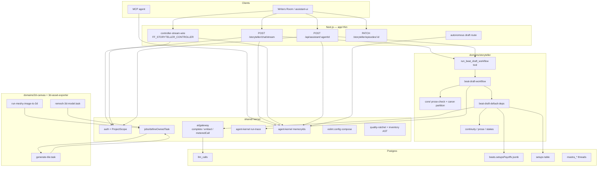

**Like you're 10.** Imagine we already live in a house. We are not building a
new house this week. We are putting stickers on the pipes so everyone knows
which one is hot water, and we are putting a free spell-checker between "write
the story" and "pay three grown-up teachers to read it."

Almost every box in the drawing already exists. This week we do not add a new
kitchen. We fix holes in the pipes we already have. The only **new** box is
the free spell-checker, sitting between "write" and "pay the teachers."

The left-ish stuff (lint, money notebook, job tickets) is the house alarm
system. It protects story writing **and** 2D tiles **and** 3D models the same
way. The story stuff (hide the twist, red circles, notebooks, Muse button) is
still the same six robots — we are not hiring new personalities this week.

If a pipe is missing from the drawing, we are not touching that pipe this week.

**Today — the workflow has no spellcheck step.** Step ids are only plan / draft /
critique / revise (`beat-draft-workflow.ts` constants):

```ts
export enum BeatDraftStepId {
  PlanBeat = 'plan-beat',
  DraftScript = 'draft-script',
  Critique = 'critique',
  Revise = 'revise',
}
```

**After — one new id, still the same agents:**

```ts
export enum BeatDraftStepId {
  PlanBeat = 'plan-beat',
  DraftScript = 'draft-script',
  ProseCheck = 'prose-check',
  Critique = 'critique',
  Revise = 'revise',
}
```

`ProseCheck` is host TypeScript. It is not a fourth critic model.

---

## 6.2 Two tracks, one exit

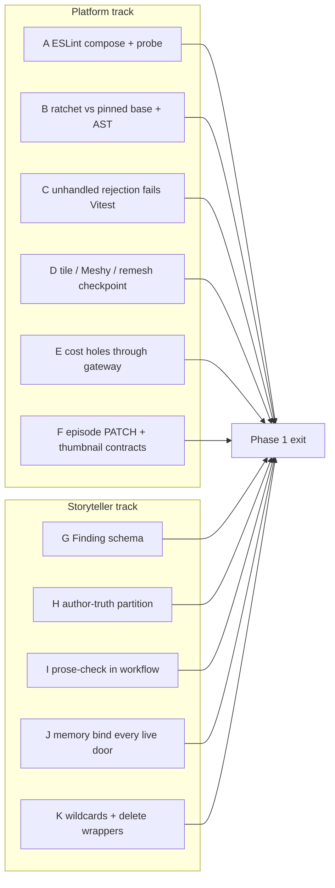

**Exit — like you're 10, this week is finished when:**

| You can see this | Which pile |
|---|---|
| A messy scene does **not** pay the three teachers | I — free spell-check |
| The writer robot never sees the butler-is-the-killer page | H — hide the twist |
| Importing the other team's code makes the hall monitor yell | A — lint actually on |
| A crashed 3D job does **not** buy a second model | D — write the ticket first |
| Deleting one teacher-robot makes a test go red | I — we still need all three |

Order, like lining up at school: **A first** (the hall monitor has to work before we
write new files). **H before I** (hide the twist before the spell-check looks for
spoiler names). **G before I** (red-circle shape exists before the spell-check
emits circles). **J helper before the four doors.** Fix real test explosions
**before** we tell the teacher to fail on explosions. D, E, F can sit beside
the story work. K is last and small (wire the Muse button, throw away empty
costumes).

**Like you're 10.** There are two piles of homework. Pile A is "make the smoke
alarms actually beep when there is fire" — lint, tests, money notebook, paid
jobs. Pile B is "make the story machine not leak the twist and not waste money
on teachers when the page is still messy." You do not get a gold star until
**both** piles are done. A nicer writing prompt does not count if the alarms
are still broken.

**Today — two tracks look optional.** You can merge a "better Author prompt"
while ESLint still does not catch `import from '@/domains/game-design'`.

**After — a probe that must fail** (this is the test, not production code):

```ts
const eslint = new ESLint()
const results = await eslint.lintText(
  `import { x } from '@/domains/game-design'\n`,
  { filePath: 'src/domains/storyteller/ai/workflows/beat-draft-workflow.ts' },
)
expect(results[0]?.messages.some(m => m.ruleId === 'no-restricted-imports')).toBe(true)
```

If that expect is false, track A is not done. Do not start writing G–K files
that "lint clean" under a dead rule.

---

## 6.3 The beat request after Phase 1

This is the product path. Chat still talks to one agent. That agent still calls one workflow
tool. The workflow still suspends for a human. What changes is **what happens between draft
and critics**, **what the Author is allowed to read**, **whether the draft is billed**, and
**whether Muse can be switched on from the tool.**

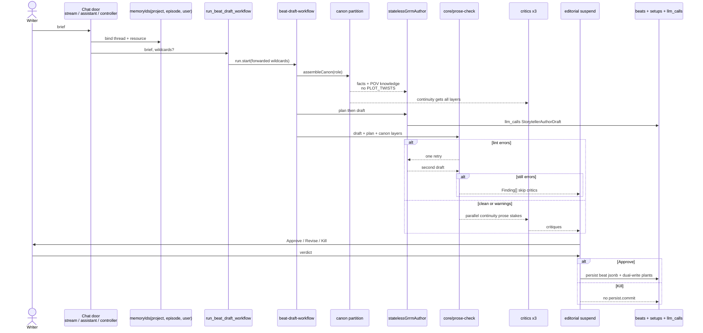

**Like you're 10.** This is still the same chat robot, the same "write a beat"
button, and a human still says yes/no/try again at the end. What changes is
the middle of the sandwich.

You write a scene. A cheap robot checks it for free (junk left in the text, a
sentence that comes from nowhere). If it is still messy, we do **not** pay
three fancy teachers to read it — we show a human the red circles. If it looks
okay, then the three teachers read it. Then a human says yes, no, or try again.
The writing robot never hits Save by itself. Save is a person's button.

There is a cheat code called `autoApprove` for tests. It is not a button in
the product. We are not adding a polish robot after Save this week.

**Today — draft goes straight to three paid critics.** The factory wires plan
then draft then critique with nothing in between (`createBeatDraftWorkflow`):

```ts
const planStep = createStep({ id: BeatDraftStepId.PlanBeat, /* … */ })
const draftStep = createStep({ id: BeatDraftStepId.DraftScript, /* … */ })
const critiqueStep = createStep({ id: BeatDraftStepId.Critique, /* … */ })
// then: plan → draft → critique → suspend
```

**After — a host step in the chain.** Errors skip critique. One Author retry
max. Then suspend with `Finding[]` if still dirty:

```ts
const proseCheckStep = createStep({
  id: BeatDraftStepId.ProseCheck,
  execute: async ({ inputData }) => {
    const findings = runProseCheck(inputData)
    const errors = findings.filter(f => f.severity === FindingSeverity.Error)
    if (errors.length === 0) return { ...inputData, findings, skipCritics: false }
    return { ...inputData, findings, skipCritics: true }
  },
})
```

`runProseCheck` is a pure function. It does not call OpenRouter.

---

## 6.4 Chat doors and memory — the notebook is a platform object

Today memory is **declared** on agent constructors and **not passed** into the live
`agent.stream()` / `handleChatStream` calls. Phase 1 treats `(thread, resource)` as part of
the platform call, like `ProjectScope` and `withGatewayContext`.

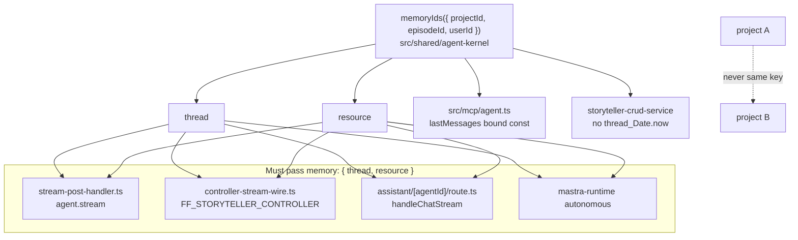

**Like you're 10.** Chat is a notebook. Every time you talk, you have to say
"this is **my** notebook, for **this** project, for **this** episode." If you
forget, the robot opens a blank notebook — or worse, someone else's. Writing
"I have a notebook" on the robot when you **build** it does not count. That is
like putting your name in the classroom and then never saying which desk is
yours when you sit down. You must point at the desk **every time** you sit.

There are four doors into chat. Binding one door and leaving the other three
loose is still broken. The helper that names the notebook lives in
`shared/agent-kernel` because MCP is a **second program** — it cannot import
storyteller. If there is no episode, use a named empty-slot (an enum), not the
same shared string for every user. The notebook holds **chat**. It does not
hold the world bible. Hiding the twist is a different trick (section 6.5).
Throwing away old notebook rows is **not** this week's job.

**Today — stream never passes memory** (`stream-post-handler.ts`):

```ts
const agent = await createStorytellerAgent()
const result = await agent.stream(promptWithContext, {
  toolChoice: STREAM_ROUTE_TEXT.toolChoiceAuto,
  traceId: input.traceId,
  requestContext,
  // no memory
})
```

Autonomous already binds (`mastra-runtime.ts`). That is the pattern to copy, not
a reason to skip the other three doors:

```ts
return getStorytellerAutonomousAgent().stream(params.prompt, {
  memory: { thread: params.threadId, resource: params.resourceId },
})
```

**Today — CRUD mints a new thread every request** (`storyteller-crud-service.ts`):

```ts
const threadId =
  validated.threadId || `thread_${Date.now()}_${Math.random().toString(36).slice(2)}`
```

That is a new notebook every time. Yesterday's chat is gone.

**After — one helper, four doors, no Date.now mint:**

```ts
export enum MemoryKeyKind {
  Thread = 'thread',
  Resource = 'resource',
}

export function memoryIds(input: {
  projectId: string
  episodeId: string | undefined
  userId: string
}): { thread: string; resource: string } {
  const episode = input.episodeId ?? MemoryEpisodeSentinel.None
  return {
    thread: `${MemoryKeyKind.Thread}:${input.projectId}:${episode}:${input.userId}`,
    resource: `${MemoryKeyKind.Resource}:${input.projectId}:${input.userId}`,
  }
}

const { thread, resource } = memoryIds({ projectId, episodeId, userId })
await agent.stream(prompt, { memory: { thread, resource }, /* … */ })
```

Helper lives in `src/shared/agent-kernel` so MCP can import it. MCP cannot import
`@/domains/storyteller`.

---

## 6.5 Canon partition — retrieval permission, not a pep talk

`assembleCanon` today dumps `sections: [All]` JSON into the Author, including
`BibleSection.PLOT_TWISTS`. A system prompt that says "don't spoil" is not a boundary.
Phase 1 splits the **payload** by **role**.

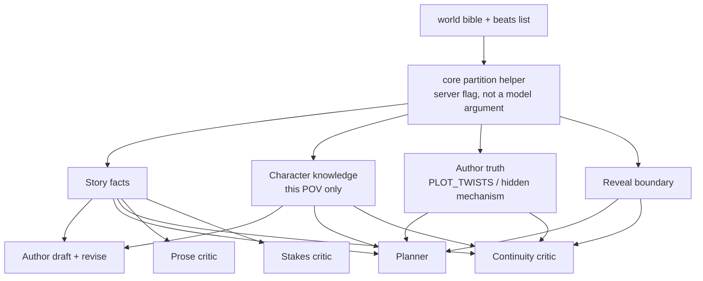

**Like you're 10.** The world bible has a secret page: the killer is the butler.
The writer robot is writing a scene **from a character's eyes**. That robot
must not be handed the secret page, or it will "accidentally" spoil the twist.
Telling it "please don't spoil" is like putting a sticky note on a present you
already unwrapped. The real fix: **do not put that page in the pile of papers
you hand the writer.**

The planner robot and the continuity teacher still get the secret page, because
they have to check the story still makes sense. The writer does **not** get
every character's secrets "just in case" — only what this point-of-view
character would know, plus the public story facts.

We are not building a new filing cabinet of "who knows what" this week. If
secrets still leak after we hide the page, that cabinet is later homework.

The spell-check later has a cheap extra lock: names that exist **only** on the
secret page, if they show up in the draft, that's a spoiler. That lock only
works if we already hid the page. That's why "hide the twist" comes before
"spell-check."

**Today — every role gets every section** (`assembleCanon` in
`beat-draft-default-deps.ts`):

```ts
const bible = await readWorldBibleTool.execute!(
  { projectId: ctx.projectId, sections: [BeatDraftWorldBibleSection.All] },
  noopCtx,
)
```

`BeatDraftWorldBibleSection.All` includes `BibleSection.PLOT_TWISTS`. The Author
reads that blob.

**After — payload split by role, not by hope:**

```ts
export enum CanonLayer {
  StoryFacts = 'story-facts',
  CharacterKnowledge = 'character-knowledge',
  AuthorTruth = 'author-truth',
  RevealBoundary = 'reveal-boundary',
}

const AUTHOR_LAYERS = [CanonLayer.StoryFacts, CanonLayer.CharacterKnowledge] as const
const PLANNER_AND_CONTINUITY_LAYERS = [
  CanonLayer.StoryFacts,
  CanonLayer.CharacterKnowledge,
  CanonLayer.AuthorTruth,
  CanonLayer.RevealBoundary,
] as const

const authorCanon = packCanon(bible, AUTHOR_LAYERS)
expect(authorCanon).not.toMatch(/PLOT_TWISTS/)
```

If a unit test can still find `PLOT_TWISTS` in the Author string, the partition
did not ship.

---

## 6.6 Prose-check — the free compiler step

This is the only new **workflow step**. It is not a chat tool. It is not a fourth critic
agent. It is host code in `src/domains/storyteller/core/prose-check/` that emits `Finding[]`.

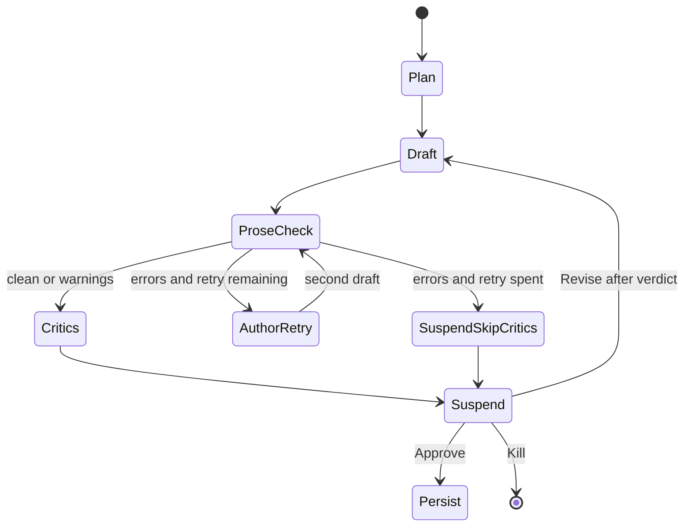

**Like you're 10.** Spell-check on a computer is free. Paying three teachers to
mark your essay is not. If the essay still has leftover junk like `***bold***`,
or a sentence that pops in with no reason, do **not** hire the teachers yet.
Let the writer try **once** more. If it is still messy, skip the teachers and
show a human the red circles. Do not loop forever until it is perfect — that
burns money, and it steals the "try again" the human was supposed to press.

This checker is a little program we own. It is not a fourth teacher-robot. It
does not call an AI. It looks for:

- a sentence with no cause (it just appears)
- a planted gun that never goes off
- leftover `***` junk, broken quotes, copy-paste garbage
- names that only exist on the secret twist page
- missing "what they did / what happened / what changed"

Red-circle **errors** skip the teachers. **Warnings** still let the teachers
run. We still have exactly three teachers on the happy path. If someone deletes
a teacher, a test must go red. If we skipped the teachers, the money notebook
must show **zero** teacher rows.

The checker must not import the evals folder (that's the exam room, not the
classroom). We copy the old exam checks into the classroom. We do not invent
new "how strict" numbers this week. The clock from last week still applies:
one timeout, 180 seconds, the human pause splits the clock.

**What the checker actually runs** (all a program, no rented brain):

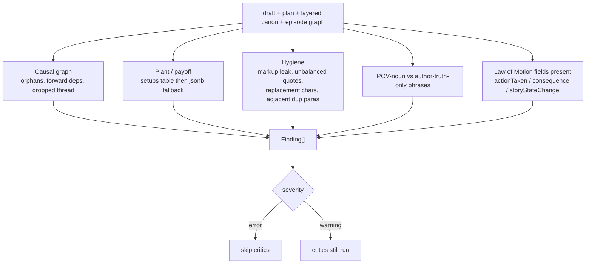

**Today — three critics always run** after draft (`BeatDraftCriticName` +
`Promise.all` in the critique step). There is no `runProseCheck`.

**After — findings first, models second:**

```ts
const findings = runProseCheck({ draft, plan, layers, episodeGraph })
const errors = findings.filter(f => f.severity === FindingSeverity.Error)

if (errors.length > 0 && retryRemaining) {
  const secondDraft = await generateAuthorDraft(promptWithFindings(findings))
  return proseCheckAgain(secondDraft, { retryRemaining: false })
}

if (errors.length > 0) {
  emitRunTrace({ type: RunTraceEventType.GateDecision, stepId: BeatDraftStepId.ProseCheck })
  return { skipCritics: true, findings }
}

await Promise.all([
  dispatchCritic(BeatDraftCriticName.Continuity),
  dispatchCritic(BeatDraftCriticName.Prose),
  dispatchCritic(BeatDraftCriticName.Stakes),
])
```

**Wrong (do not write this):**

```ts
// unbounded — burns Author tokens until clean; also steals the human Revise
.dountil(({ findings }) => findings.filter(f => f.severity === 'error').length === 0)
```

**Wrong (do not write this either):**

```ts
import { scoreCausalGraph } from '../../../../evals/structural/s1-causal-graph'
```

Domain `core/` must not import `evals/`. Copy or move the checker into
`src/domains/storyteller/core/prose-check/`. Evals may call core.

---

## 6.7 Finding — one shape for code and models

Critics today return `{ quote, why, severity: critical|major|minor }` with no location.
The compiler metaphor only works if a linter finding and a model finding are the same
object, and if "the pacing is stiff" cannot be stored.

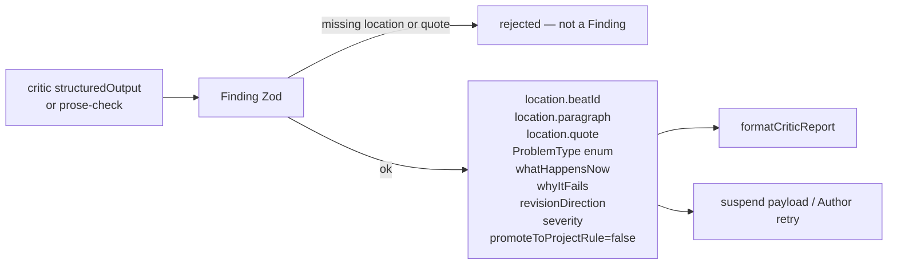

**In the system, not in a future ticket:** `promoteToProjectRule` is a boolean default
`false`. There is no `promote_rule` tool. Extra scopes `cognition` / `dialogue` are not
Agent classes this phase. The three existing critic agents stay; they share the schema.

**Like you're 10.** A finding is a red circle on a real sentence. It must say:
which beat, which paragraph, the exact words, what kind of problem it is, why
that is bad, and what to try instead. "The pacing is stiff" is not a red
circle. It is a shrug. The computer must **refuse** shrugs — if the paper
doesn't have a place and a quote, it is not a finding, full stop. The free
spell-check and the paid teachers must use the **same** red-circle shape, so a
human (and the writer robot) can read both lists the same way. There is a
checkbox called `promoteToProjectRule`. It stays off. We are not building a
"save this as a house rule" button this week.

**Today — quote + why, no place, no type** (`critic-schema.ts`):

```ts
export const CriticFindingSchema = z.object({
  quote: z.string().min(1),
  why: z.string().min(1),
  severity: z.enum(['critical', 'major', 'minor']),
})
```

This object can store `"pacing is stiff"` with no beat id and no paragraph.

**After — same shape from linter and from models:**

```ts
export enum ProblemType {
  CausalOrphan = 'causal-orphan',
  ForwardDep = 'forward-dep',
  DroppedThread = 'dropped-thread',
  PlantWithoutPayoff = 'plant-without-payoff',
  MarkupLeak = 'markup-leak',
  PovNounLeak = 'pov-noun-leak',
  LawOfMotionMissing = 'law-of-motion-missing',
  ContinuityBreak = 'continuity-break',
  ProseIssue = 'prose-issue',
  StakesIssue = 'stakes-issue',
}

export const FindingSchema = z.object({
  location: z.object({
    beatId: z.string().min(1),
    paragraph: z.number().int().nonnegative(),
    quote: z.string().min(1),
  }),
  problemType: z.nativeEnum(ProblemType),
  whatHappensNow: z.string().min(1),
  whyItFails: z.string().min(1),
  revisionDirection: z.string().min(1),
  severity: z.nativeEnum(FindingSeverity),
  promoteToProjectRule: z.boolean().default(false),
})
```

**This is not a Finding (must parse-fail):**

```ts
FindingSchema.parse({
  quote: 'the pacing is stiff',
  why: 'it feels slow',
  severity: 'minor',
})
```

No `promote_rule` tool. `promoteToProjectRule` stays `false` unless a later
phase builds promotion.

---

## 6.8 Persist — two stores, one job each

This is the place an earlier spec over-simplified. `setupsPayoffs` jsonb is **not** a
dead duplicate of `setups`.

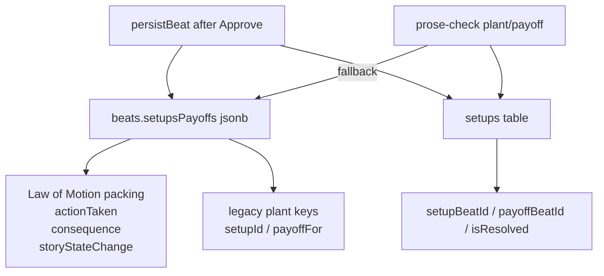

**Do not `DROP` jsonb.** `packSetupsPayoffs` in `beat-tool-operations.ts` is live persist
for the planner's Law of Motion fields. Deleting it breaks the board and the
concreteness story. Phase 1 **dual-writes new plants** into `setups`. The linter prefers
the table. Action fields stay in jsonb until they have their own home (not this phase).

**Like you're 10.** Imagine two boxes on the desk, with two different jobs.

Box 1 (`setupsPayoffs` jsonb) is "what the character **did**, what happened
because of it, and how the story world changed." The storyboard needs that.
Box 2 (`setups` table) is "we planted a gun in scene 1 — it should go off
later."

An old spec said "throw box 1 in the trash, we have box 2." That is wrong.
Throwing box 1 away blanks the "what they did" notes. This week we **copy new
plants into box 2** so the spell-check can look them up easily. We still write
box 1. The spell-check looks in box 2 first, and only peeks in box 1 if box 2
is empty.

**Today — persist packs motion into jsonb only** (`packSetupsPayoffs` +
`persistBeat`):

```ts
export function packSetupsPayoffs(
  setupsPayoffs: BeatData['setupsPayoffs'],
  action: ActionFields,
) {
  return { ...(setupsPayoffs ?? {}), ...action }
}

// persistBeat → manageBeatTool create:
data: {
  logline: plan.goal,
  content: finalDraft,
  actionTaken: plan.goal,
  consequence: plan.conflict,
  storyStateChange: plan.turn,
}
```

No insert into `setups`. The linter would have to scrape jsonb.

**Wrong (do not write this):**

```sql
ALTER TABLE beats DROP COLUMN setups_payoffs;
```

That column is where Law of Motion lives. Dropping it blanks the board.

**After — same jsonb write, plus a plant row:**

```ts
await db.update(beats).set({
  setupsPayoffs: packSetupsPayoffs(data.setupsPayoffs, {
    actionTaken,
    consequence,
    storyStateChange,
  }),
})

if (newPlant) {
  await db.insert(setups).values({
    projectId,
    setupBeatId: persisted.beatId,
    payoffBeatId: null,
    isResolved: false,
  })
}
```

Linter reads `setups` first, jsonb only as fallback.

---

## 6.9 Cost ledger — every paid call on this path, or a named hole

Phase 0 put `totalUsage` and assistant `withGatewayContext` in place. Phase 1 closes the
remaining **named** holes on the graph. Eval scorers stay off `llm_calls` (ADR 0003).

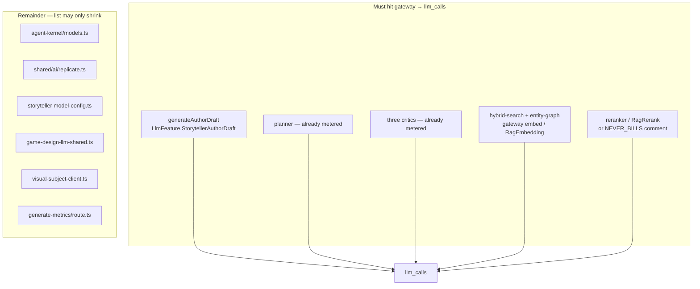

**Unpriced model.** Still "we don't know," never a successful `$0`. The Phase 2 eval
comparison "skipped ≠ zero" is not this chapter.

**Like you're 10.** Every time we rent an AI brain, we are supposed to write it
in a money notebook (`llm_calls`). If we skip the notebook, the bill looks
smaller than it really is — that is lying to ourselves. Right now the **writer**
robot talks to the brain without writing in the notebook. The planner and the
teachers already write it down. The writer must too. Same for "turn this
question into numbers so we can search" (embeddings) — that also costs money.

One more rule: if we do not know the **price** of a brain, we must stop and say
"we don't know." We must not write `$0` and pretend it was free. Zero means
"we priced it and it was free," not "we shrugged."

**Today — Author generate bypasses the gateway** (`generateAuthorDraft`):

```ts
const response = await Promise.race([
  statelessGrrmAuthor.generate(hardened, {
    toolChoice: BeatDraftToolChoice.None,
    maxSteps: 1,
  }),
  timeout,
])
```

Planner and critics already go through `meteredCall`. Author does not. Spend
dashboards lie.

**Today — RAG embed is also a hole** (`hybrid-search.ts`):

```ts
const queryEmbedding = await this.embeddings.embedQuery(query)
```

That is a paid embedding with no `llm_calls` row.

**After — wrap the Author (and embed) the same way as the planner:**

```ts
const response = await meteredCall(
  { feature: LlmFeature.StorytellerAuthorDraft, scope: projectScope },
  () =>
    statelessGrrmAuthor.generate(hardened, {
      toolChoice: BeatDraftToolChoice.None,
      maxSteps: 1,
    }),
)
```

If a model has no price in the table, this throws. It does not insert `$0`.

---

## 6.10 Paid jobs — checkpoint is a state machine

Submission nonce (SPEC-14) stops a **second submit**. It does not stop a **retry after the
provider already created work**. Phase 1 adds an explicit state on the Trigger run.

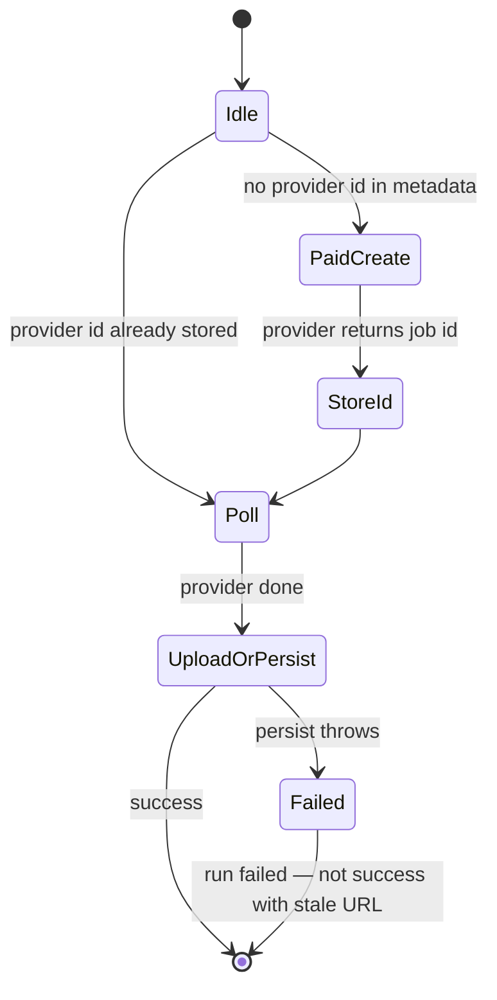

**Surfaces (and no others this phase):**

| Task | File | Failure today |
|---|---|---|
| Tile generate | `2d-canvas/tasks/generate-tile.task.ts` `maxAttempts: 3` | Paid generate then upload; retry re-generates |
| Meshy image-to-3d | `3d-asset-exporter/tasks/lib/run-meshy-image-to-3d.ts` | Writes `meshyTaskId` after POST; never reads at start; persist swallows DB errors |
| Remesh | `remesh-3d-model.task.ts` `maxAttempts: 1` | Stopgap. Replace with the same checkpoint |

Not in this graph: `text-to-3d`, `retexture`, `surface-material`, Loop Creator jobs. Do not
"while we're here" them.

Keep `defineOwnedTask`. If `persistMeshyModelUrl` is edited, that one `supabaseAdmin` site
becomes `serviceRoleClient(reason)` — not a burn-down of 23 service-role call sites.

**Like you're 10.** You order a 3D model from a shop. The shop gives you a
ticket number. If our computer crashes **after** we ordered but **before** we
wrote the ticket down, it will order **again** when it wakes up. We pay twice
for the same model. So: write the ticket number down **first**. If we crash and
try again, look at the ticket and **wait for that order**. Do not buy a second
one.

Same story for a map tile picture: generate (paid) then upload (can fail). If
upload fails and we retry the whole job, we generate again — second bill.

If saving the finished file into our folder fails, that must count as **fail**,
not a fake success with a leftover old file. We are only fixing tile generate,
Meshy image-to-3d, and remesh this week. Not every other 3D button.

**Today — Meshy POSTs first, stores id after, swallows DB errors:**

```ts
const createResponse = await fetch(MeshyGenerationApiUrl.OpenApiImageTo3d, { method: HttpMethod.Post, /* … */ })
const taskId = readRowString(createJson, MeshyResponseField.Result)
await metadata.set(MeshyGenerationMetadataKey.MeshyTaskId, taskId)

await persistMeshyModelUrl(assetId, result)

async function persistMeshyModelUrl(/* … */) {
  try {
    await supabaseAdmin.from(DB_TABLE.ASSETS).update({ /* url */ }).eq(DB_COLUMN.ID, assetId)
  } catch (dbErr) {
    logger.error(MeshyGenerationLog.DbUpdateFailed, { dbErr })
    // run still succeeds — URL is gone
  }
}
```

If the process dies after POST and before `metadata.set`, retry POSTs again.
If persist throws, the run looks successful with a stale URL.

**Today — tile gen retries the paid generate** (`generate-tile.task.ts`):

```ts
retry: { maxAttempts: 3 },
run: async payload => {
  const generatedImageBase64 = await generateTileImage(/* … */)
  const { filename, newUrl } = await uploadTileToBlob(projectId, x, y, generatedImageBase64)
}
```

Upload can fail after the provider already billed. Attempt 2 generates again.

**After — read checkpoint, then maybe create:**

```ts
const existingId = await metadata.get(MeshyGenerationMetadataKey.MeshyTaskId)
if (typeof existingId === 'string' && existingId.length > 0) {
  return pollExisting(existingId)
}

const taskId = await createMeshyTask(/* … */)
await metadata.set(MeshyGenerationMetadataKey.MeshyTaskId, taskId)
const result = await pollExisting(taskId)
await persistMeshyModelUrl(assetId, result) // throw on DB error — do not catch-and-succeed
```

Do not add `text-to-3d` / `retexture` "while we are here."

---

## 6.11 Episode PATCH — one contract, executed

The 3D exporter pattern (schema → mapper → domain type) is the **pilot**, not a flood of
86 routes.

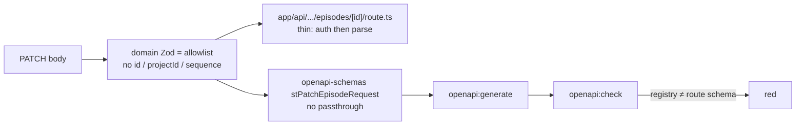

Today the allowlist lives under `app/api/.../constants/episode-patch.ts` (wrong layer) and
OpenAPI is four optional fields plus `.passthrough()`. Phase 1 moves the allowlist to
`domains/storyteller/core` (or `contracts/`). The route does not shape UPDATE maps by
hand. Extra keys strip. Reparent is still forbidden.

**Like you're 10.** There is a form for changing an episode: title, poster, and
a few other boxes. The instructions (OpenAPI) should match the real form the
server uses. Right now they don't. The instructions show four boxes and then
say "also we will accept anything else you sneak in." Sneaking in `projectId`
is how you **move an episode into someone else's project**. That is stealing.

Fix: one list of allowed boxes, in the storyteller domain, used by the route
**and** the docs. Extra boxes get thrown away. You cannot change `id`,
`projectId`, or `sequence`. The route should not hand-build the database update
from leftover keys.

**Today — two contracts.** The route allowlist is under `app/`
(`episode-patch.ts`):

```ts
export const EPISODE_PATCH_ALLOWED_COLUMNS = [
  'title', 'summary', 'premise', 'thematicFocus', 'scriptContent',
  'masterPrompt', 'currentPhase', 'status', 'posterUrl', 'posterPrompt',
  'storyPlan', 'planApproved', 'tenPointsPlan',
] as const
```

OpenAPI is four fields plus a hole (`openapi-schemas.ts`):

```ts
export const stPatchEpisodeRequest = z
  .object({
    title: z.string().optional(),
    masterPrompt: z.string().optional(),
    posterUrl: z.string().optional(),
    premise: z.record(z.unknown()).optional(),
  })
  .passthrough()
```

`.passthrough()` means `projectId` in the body is "documented as allowed."

**After — one Zod in the domain, route only parses:**

```ts
export const episodePatchSchema = z.object({
  title: z.string().optional(),
  summary: z.string().optional(),
  // …same keys as EPISODE_PATCH_ALLOWED_COLUMNS, no id / projectId / sequence
})

export const stPatchEpisodeRequest = episodePatchSchema
  // no .passthrough()

export async function PATCH(req: NextRequest, ctx: { params: { episodeId: string } }) {
  await requireAuth()
  const body = episodePatchSchema.parse(await req.json())
  return domainPatchEpisode(ctx.params.episodeId, body)
}
```

`openapi:check` fails if registry Zod ≠ this schema.

---

## 6.12 Thumbnail — two domains, no import between them

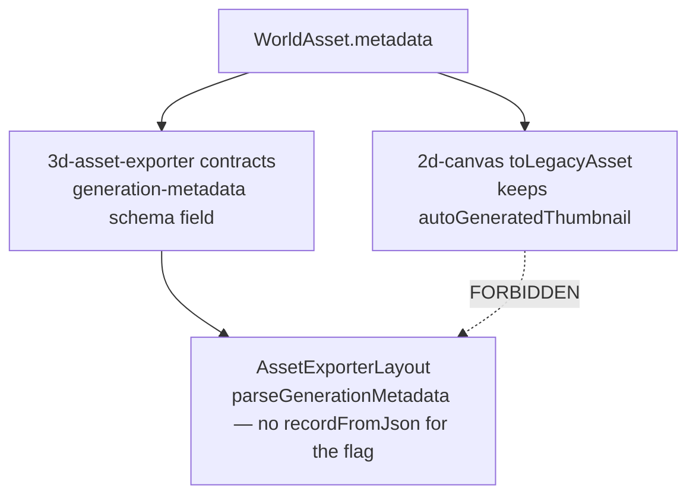

`@/domains/3d-asset-exporter` must not import `@/domains/2d-canvas`. Shared kernel does
not import either. Verification is the mapper unit test, not a browser.

**Like you're 10.** The 2D drawing room and the 3D model room are not allowed to
borrow each other's toys. There is a little flag that means "this picture is a
fake placeholder, not a real thumbnail." 3D currently rummages in a messy bag
of leftovers to find that flag. 2D even **drops** the flag when packing the
bag, so the flag often isn't there.

Each room must pack the flag in **its own** box. 3D must not `import` 2D. We
prove it with a unit test, not by clicking around in the browser.

**Today — 3D UI reads a raw json key** (`AssetExporterLayout.tsx`):

```ts
isPlaceholderImage={
  recordFromJson(selectedAsset.metadata).autoGeneratedThumbnail === true
}
```

2D's `toLegacyAsset` also **drops** that key: `Asset['metadata']` only types
`bounds` and `box`, so the flag never arrives in the 3D shape even if 2D had it.

**After — typed field on each side, no cross-domain import:**

```ts
export type Asset = {
  metadata: {
    bounds?: { x: number; y: number; width: number; height: number }
    box?: { x1: number; y1: number; x2: number; y2: number }
    autoGeneratedThumbnail?: boolean
  }
}

legacyMetadata.autoGeneratedThumbnail = metadata.autoGeneratedThumbnail === true

isPlaceholderImage={parseGenerationMetadata(selectedAsset.metadata).autoGeneratedThumbnail === true}
```

**Wrong:**

```ts
import { toLegacyAsset } from '@/domains/2d-canvas'
```

That import is a lint error on purpose. 3D owns `generation-metadata.schema.ts`.

---

## 6.13 Gates as platform — compose, ratchet, unhandled

These are not "tooling chores." They are how the rest of this chapter stays true after
the PR merges.

### ESLint last-write-wins

Flat config **replaces** `no-restricted-imports` options. Nine blocks, later provider-SDK
`src/**` overwrites the cross-domain ban. Blast radius is currently zero. Phase 1 still
fixes it because the next storyteller file can walk through the open door.

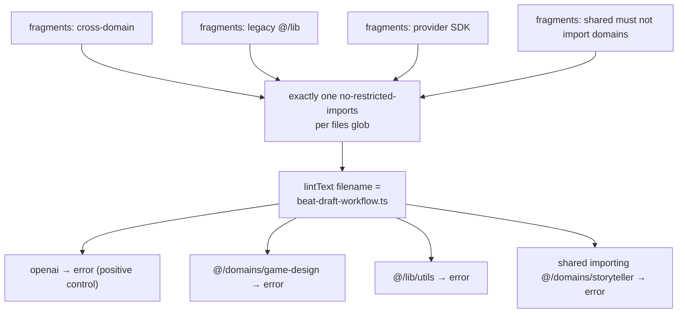

**Like you're 10.** The linter is a hall monitor with a list of "don't do this."
In this kind of config, if you pin **two** lists on the same classroom door,
the **second** list throws the first one in the trash. So we might think "don't
import the other team's code" is on — and it isn't. Someone can import
game-design from storyteller and the hall monitor smiles.

Fix: glue the lists into **one** list per group of files. Then a test that
tries the bad import on purpose, using a **real filename**, and checks the
alarm still rings. Do not turn rules off. Do not drop the older "don't call
`getSession` on app routes" rule. The leftover-allow lists may only get
shorter.

**Today — last block for a glob can drop earlier bans.** Simplified picture
(do not copy as a patch; the real file has more globs):

```js
{
  files: ['src/domains/storyteller/**/*.{ts,tsx}'],
  rules: { 'no-restricted-imports': ['error', composeRestrictedImports(crossDomain('storyteller'))] },
},
{
  files: ['src/**/*.{ts,tsx}'],
  rules: { 'no-restricted-imports': ['error', { paths: PROVIDER_SDK_RESTRICTED_PATHS }] },
}
```

If the second glob matches the first file, cross-domain is gone. `import from
'@/domains/game-design'` looks clean.

**After — one options object:**

```js
'no-restricted-imports': [
  'error',
  composeRestrictedImports(crossDomain(domain), legacyRoot(), providerSdk(), projectAccess()),
]
```

Probe with `lintText` + a **real filename** (see 6.2). Do not commit a
storyteller file that imports game-design.

**Do not drop** Phase 0 `getSession` syntax on app routes. Remainder lists
shrink only.

### Ratchet vs a previous tree

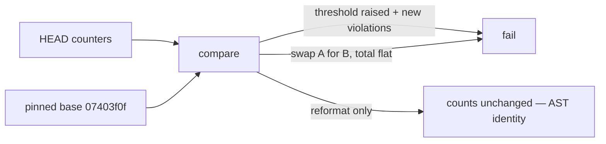

Seven honor-system counters (`_commands` greps with no Vitest consumer) get a checker or
are deleted. `evalSkipCommits` too. Line-of-text inventory becomes module+symbol+kind.

**Like you're 10.** There is a scoreboard of "how many messes we still have"
(23 leftover admin keys, 1148 untyped JSON reads, …). If that scoreboard is
just a number someone typed in a file, you can change 23 to 24 and nobody
notices. That is a diary, not a referee.

A real referee **counts the messes in the code**, compares to a photo of last
week's code (a pinned git commit), and fails if you made **more** messes.
Renaming a function without deleting the mess should **not** change the count
— we count the real mess, not the letters. Swapping mess A for a brand-new
mess B but keeping the same total must still fail. You can't "trade" messes.

**Today — honor-system numbers** (`.quality-ratchet.json`):

```json
{
  "serviceRoleClientSites": 23,
  "evalSkipCommits": 0,
  "untypedJsonReads": 1148
}
```

`_commands` greps exist. Most have no Vitest consumer. You can raise 23 to 24
and CI still smiles.

**After — compare HEAD to a pinned SHA, identity is AST not text:**

```ts
const head = countServiceRoleSites(treeAt('HEAD'))
const base = countServiceRoleSites(treeAt('07403f0f'))
expect(head).toBeLessThanOrEqual(base)
expect(head).toBe(ratchet.serviceRoleClientSites)
```

Renaming a function without deleting the call must **not** change the count
(AST). Swapping violation A for new violation B with a flat total must **fail**.

### Unhandled rejection

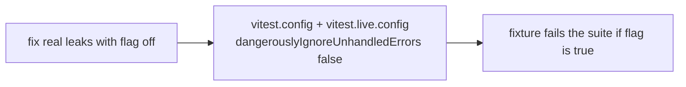

No coverage percentages. Do not flip C2 while C1 is red.

**Like you're 10.** Tests are a teacher watching homework. Sometimes a promise
explodes in the corner of the room and nobody is looking. Today we told the
teacher: "ignore explosions in the corner." That is how leaks hide. A test can
still get a gold star while something is on fire.

First we find and fix the real explosions (with the ignore-flag still on, so
we can see them one by one). **Then** we tell the teacher to fail the class if
anything explodes with no one catching it. Do not flip that switch while the
room is still on fire.

**Today** (`vitest.config.ts`):

```ts
dangerouslyIgnoreUnhandledErrors: true,
```

A test can `fetch()` without await, the assertion still passes, the leak is
real in production.

**After — fix leaks first, then:**

```ts
dangerouslyIgnoreUnhandledErrors: false,
```

A fixture that `Promise.reject`s with no listener must fail the suite. Same
flag in `vitest.live.config.ts`. Do not flip the flag while C1 is still red.

---

## 6.14 Muse reachability and dead wrappers

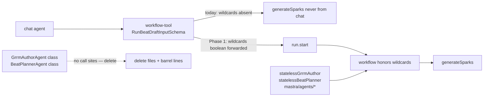

No new `brainstorm` chat tool. No `@mention` specialist router. Keep `*AgentId` enums and
file-based agents. No `z.any()` on the touched schema. No `commit_beat`.

**Like you're 10.** Muse is a "give me wild ideas" button. The story machine
already knows how to press it **if** you pass `wildcards: true`. The chat tool
never sends that checkbox — so the button is on the wall with **no wire**.
Chat cannot turn Muse on.

Also: there are leftover class files (`GrrmAuthorAgent`, `BeatPlannerAgent`)
that nobody actually calls. They are empty costumes. Delete the costumes. Keep
the live robots (`statelessGrrmAuthor`, `statelessBeatPlanner`, and the files
under `src/mastra/agents/`). Do not invent a whole new chat command called
`brainstorm`. Do not add `z.any()`. Do not add a `commit_beat` tool.

**Today — schema has no wildcards, start does not forward them**
(`workflow-tool.ts`):

```ts
const RunBeatDraftInputSchema = z.object({
  projectId: z.string().min(1).optional(),
  episodeId: z.string().min(1).optional(),
  brief: z.string().min(1),
  characters: z.array(z.string()).optional(),
  autoApprove: z.boolean().optional(),
})

await run.start({
  inputData: {
    projectId,
    episodeId,
    brief: inputData.brief,
    characters: inputData.characters ?? [],
    autoApprove: inputData.autoApprove ?? false,
  },
})
```

The workflow already does `inputData.wildcards ? generateSparks(...) : []`. Chat
cannot set the flag.

**Today — barrel still exports unused classes** (`ai/index.ts`):

```ts
export { GrrmAuthorAgent, createGrrmAuthorAgent } from './agents/GrrmAuthor/grrm-author-agent'
export { BeatPlannerAgent, createBeatPlannerAgent } from './agents/BeatPlanner/beat-planner-agent'
```

Live path uses `statelessGrrmAuthor` / `statelessBeatPlanner` from
`src/mastra/agents/*`.

**After:**

```ts
const RunBeatDraftInputSchema = z.object({
  // …existing fields
  wildcards: z.boolean().optional(),
})

await run.start({
  inputData: {
    projectId,
    episodeId,
    brief: inputData.brief,
    characters: inputData.characters ?? [],
    autoApprove: inputData.autoApprove ?? false,
    wildcards: inputData.wildcards ?? false,
  },
})
```

Delete the class files and those two barrel lines. Grep must find zero
`createGrrmAuthorAgent(` call sites. Do not add a `brainstorm` chat tool.

---

## 6.15 What is not on these graphs

If it is not drawn above, it is out of Phase 1. Listed so a later assistant cannot "complete"
this chapter by building them.

| Not in Phase 1 | Why it is absent from the diagrams |
|---|---|
| Humanizer after verdict | Phase 2. Would add a box after Approve |
| Catalog L1/L2 skill bodies | Phase 2. Disclosure is not this compiler |
| `psychology` moved to Planner | Phase 2, after pack-on vs pack-off |
| Knowledge ledger tables | Phase 4 if partition fails |
| `cognition` / `dialogue` critic scopes | Phase 4 ablation |
| `read_canon` / `run_prose_check` as chat tools | Linter is a workflow step |
| `/api/assistant` domain-agnostic host | Phase K, after this phase, before Humanizer |
| One SSE vs AI-SDK wire merge | Phase K |
| `drizzle-kit` drift CI, 409 optimistic lock, RLS user-B tests | Appendix 33–35, not this phase |
| Playwright / browser | evaluation.md §9.1 |
| Drop `setupsPayoffs` | Would delete Law of Motion packing |
| Extra Meshy/tile tasks | Out of the D graph |

**Like you're 10.** If it is not in the drawings above, it is **not this week's
homework**. A later helper will want to "finish" the chapter by adding a polish
robot after Save, or extra teacher types, or deleting box 1. That is next
week's (or later) class. Doing it now is extra credit in the **wrong** subject.

**Wrong "helpful" patches (do not ship in Phase 1):**

```ts
await humanizer.polish(finalDraft)

import { read_canon } from './chat-tools'

z.object({ modifications: z.any() })

await db.query.mastraThreads.findMany({ where: olderThan(30) }).then(deleteAll)
```

Those belong to Humanizer, chat-tooling, game-design resume, and memory shred
— other phases.

---

## 6.16 The system, one more time, as data flow

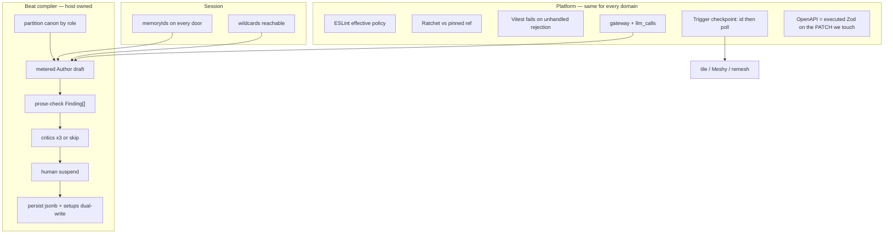

That is the whole phase. Gates on the left so the compiler in the middle cannot quietly
rot. Session keys so the compiler is not a goldfish with the wrong neighbour's memories.
Jobs on the side so a failed blob upload does not buy a second 3D model.

**Like you're 10.** Look at the drawing one more time, slowly.

Left column is the smoke alarms: lint, scoreboard, tests that catch explosions,
the money notebook, "don't buy the 3D model twice," one form for episode PATCH.

Middle is the story factory: hide the twist from the writer, pay for the
writer, free spell-check, maybe pay three teachers, a human says yes, save
**both** boxes.

Top is whose notebook we opened.

Side is the picture/3D jobs: write the ticket down first.

That is the whole week. Nothing else.

**The whole path as one function (contract, not a file to paste):**

```ts
async function phase1BeatTurn(input: BeatTurnInput) {
  const memory = memoryIds(input)
  await bindChatDoor(input.door, memory)

  const layers = partitionCanon(input.bible, CanonRole.Author)
  const draft = await meteredCall(
    { feature: LlmFeature.StorytellerAuthorDraft, scope: input.scope },
    () => generateAuthorDraft(layers),
  )

  const findings = runProseCheck({ draft, plan: input.plan, layers })
  const critiques =
    findings.some(f => f.severity === FindingSeverity.Error)
      ? []
      : await runThreeCritics(draft)

  const verdict = await suspendForHuman({ draft, findings, critiques })
  if (verdict.action === BeatDraftVerdictAction.Approve) {
    await persistBeatJsonbAndSetups(draft, input.plan)
  }
}
```

If any line above is missing in the implementation, that graph is unfinished.

---

## 6.17 File map (where the arrows land)

| Concern | Path |
|---|---|
| ESLint compose | `eslint.config.js`, `eslint-rules/`, `scripts/__tests__/eslint-effective-config.test.ts` |
| Ratchet / AST | `.quality-ratchet.json`, `scripts/inventory/index.mjs`, `scripts/__tests__/*inventory*` |
| Unhandled | `vitest.config.ts`, `vitest.live.config.ts` |
| Tile checkpoint | `src/domains/2d-canvas/tasks/generate-tile.task.ts` |
| Meshy / remesh | `src/domains/3d-asset-exporter/tasks/lib/run-meshy-image-to-3d.ts`, `remesh-3d-model.task.ts` |
| Author meter | `beat-draft-default-deps.ts`, `src/shared/ai/gateway/constants/llm-call.ts` |
| RAG / rerank | `src/shared/ai/rag/hybrid-search.ts`, `reranker.ts`, `entity-graph-service.ts` |
| Episode PATCH | move `episode-patch` into `src/domains/storyteller/core/`, `openapi-schemas.ts`, thin route |
| Thumbnail | `world-types.ts` `toLegacyAsset`, `generation-metadata.schema.ts`, `AssetExporterLayout.tsx` |
| Finding | `critic-schema.ts`, critic `instructions.md` |
| Partition | `src/domains/storyteller/core/` helper, `assembleCanon` |
| Prose-check | `src/domains/storyteller/core/prose-check/`, `beat-draft-workflow.ts` |
| Setups dual-write | persist path + `core-tables.ts` `setups`; **keep** `packSetupsPayoffs` |
| Memory | `src/shared/agent-kernel` helper; four doors; `src/mcp/agent.ts`; crud service |
| Wildcards | `workflow-tool.ts` schema + `run.start` |
| Wrappers | delete class files; keep `src/mastra/agents/grrm-author` and `beat-planner` |

Each row is one "after" snippet earlier in this chapter. If the file still
matches the "today" fence, that slice is not done.

---

## 6.18 How to verify this chapter against the tree

When implementation starts, each graph is a test, not a slide.

**Like you're 10.** "Done" does **not** mean you clicked around in the app and
it looked fine. "Done" means a test on the computer turns **red** if you undo
the fix. If the "after" snippet is still not true of the code, that slice is
not done. Opening localhost does not count — we are not allowed to "just
check" in the browser for this phase.

**What a failing-then-green test looks like** (lint-skip path, 6.3 / 6.6):

```ts
it('skips critics when prose-check still has errors after one retry', async () => {
  const deps = stubDeps({
    draft: DIRTY_DRAFT,
    retryDraft: STILL_DIRTY_DRAFT,
  })
  const result = await runBeatDraftOnce(deps)
  expect(deps.dispatchCritic).not.toHaveBeenCalled()
  expect(criticLlmCallCount()).toBe(0)
  expect(result.skipCritics).toBe(true)
})
```

1. **6.3 / 6.6** — stubbed workflow: lint-error fixture → zero critic dispatches, Author
   `llm_calls` may be 1–2, critic `llm_calls` = 0.
2. **6.5** — assembly unit test: Author payload has no `PLOT_TWISTS`; continuity payload
   does.
3. **6.4** — each of the four doors' tests assert `memory.thread` and `memory.resource`.
4. **6.10** — mocked fetch: second attempt does not POST create.
5. **6.13** — `calculateConfigForFile` on `beat-draft-workflow.ts`; delete a fragment →
   named test red.
6. **6.11** — `openapi:check` red if registry and route Zod diverge for episode PATCH.
7. **6.12** — no `@/domains/2d-canvas` in 3d-asset-exporter; thumbnail round-trip test.
8. **6.8** — persist still writes Law of Motion into jsonb; new plant also in `setups`.
9. **6.14** — tool input with `wildcards: true` reaches `generateSparks`; grep has no
   `createGrrmAuthorAgent` call sites.

10. **6.9** — Author `generate` goes through `meteredCall`; a fixture draft
    inserts `llm_calls` with `LlmFeature.StorytellerAuthorDraft`.

No graph in this chapter is accepted by opening the app. That is a platform rule for this
phase, not a shortcut.
