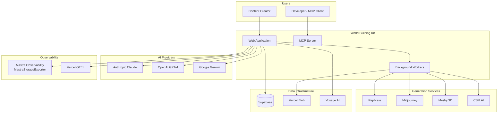
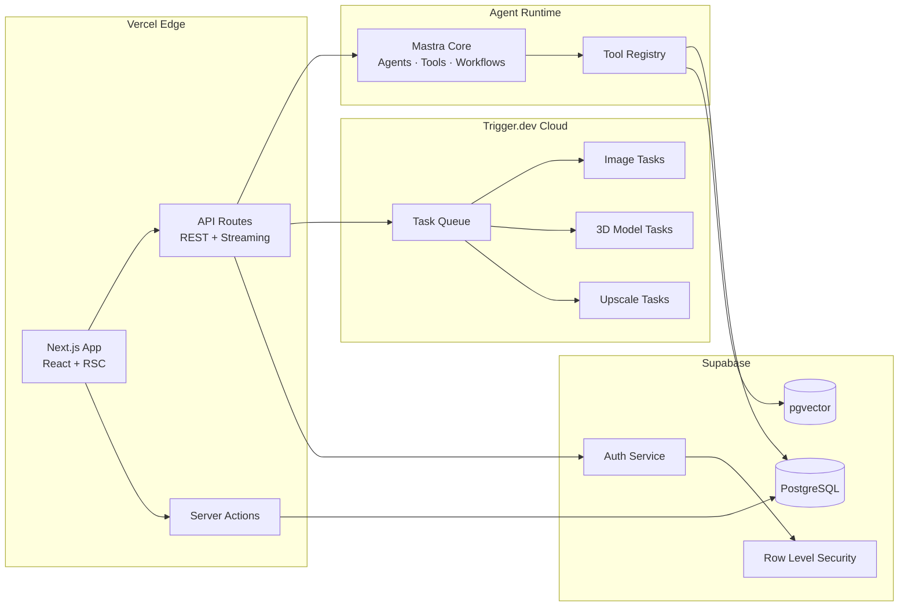
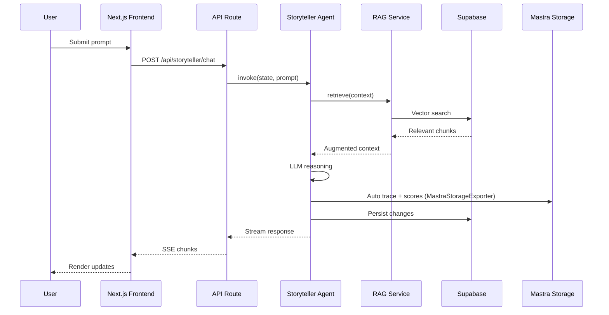

# System Architecture

> World Building Kit — A multi-agent creative production platform.

## Overview

The system follows a **layered architecture** with clear separation of concerns:

1. **Presentation Layer**: Next.js 15 with React Server Components
2. **Application Layer**: API Routes, Server Actions, Real-time handlers
3. **Domain Layer**: Multi-agent orchestration (**Mastra v1** — agents, tools, workflows)
4. **Infrastructure Layer**: External services, databases, AI providers

### Target module architecture

Every feature module under `src/domains/<module>/` follows the blueprint in
[docs/unified/ARCHITECTURE.md](unified/ARCHITECTURE.md) §4 (`ui/`, `state/`, `io/`,
`core/`, `services/`, `agents/`, `tasks/`, plus a root `index.ts` public barrel).
Implementation sequencing and acceptance criteria live in
[docs/unified/SPEC.md](unified/SPEC.md). Conformance is enforced by
`src/domains/__tests__/domain-structure.test.ts` and ESLint barrel-import rules.

### `src/` topology (7 folders)

| Folder | Role |
|--------|------|
| `app/` | Next.js routes, API glue, `_shell/` app chrome |
| `domains/` | Feature modules (blueprint §4) |
| `shared/` | Cross-module code (`agent-kernel`, `ai`, `data`, `auth`, …) |
| `components/` | Radix/CVA design system — flat PascalCase folder per primitive (+ `shell/`) |
| `db/` | Drizzle schema + client |
| `trigger/` | Task registry + shared task helpers |
| `mcp/` | MCP server (separate deployable) |

`src/mastra.ts` is the Mastra Studio CLI entry; `src/mastra/index.ts` is a one-file shim for `mastra dev`/`build`.

Dev-time eval harness lives in top-level `evals/` (excluded from app `tsconfig`).
Static legal copy lives in `src/domains/marketing/legal/` (served at `/terms` and `/privacy`).
Structure is enforced by `src/__tests__/structure.test.ts` and `src/__tests__/src-topology.ts`.

### TypeScript & ESLint (strict)

- **`tsconfig.json`**: `strict: true` (includes `noImplicitAny` — implicit `any` is a compile error).
- **`eslint.config.js`** (see also `.cursor/rules/eslint-boundaries.mdc`):
  - `@typescript-eslint/strict` + `@typescript-eslint/no-explicit-any`: **`error`**
  - `@typescript-eslint/consistent-type-assertions`: **`error`**, `assertionStyle: 'never'` (`as const` only)
  - **Cross-domain isolation**: `src/domains/<A>` must not import `@/domains/<B>` — use `@/shared`
  - Barrel guards for non-domain code importing domain internals
  - Shared deep merge: `@/shared/data/deep-merge` (`deepMerge`, `deepMergeRecords`, `recordFromJson`)
- **Style preference:** magic string protocol values → TypeScript **`enum`**, not `as const` object maps
- **Pre-commit**: staged-file ESLint via `scripts/pre-commit-lint.mjs`; full repo: `npm run lint` / `npm run check:lint`.
- Legacy files may still use `@ts-nocheck` during migration; new code must not add `any`, `as` casts, or cross-domain imports.

---

## System Context Diagram

This shows how the system interacts with external actors and services.



---

## Container Diagram

Shows major deployable units and their interactions.



---

## Data Flow Diagram

Shows how data moves through the system for a typical agent interaction.



---

## Third-Party Services

| Category | Service | Purpose | Integration |
|:---------|:--------|:--------|:------------|
| **Hosting** | Vercel | Frontend, APIs, Edge Functions | `@vercel/otel`, Blob Storage |
| **Compute** | Trigger.dev | Background jobs, retries | `@trigger.dev/sdk` |
| **Database** | Supabase | PostgreSQL + pgvector + Auth | `@supabase/supabase-js` |
| **LLM** | Anthropic | Primary agent reasoning | `@ai-sdk/anthropic` |
| **LLM** | OpenAI | Alternative models, embeddings | `@ai-sdk/openai` |
| **LLM** | Google | Gemini for specific tasks | `@ai-sdk/google` |
| **Embeddings** | Voyage AI | High-quality embeddings (voyage-3) | Custom client |
| **Images** | Replicate | Flux, SD, LoRAs | `replicate` |
| **Images** | Midjourney | Hero assets | Proxy API |
| **3D Models** | Meshy | Text-to-3D | REST API |
| **3D Models** | CSM | Image-to-3D | REST API |
| **Observability** | Mastra | AI tracing, scores (Postgres-backed) | `@mastra/observability`, `MastraStorageExporter` in `create-mastra.ts` |
| **Evals** | Mastra scorers | Offline + live quality gates | `createScorer` in `src/shared/agent-kernel/scorers/`; harness in `evals/` |

---

## Core Patterns

### 1. Confidence & Evaluation

Every agent decision includes a self-reported confidence score (0-1). This enables:

- **Filtering**: Query "decisions with confidence < 0.7"
- **Audit**: Mastra AI traces persisted via `MastraStorageExporter` (same Postgres as agent memory)
- **Improvement**: Mastra `createScorer` judges in `src/shared/agent-kernel/scorers/`; batch runs via `npm run eval`

### 2. RAG Pipeline

```
Query → Expansion → Hybrid Search → Rerank → Cite
         ↓              ↓             ↓
    Sub-queries    Vector + BM25   Cross-encoder
```

- **Voyage AI** embeddings for semantic similarity
- **Postgres FTS** for keyword matching
- **Citation tracking** prevents hallucinations

### 3. Async Worker Pattern

```
Frontend → API → Trigger.dev → External API → Supabase
    ↑                                             │
    └────────── Poll/Subscribe ←──────────────────┘
```

Long-running tasks (image/3D generation) use Trigger.dev:
- Returns `runId` immediately
- Handles retries and timeouts
- UI polls or subscribes for completion

### 4. Agent Handoffs (V2)

Instead of a central supervisor:

```
Router → Specialist A → Direct Handoff → Specialist B
```

- Preserves full context
- Reduces latency
- Each agent owns its domain

---

## Mastra Studio (local dev)

Inspect and chat with registered agents outside the Next.js app:

```bash
npm run mastra:dev   # http://localhost:4111
```

| Concern | Location |
|---------|----------|
| Studio entry | `src/mastra.ts` → `src/shared/agent-kernel/mastra/index.ts` |
| Studio agent registry | `src/shared/agent-kernel/mastra/agents/registry.ts` |
| Studio tool catalog (bundler-safe stubs) | `src/shared/agent-kernel/mastra/tools/bundles.ts` |
| Production Mastra instance + Postgres memory | `src/shared/agent-kernel/MastraInstance.ts` |
| Production agents & tools | `src/domains/*/agents/` |

Studio tools mirror production IDs/descriptions; DB writes and Trigger jobs run in the app runtime.

---

## Testing

See [TESTING.md](./TESTING.md). Unit tests are **colocated** under `src/**/__tests__/`. Run `npm run test:unit`. E2E: `npm run test:e2e`.
