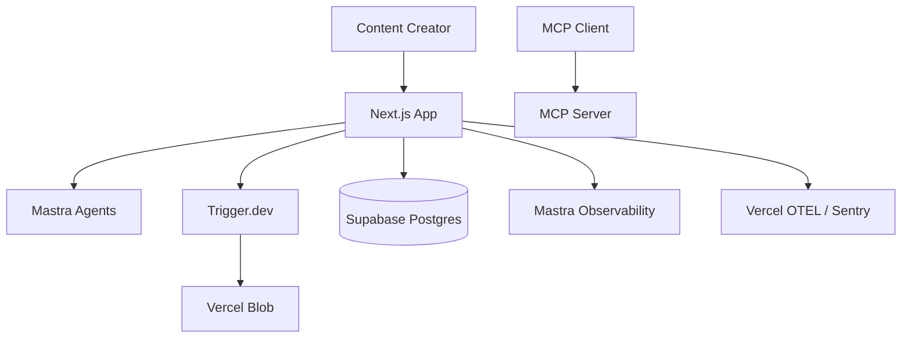
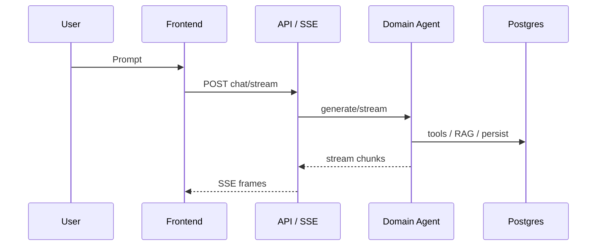

# System Architecture

> World Building Kit — multi-agent creative production platform.  
> **Companion:** [MODULES.md](./MODULES.md) · [STORYTELLER.md](./STORYTELLER.md) · [DEVELOPMENT.md](./DEVELOPMENT.md) · root [AGENTS.md](../AGENTS.md)

## Overview

1. **Presentation** — Next.js 16 (App Router, RSC)
2. **Application** — API routes, Server Actions, SSE streams
3. **Domain** — Mastra v1 agents / tools / workflows under `src/domains/*`
4. **Infrastructure** — Supabase Postgres, Trigger.dev, AI providers, Vercel Blob

### Locked stack

Next.js 16 · Mastra · Radix/CVA · Supabase · TanStack Query · Trigger.dev · Vercel · Drizzle (`src/db`).

## `src/` topology

| Folder | Role |
|--------|------|
| `app/` | Thin routes + API glue only |
| `domains/` | Feature vertical slices (blueprint below) |
| `shared/` | Cross-module — allowlist in `scripts/structure-gates/src-topology.ts` (`admin`, `agent-kernel`, `auth`, `canvas`, `chat`, `data`, `debug`, `errors`, `jobs`, `observability`, `openapi` + legacy `ai`/`three`/`tours`/`types`/`workspace`) |
| `components/` | Design system (PascalCase folders) |
| `db/` | Drizzle schema + `db` client (`DATABASE_URL`) |
| `trigger/` | Task registry |
| `mcp/` | MCP server (separate deployable) |

`src/mastra.ts` — Mastra Studio CLI entry; `src/mastra/agents/` holds file-based instructions. Production instance: `src/shared/agent-kernel/MastraInstance.ts`.  
Evals: top-level `evals/`. Structure tests: `src/__tests__/structure.test.ts`, `src/domains/__tests__/domain-structure.test.ts`.  
Storybook (shared primitives): top-level `stories/` + `.storybook/` — Vite catalog of `src/components/`, not App Router.

### Dependency rule

```
app  → domains/<m>/index.ts → module internals
domains/<m> → shared/*, components, db   (never another domain)
shared/* → shared/*, db                  (never domains)
core/ (pure) → no React, no db, no fetch
```

## Module blueprint

Every `src/domains/<module>/`:

```
index.ts          # ONLY public import target
ui/               # React (PascalCase components)
state/            # Zustand UI + TanStack queries/mutations
core/             # pure types/logic; core/io/ = typed fetchers + DTOs
services/         # server-only Drizzle / external APIs
ai/               # server-only Mastra (agents under ai/agents/)
tasks/            # Trigger.dev schemaTask
```

**Rules**

- Server state → **TanStack Query**; Zustand → ephemeral UI only.
- Browser never writes with privileged Supabase credentials — API → `requireAuth()` → Drizzle.
- Long work (>~1s) → Trigger.dev + Realtime / poll; no bespoke `window` events.
- Asset modules lean on `tasks/`; AI modules use `ai/` + prompts.
- AI layer naming: domain folder is `ai/` (not `agents/`); packages live in `ai/agents/`.

Conformance: domain-structure tests + ESLint (`.cursor/rules/eslint-boundaries.mdc`, `domain-structure.mdc`).

## TypeScript & ESLint (strict)

- `strict: true`; `@typescript-eslint/no-explicit-any` **error**
- Type assertions banned (`assertionStyle: 'never'`, `as const` only)
- Cross-domain imports forbidden — lift to `@/shared`
- Protocol strings → TypeScript `enum`
- Shared deep merge: `@/shared/data/deep-merge`; URLs: `@/shared/data/url-builder`

## System context



## Data flow (typical agent turn)



## Third-party services

| Category | Service | Role |
|----------|---------|------|
| Hosting | Vercel | App + Blob |
| Jobs | Trigger.dev | Image / 3D / long work |
| DB / Auth | Supabase | Postgres + pgvector + Auth |
| LLM gateway | OpenRouter (primary) | Agents / scorers |
| Embeddings | OpenRouter | RAG (`/embeddings`; optional Cohere rerank) |
| Images | Gemini / Grok / Stability / LegNext | Tiles & media |
| 3D | Meshy / Hyper3D / … | Asset exporter tasks |
| Music links | YouTube public search (`youtube-search-api`, unauthenticated scrape) | Resolves soundtrack video ids from title/artist — a model cannot recall a video id, so it is never trusted to supply one |
| Observability | Mastra store + Sentry/OTel | AI spans vs HTTP |

## Access control

Two tiers. Supabase Auth + RLS decides *whether you are signed in and which rows you own*; an admin allowlist decides *who may change platform-wide settings*.

`NEXT_PUBLIC_CENTRAL_USERS` is a comma-separated list of admin emails (falls back to `ADMIN_USER_EMAIL` in `shared/auth/constants/admin-users`). `isAdminUser(email)` normalises case and whitespace, then membership-tests it.

| Surface | Gate |
|---|---|
| `/admin` route group | `app/(workspace)/admin/layout.tsx` redirects non-admins |
| `GET/PUT /api/admin/model-settings` (+ `/probe`) | `isAdminUser` before any write |
| `/api/admin/modules`, `/api/admin/tests` | `isAdminUser` |
| World Bible lock, onboarding bypass | `shared/auth/bible-permissions` |
| Background job runs (read + cancel) | `shared/jobs/owned-run` — see below |

### API authentication

Two layers, deliberately unequal.

**The edge proxy default-denies `/api/**`.** `src/proxy.ts` (Next 16's middleware) calls `denyAnonymousApiRequest`, which rejects any `/api` request carrying no Supabase session cookie. It is a coarse filter, not the authorization decision — it cannot do a database lookup — so it removes only the class where a route forgot to ask at all. Behind it, every handler still authenticates, and ownership checks still decide what a caller may touch.

`MIDDLEWARE_DENY_MODE` selects `report` (log and allow) or `enforce` (401). Report exists so the deny list can be observed against real traffic before it bites; anything appearing in the log is either a missing allowlist entry or a real vulnerability.

**`PUBLIC_API_PATHS`** (`shared/auth/constants/public-api-paths`) is the one allowlist in the system, because it *is* the security decision rather than a way to avoid one. Every entry states why it is public. Adding one is a security review.

**Using the session.** A handler that binds the authenticated session and never reads it is an error (`local/no-discarded-auth-context`): in an API route that usually means it proved *someone* is signed in, then acted on a caller-supplied id without checking *who*. Routes that genuinely need only session existence say so on the first line of the handler — `// auth-scope: session-existence-only — <reason>` — an explicit statement rather than a path exemption.

**Reads through Drizzle are not protected.** RLS applies only on the request-scoped Supabase-client path. Anything reaching the database through Drizzle must verify ownership itself, and services that take a `projectId` take the caller's `userId` alongside it.

**Status codes.** `401` no session · `404` authenticated but not the owner — **never `403`**, which confirms the resource exists · `400` schema failure.

Machine-checked by `src/app/api/__tests__/route-auth-conformance.test.ts`, which enumerates the real route tree and asserts every handler — including its `_lib/` helpers — reaches an auth idiom, with `PUBLIC_API_PATHS` as the only exclusion. It also asserts every allowlist entry still maps to a live route, so the two cannot drift.

**Edge runtime.** `proxy.ts` and anything it imports run on the Edge. A `no-restricted-imports` block keeps `@/db`, drizzle, Node builtins and provider/job SDKs out of that bundle, with a fixture under `scripts/gate-fixtures/` that must fail.

### Background job runs

A Trigger.dev run id is **not** a capability token: it is handed to the client on trigger and echoed in URLs and logs. Reading or cancelling a run therefore has to prove the caller owns the project the run belongs to, or any signed-in user can read any tenant's generation output.

- **One owner module.** `shared/jobs/owned-run.ts` is the only legal caller of `runs.retrieve` / `runs.cancel` / `runs.subscribeToRun`. Use `retrieveOwnedRun(runId, userId)` and `cancelOwnedRun(runId, userId)`.
- **Ownership travels on a run tag.** `triggerOwnedRun` stamps `project:<uuid>`, derived from the payload's `projectId`. Task-written *metadata* is not a reliable source — most tasks never set one. A run that cannot be tagged is refused rather than created unreadable.
- **404, never 403.** A 403 confirms that someone else's run id exists.
- **No user?** `retrieveSystemRun(runId, SystemRunReason)` — a named, countable reason, not a path exemption.

Machine-checked by `local/trigger-runs-ownership` (`npm run lint`), which ships a deliberately-invalid fixture under `scripts/gate-fixtures/` that must fail; `scripts/__tests__/gate-fixtures.test.ts` asserts it still does, so the rule cannot be silently disabled.

The `NEXT_PUBLIC_` prefix inlines the list into the client bundle so the UI can hide admin affordances. It is **not** a security boundary — treat it as public and keep every real check server-side, as the routes above do. Anything genuinely secret stays in RLS policies or server-only env. The `anon` role has no table grants in `public`, so the public API key cannot enumerate relations via PostgREST or GraphQL; signed-in browser clients use `authenticated`, and server jobs use `service_role`. `pg_graphql` is not installed.

## Core patterns

1. **RAG** — hybrid search + rerank; cite sources.
2. **Async workers** — Frontend → API → Trigger → persist → poll/subscribe.
3. **One Mastra instance / one Postgres store** — see AGENTS.md.
4. **Quality gates** — `qualitygate:*`, metrics 400/800 lines, complexity 15/25 — [DEVELOPMENT.md](./DEVELOPMENT.md).

## Mastra Studio

```bash
npm run mastra:dev    # :4111
npm run mastra:build
npm run mastra:smoke  # handover when Mastra paths change
```

| Concern | Location |
|---------|----------|
| Studio entry | `src/mastra.ts` |
| File-based agents | `src/mastra/agents/<id>/` |
| Runtime registry | `src/shared/agent-kernel/mastra/runtime-registry.ts` |
| Domain agents | `src/domains/*/ai/` |

## Agent local workspace (`.local/`)

| Path | Use |
|------|-----|
| `.local/sessions/…` | Multi-request tracking |
| `.local/tmp/…` | Throwaway recon |
| `.local/quality-backlog.md` | Cached gate failures |

Templates: `.agents/templates/session/`.
