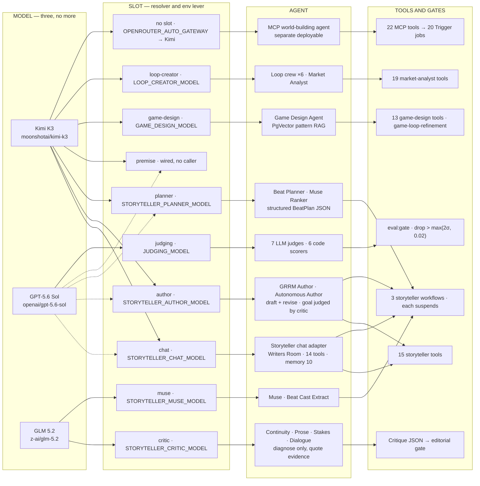

# Agents, models, tools, scores — the whole wiring

Three models and no more. Kimi writes by default, Sol is the only thing the writer can switch to and the only thing that judges, GLM does the cheap structured work nobody sees. Everything below routes through one OpenRouter key (`OPENROUTER_API_KEY`).

| | |
|---|---|
| Text models | 3 |
| Registered production agents | 16 |
| Production tools | 69 |
| Workflows (each human-gated) | 4 |
| Gate scorers | 13 |
| Background jobs | 20 |

Prices are the committed table in `src/shared/ai/gateway/constants/pricing.ts`, USD per million input / output tokens. An unpriced model throws rather than recording as free.

| Model | OpenRouter id | Job | In / out |
|---|---|---|---|
| Kimi K3 | `moonshotai/kimi-k3` | Prose, voice and story structure — the default everywhere | 2.55 / 12.75 |
| GPT-5.6 Sol | `openai/gpt-5.6-sol` | The writer's alternative in the chat picker, and the eval judge | 2.00 / 10.00 |
| GLM 5.2 | `z-ai/glm-5.2` | Cheap tier — diagnose-only critics, brainstorm, ghost text, labels | 1.40 / 4.40 |

A slot with no pin lands on Kimi: `OPENROUTER_AUTO_GATEWAY` is `openrouter/moonshotai/kimi-k3`. Anthropic ids remap to Kimi via `enforceTextGenModelPolicy`. Lanes, temperature, token caps: `src/domains/storyteller/config/constants/agent-model-matrix.ts`. Operator env pins and OpenRouter account controls: [DEVELOPMENT.md](./DEVELOPMENT.md) § Model routing.

## Which model each agent lands on

Read left to right: **model → slot → agent → tools / gates**. Solid arrows are the hardcoded default. Dashed Sol arrows fire only if the writer picks Sol in the chat picker.

The picker band is chat, author, planner, and premise. Critic and muse sit outside it on purpose. The autonomous author is the one agent using two lanes at once: it drafts on the author slot and its goal is judged by the critic slot, so a long loop cannot bill judgement at writing prices. `beat-cast-extract` reads `TEXT_GEN_FAST_MODEL` (GLM) directly and does not go through a slot.

## What wins when two things want to pick the model

writer's chat picker → admin panel slot → env var → matrix lane.

| Step | Who it covers |
|---|---|
| Writer's chat picker | chat, author, planner, premise |
| Admin panel slot | every named slot |
| Env var | operator rollback lever (`STORYTELLER_*_MODEL`, `GAME_DESIGN_MODEL`, …) |
| Matrix lane | the committed default in `agent-model-matrix.ts` |

`resolveConfiguredModelId` (`src/shared/ai/gateway/model-registry.ts`) reads that chain at call time, not module load. The picker rides `writerModel` on the gateway call context (`src/shared/ai/gateway/call-context.ts`), so it reaches author and planner inside a workflow without threading a request through every step. `WRITER_CHOICE_ROLES` in the storyteller model config decides who reads it: critic and muse ignore it, because a writer switching prose models must not move the checker underneath the check.

`GET /api/settings/models` prints the resolved role→model table with provenance. Resolvers: `domains/storyteller/config/constants/model-config.ts`, `domains/game-design/config/model-config.ts`, `domains/loop-creator/config/model-config.ts`.

## Agents

23 agent instances. Only the 16 marked runtime are registered on the production Mastra instance; Studio stubs are overwritten by the real ones the moment a domain module loads.

| Agent | Slot → model | Tools | Registered | Notes |
|---|---|---|---|---|
| storyteller (chat adapter) | chat → Kimi / Sol | 14 | runtime + Studio | memory 10 msgs; AgentController plan gate behind `FF_STORYTELLER_CONTROLLER` |
| storyteller (per request) | chat → Kimi / Sol | 15 | built per request | the default HTTP chat path; same id as the registered one |
| grrm-author | author → Kimi / Sol | — | runtime + Studio | drafts and revises beat scripts |
| storyteller-autonomous-author | author → Kimi / Sol | 5 | runtime (durable) | goal judged by the critic slot (GLM); `maxRuns` from env; `FF_STORYTELLER_AUTONOMOUS` |
| beat-planner | planner → Kimi / Sol | — | runtime + Studio | structured BeatPlan JSON, no prose |
| muse-ranker | planner → Kimi / Sol | — | direct call only | keeps or rejects muse ideas |
| muse | muse → GLM | — | direct call only | blank-context wildcard brainstorm |
| continuity-critic | critic → GLM | — | runtime + Studio | canon, timeline and knowledge violations |
| prose-critic | critic → GLM | — | runtime + Studio | clichés, stated emotion, POV breaks |
| stakes-critic | critic → GLM | — | runtime + Studio | costless beats, slack tension |
| dialogue-critic | critic → GLM | — | runtime + Studio | talking heads, disembodied dialogue |
| beat-cast-extract | `TEXT_GEN_FAST_MODEL` → GLM | — | direct call only | reads the constant directly, bypassing the slot chain |
| game-design-agent | game-design → Kimi | 13 | runtime + Studio | own PgVector pattern RAG index (documented exception) |
| loop-creator-supervisor | loop-creator → Kimi | — | runtime | routes and synthesises the crew |
| loop-creator-loop-planner | loop-creator → Kimi | — | runtime | core, meta and social loops |
| loop-creator-mechanics-designer | loop-creator → Kimi | — | runtime | mechanics definition |
| loop-creator-balance-analyst | loop-creator → Kimi | — | runtime | effort versus reward |
| loop-creator-progression-architect | loop-creator → Kimi | — | runtime | pacing and progression |
| loop-creator-concept-evaluator | loop-creator → Kimi | — | runtime | concept alignment scoring |
| market-analyst | loop-creator → Kimi | 19 | runtime | ReAct market research loop |
| world-building-agent (MCP) | no slot → Kimi | 22 | MCP deployable | separate process; not on the production Mastra instance |
| world-building-agent (Studio stub) | no slot → Kimi | 40 stubs | Studio only | same id as the MCP agent; stub tools return `{ studio: true }` |
| provider-probe | per-request model id | — | API route | connectivity check for the settings panel |

## Tools

69 production tools in four bundles. Plus 53 Mastra Studio stubs (40 storyteller, 13 game-design) that exist only so Studio can render an agent without touching the database — they return `{ studio: true }` and nothing else.

### Storyteller — 15 tools

`src/domains/storyteller/ai/tools` — the chat adapter gets 14 (`manage_beat` swapped for the approval variant).

| Tool id | What it does |
|---|---|
| `manage_beat` | create / update / delete / get a beat |
| `manage_beat` (approval) | same id; delete needs user approval |
| `list_beats` | beats for an episode or project |
| `manage_character` | CRUD one character |
| `list_characters` | characters in the project |
| `manage_episode` | CRUD one episode |
| `list_episodes` | episodes in the project |
| `update_world_bible` | write a world-bible section |
| `read_world_bible` | read world-bible content |
| `check_continuity` | validate story consistency |
| `check_section_alignment` | one section against related canon |
| `search_manuscript` | literal and embedding search |
| `promote_rule` | promote or revoke a versioned world rule |
| `propose_character_fields` | propose unsaved form fields |
| `run_beat_draft_workflow` | start the beat-draft workflow |

### Game design — 13 tools

`src/domains/game-design/ai/tools/v2` — four call an LLM, the rest are reads or pure checks.

| Tool id | What it does |
|---|---|
| `get_game_loops` | all loops for the project |
| `get_game_loop_by_id` | one loop with nodes and edges |
| `get_market_analysis` | market analysis for a loop |
| `identify_core_loop` | LLM: name the core gameplay loop |
| `analyze_mechanic_balance` | LLM: balance of one mechanic |
| `suggest_progression` | LLM: progression expansion |
| `validate_loop_structure` | deterministic loop-graph check |
| `design_atomic_systems` | Klei-style atomic systems |
| `design_implicit_tutorial` | Klei-style silent teaching |
| `design_world_memory` | CDPR-style world memory |
| `design_moral_choices` | CDPR-style grey palette |
| `design_strand_connections` | Kojima-style async links |
| `design_meaningful_mundane` | Kojima-style mundane ritual |

### Market analyst — 19 tools

`src/domains/loop-creator/ai/agents/market-analyst` — four archetype scorers are pure code, not eval scorers.

| Tool id | What it does |
|---|---|
| `web_search` | industry trends and data |
| `steam_charts` | player stats for comparables |
| `steam_trending` | what is trending on Steam now |
| `twitter_gaming_trends` | real-time X gaming chatter |
| `reddit_gaming_pulse` | Reddit sentiment and posts |
| `market_momentum_analysis` | aggregate of the three signals |
| `game_database` | reference game metadata |
| `pattern_matcher` | design against known patterns |
| `competitor_finder` | find and analyse competitors |
| `metrics_planner` | KPIs and benchmarks |
| `audience_analyzer` | psychographic audience fit |
| `trend_analyzer` | genre and mechanic openings |
| `market_size_estimator` | TAM and SAM estimate |
| `best_match_archetype_scorer` | strongest of the three archetypes |
| `disco_elysium_scorer` | narrative RPG fit |
| `vampire_survivors_scorer` | action roguelike fit |
| `counter_strike_scorer` | competitive shooter fit |
| `generate_report` | compile the final report |

### MCP — 22 tools

`src/mcp/domains` — entities 5, storyteller 9, generation 5, trigger 3; separate deployable. Integrator reference: [MCP_API.md](./MCP_API.md).

| Tool ids | What they do |
|---|---|
| `list_entities` · `get_entity` · `create_entity` · `update_entity` · `delete_entity` | cross-domain entities |
| `list_characters` · `get_character` · `create_character` · `update_character` · `delete_character` | storyteller characters |
| `list_episodes` · `list_beats` · `get_series_bible` | storyteller reads |
| `storyteller_chat` | send a message into Writers Room chat |
| `generate_tile` · `upscale_tile` | triggers the 2D canvas jobs |
| `generate_3d_model` · `remesh_3d_model` | triggers the Meshy jobs |
| `generate_portrait` | triggers the portrait job |
| `get_run_status` · `cancel_run` · `wait_for_run` | Trigger.dev run control |

## Workflows

Four workflows, four human gates. Every workflow suspends at exactly one step and waits in Postgres for a person. That gate is a Mastra `suspendSchema`, not a controller mode and not a goal — one gate, one owner.

| Kind | Meaning |
|---|---|
| agent | Mastra agent generate |
| code | deterministic check, no LLM (or a tool that is a check) |
| human | `suspendSchema` — approve / revise / kill |
| persist | write to Postgres |

### `beat-draft-workflow`

Storyteller · started by `run_beat_draft_workflow`.

`plan-beat` (Beat Planner, optional Muse) → `draft-script` (GRRM Author) → `prose-check` (sync check, optional redraft) → `critique` (3–4 critics in parallel) → **`editorial-verdict`** (approve / revise / kill) → `revise` (GRRM Author → `manage_beat`)

### `artifact-draft-workflow`

Storyteller · bible, character and episode artifacts.

`assemble` (canon from Postgres) → `deterministic-check` (world-rule continuity) → `critique` (continuity and/or stakes) → **`artifact-verdict`** (accept / reject) → `persist` (bible / character / episode tools)

### `fix-inconsistencies`

Storyteller · cascading canon repair.

`assemble-canon` → `structural-scan` (setup / payoff, no LLM) → `agentic-scan` (continuity critic per job) → `propose-fixes` (GRRM Author) → **`editorial-verdict`** (apply / discard) → `apply-fixes` (cascading writes)

### `game-loop-refinement`

Game-design.

`ideation` (Game Design Agent) → `balance_check` (`analyze_mechanic_balance`) → `structure_validation` (`validate_loop_structure`) → **`human_review`** (approve / modify) → `refinement` (Game Design Agent) → `finalization` (insert into `gameLoops`)

## Scores

13 scorers decide whether a change ships. Seven are LLM judges on Sol, six are pure code. The judge family must differ from the author family, which is why Sol judges Kimi. Judge calls deliberately skip the metered gateway so eval spend never lands in `llm_calls` ([DECISIONS.md](./DECISIONS.md) ADR 0003). Gate mechanics: [DEVELOPMENT.md](./DEVELOPMENT.md) § The eval gate.

| Scorer | Kind | What it measures | Golden rows |
|---|---|---|---|
| `magic` | LLM judge · Sol | originality and anti-slop | 3 |
| `consistency` | code | alive versus dead fact contradictions | 3 |
| `hallucination` | LLM judge · Sol | grounding against canon | 3 |
| `persona-fidelity` | LLM judge · Sol | match to the requested persona | 3 |
| `prose-craft` | LLM judge · Sol | clichés, stated emotion, POV breaks | 3 |
| `story-motion` | LLM judge · Sol | state change versus stasis | 3 |
| `stakes-cost` | LLM judge · Sol | beats that actually cost something | 0 |
| `beat-plan-concreteness` | code | valid BeatPlan JSON plus concreteness | 3 |
| `critic-discipline` | code | quotes evidence, never rewrites | 3 |
| `voice-distinctiveness` | code | minimum pairwise speaker divergence | 1 |
| `grrm-plan-rubric` | code | consequence, withheld truth, sensory density | 0 |
| `idea-uniqueness` | code | uniqueness inside an idea set | 4 |
| `idea-diversity-judge` | LLM judge · Sol | LLM view of idea spread | 4 |

Four scorers are wired but not really measured: `stakes-cost` and `grrm-plan-rubric` run in the gate with zero golden rows scoped to them. `voice-distinctiveness` never fires because the dataset tags it `voice_distinctiveness` with an underscore. And the `premise` model slot has an env var and a matrix lane but no agent calls it.

### Nine structural scorers — Studio only

Registered on the Mastra instance for Trace Evaluate, but outside `eval:gate` because they need dumped-beat fixtures the storyteller golden set does not carry.

| Scorer | What it measures |
|---|---|
| `causal_graph_integrity` | beats with real causal dependencies |
| `plan_coverage_evenness` | even mapping onto the 10-point plan |
| `setup_payoff_distance` | entities introduced too late |
| `canon_violation` | unknown lexicon entities per 1k tokens |
| `character_field_adherence` | wants / fears / wontBreak contradictions |
| `schema_validity` | beat row parse rate |
| `slop_rate` | negative-corpus phrase hits per 1k tokens |
| `self_repetition` | distinct-3 inside one set |
| `voice-distinctiveness` | also the one structural scorer in the gate |

### How the gate decides

| Rule | Value |
|---|---|
| Regression threshold | drop worse than `max(2σ, 0.02)` against the dated baseline |
| σ source | committed per judge model in `evals/constants/thresholds.ts` |
| Unknown judge model | throws — the gate fails closed rather than guessing σ |
| Judge cost ceiling | 1.1× the baseline run |
| Quality up but cost doubled | still fails at 2× baseline cost |
| Baseline | `evals/baselines/storyteller.2026-08-28.json` |
| Pre-commit freshness | hashes eval sources; it never runs the evals |
| Live scorers on HTTP chat | none — `CHAT_HTTP_SCORERS` is empty by design |

## Jobs

20 background jobs behind the agents. Every one is defined by `defineOwnedTask`, so a payload schema, a queue and a client-minted submission nonce are compile-time requirements. Queues name a provider quota pool, never a task, and the idempotency key is `taskId:requestId` — re-rolling the same prompt buys a new image rather than replaying the old one. Adding a task: [DEVELOPMENT.md](./DEVELOPMENT.md) § Adding a background task.

| Task id | Queue (quota pool) | Owner |
|---|---|---|
| `generate-tile` | ImageProvider | 2d-canvas |
| `upscale-tile` | ImageProvider | 2d-canvas |
| `repaint-tile` | ImageProvider | 2d-canvas |
| `enhance-fidelity` | Apiframe | 2d-canvas |
| `segment-object` | Fal | 2d-canvas |
| `select-mj-variant` | Storage | 2d-canvas |
| `generate-3d-model` | Meshy | 3d-asset-exporter |
| `text-to-3d` | Meshy | 3d-asset-exporter |
| `remesh-3d-model` | Meshy | 3d-asset-exporter |
| `retexture-model` | Meshy | 3d-asset-exporter |
| `surface-material` | Meshy | 3d-asset-exporter |
| `generate-portrait` | Apiframe | storyteller |
| `select-portrait-variant` | Storage | storyteller |
| `generate-poster` | Apiframe | storyteller |
| `generate-episode-poster` | Apiframe | storyteller |
| `generate-storyboard` | ImageProvider | storyteller |
| `generate-combined-storyboard` | Apiframe | storyteller |
| `generate-moodboard` | ImageProvider | storyteller |
| `upload-asset` | Storage | storyteller |
| `prune-mastra-memory` | Storage | platform |
