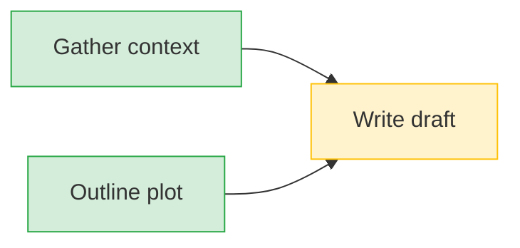

# Visualization & Evaluation

> Tools for understanding and measuring agent behavior.

## Dependency Graph

Generates visual representations of plan task dependencies.

### Formats

| Format | Use Case |
|--------|----------|
| Mermaid | Embed in markdown, render in docs |
| ASCII | Terminal output, logs |
| JSON | Custom visualization, D3.js |

### Usage

```typescript
import { DependencyGraph } from './visualization/dependency-graph'

const graph = DependencyGraph.fromPlan(plan)

// Mermaid flowchart
console.log(graph.toMermaid())

// ASCII art
console.log(graph.toAscii())

// Critical path
const path = graph.getCriticalPath()
console.log('Longest chain:', path.join(' → '))
```

### Example Mermaid Output



---

## Planning Drift Benchmark

Measures how much a plan changes over agent iterations.

### Metrics

| Metric | Description |
|--------|-------------|
| `tasksAdded` | Total new tasks across iterations |
| `tasksRemoved` | Total deleted tasks |
| `tasksModified` | Changed title, status, or dependencies |
| `goalChanges` | Number of times goal was rewritten |
| `driftScore` | 0-1 normalized instability score |
| `stability` | "stable" / "moderate" / "unstable" |

### Usage

```typescript
import { PlanningDriftBenchmark } from './evaluation/planning-drift'

const benchmark = new PlanningDriftBenchmark()

// Take snapshots during agent execution
benchmark.snapshot(plan)  // After iteration 1
benchmark.snapshot(plan)  // After iteration 2
benchmark.snapshot(plan)  // After iteration 3

// Get metrics
console.log(benchmark.generateReport())
```

### Sample Report

```
=== Planning Drift Report ===
Iterations: 5
Tasks Added: 3
Tasks Removed: 1
Tasks Modified: 2
Goal Changes: 0
Drift Score: 15.2%
Stability: STABLE
=============================
```

### Context Comparison

Compare drift between different domains:

```typescript
const storyBench = new PlanningDriftBenchmark()
const gameBench = new PlanningDriftBenchmark()

// ... run agents ...

const comparison = PlanningDriftBenchmark.compareContexts(storyBench, gameBench)
console.log(comparison.analysis)
// Story context drift: 12.5% (stable)
// Game context drift: 28.3% (moderate)
// Winner: story (lower drift)
```
