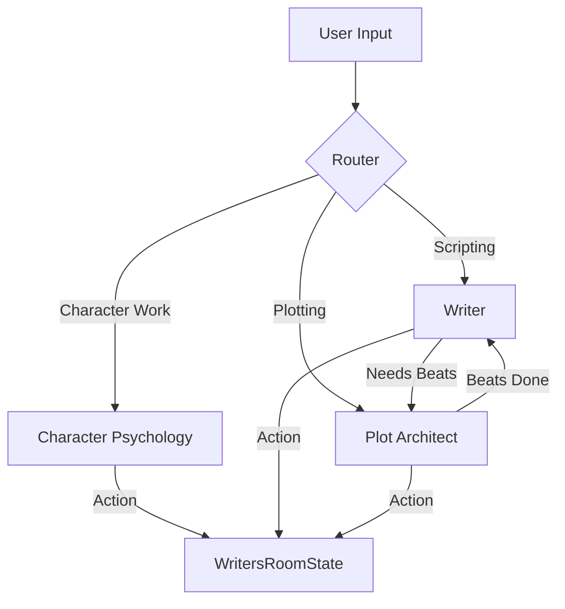

# Storyteller Module Documentation

## 1. Overview

The Storyteller module is the core narrative engine of the application. It acts as a "Virtual Writers Room," simulating the collaborative process of a TV production team. It uses a **Multi-Agent System (MAS)** built on LangGraph/LangChain.

## 2. Architecture: Writers Room V2 (Handoffs + Skills)

The module uses the **Handoffs + Skills** pattern to improve agent orchestration, moving away from a purely Supervisor-based model to a more efficient graph where agents can hand off tasks to specialists.

### Key Features
*   **Router**: Classifies user intent and routes to the appropriate specialist (e.g., Character Psychology vs. Writer).
*   **Handoffs**: Agents can explicitly hand off control (e.g., Writer -> Plot Architect if beats are missing).
*   **Skills On-Demand**: Agents load specific "skill" prompt modules (e.g., `dialogue-craft`, `script-format`) only when needed to save tokens.

### Agent Structure
Agents are located in `src/domains/storyteller/agents/v2/`.
*   **Character Psychology**: Manages character creation, metrics, and relationships.
*   **Writer**: Handles scene writing and screenplay formatting.
*   **Plot Architect**: Structures beats and story arcs.
*   **Premise Architect**: Develops the world bible and series concepts.

## 3. Writers Room State

The entire session state is managed in `WritersRoomState` (`src/domains/storyteller/types.ts`), serving as the single source of truth.

### Workflow Phases
The module enforces a workflow to ensure narrative coherence:
1.  **BRAINSTORMING**: Initial concept generation.
2.  **PLANNING**: Creating the beat board and breaking the story.
3.  **WRITING**: Transforming beats into screenplay scenes.
4.  **REVIEW**: Final polish and specific agent feedback (Devil's Advocate).

## 4. Context Assembly

Agents receive optimized prompts generated by `context/assembler.ts`, including:
*   **Showrunner Context**: Phase progress and tasks.
*   **RAG Integration**: Retrieval of relevant history/facts via `rag-service.ts` to prevent hallucinations.

## 5. UI Components

*   **World Bible Panel**: Manages world rules, factions, and characters.
*   **Workflow Canvas**: Visualizes the narrative flow and beat board.
*   **Bible Locking**: "Central Users" can lock the bible to prevent AI changes during sensitive phases.

## 6. Services Ecosystem

*   **RAG Service**: Vector search for narrative consistency.
*   **Generative Media**: Trigger.dev tasks for moodboards, portraits, and posters.
*   **Script Operations**: Intelligent editing features (`expandScene`, `improveDialogue`).
*   **Feedback & Tracing**: Captures user corrections and logs decision audits to LangSmith.
