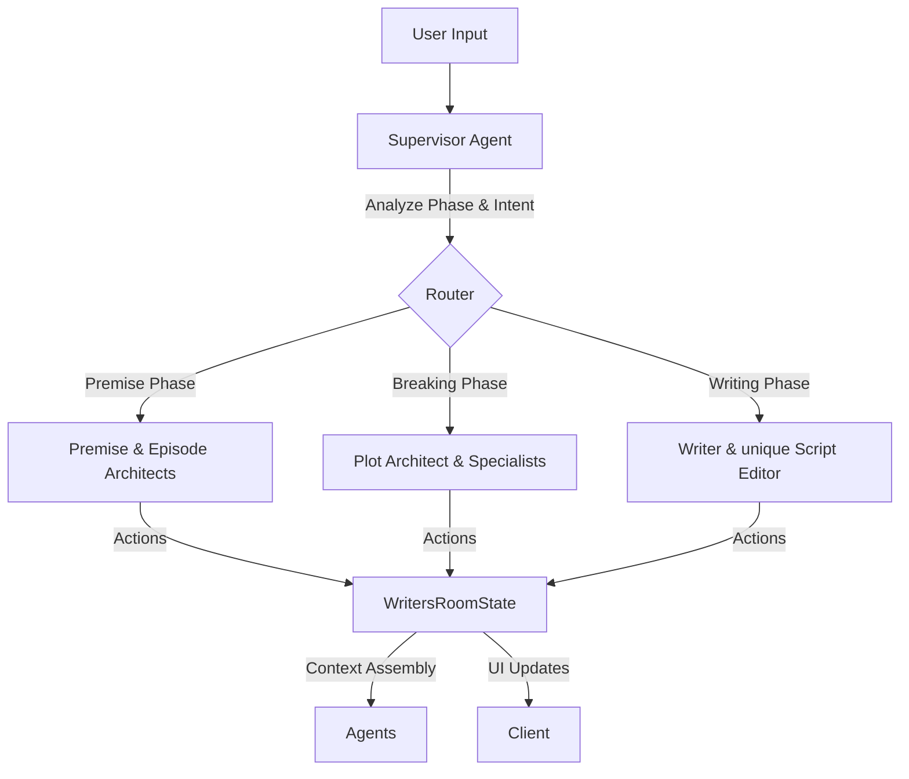

# Storyteller Module Documentation

## 1. Overview

The Storyteller module is the core narrative engine of the application. It acts as a "Virtual Writers Room," simulating the collaborative process of a TV production team. It uses a **Supervisor-Worker** multi-agent architecture (MAS) built on LangGraph/LangChain to simulate a "Writer's Room" environment, handling plot generation, character psychology tracking, and script-level editing.

## 2. Architecture

### Core Data Flow

The module uses a sophisticated agentic workflow where a central orchestrator delegates tasks based on the production phase.

### The Agent System

- **Supervisor (`supervisor.ts`)**: The central entry point. It evaluates the current phase, checks transition conditions, and enforces a **forced delegation** loop to ensure specialist agents are used.
- **Premise Architect**: Generates and refines world bibles, factions, and rules.
- **Episode Premise Architect**: Structures specific episode concepts (Hook, Turn, Aftermath).
- **Plot Architect**: Proposes beats using the **Mazur Elements** framework (Setup, Complication, Revelation, Decision, Consequence).
- **Character Psychology**: Tracks character metrics (`valence`, `arousal`, `autonomy`) and strictly validates if actions align with established profiles.
- **Devil's Advocate**: Adversarial agent that challenges narrative decisions to avoid clichés and logical gaps.
- **Consequence Tracker**: Maintains the causal graph of setups and payoffs (Chekhov’s Gun enforcement).
- **Writer**: Converges narrative beats into final screenplay content/scenes.

## 3. Writers Room State

The entire session state is managed in `WritersRoomState` (`src/domains/storyteller/graph/state.ts`), serving as the "Blackboard" or single source of truth.

### Key State Elements:

- **Project Context**: `projectId`, `episodeId`.
- **Phase Management**: Tracks the current workflow stage (`premise`, `breaking`, `cardlock`, `writing`, `complete`).
- **Series Bible**: The source of truth for world rules, factions, and tone.
- **Beat Board**: A dynamic list of `BeatCard` objects representing the episode's structure.
- **Character State**: Real-time psychological tracking and arc progression.
- **Task Queue**: Active objectives currently being processed.

## 4. Workflow Phases

The module enforces a strict unidirectional workflow to ensure narrative coherence:

1.  **PREMISE**: Establish the "Series Bible" (World Rules, Factions, Key Characters) and the "Episode Premise" (Logline, Theme).
    - _Exit Condition_: World description, factions, and characters must be defined.
2.  **BREAKING**: Create the "Beat Board". Agents propose, challenge, and refine beats.
    - _Exit Condition_: At least 3 approved beats.
3.  **CARDLOCK**: Finalize the beat board. No new beats can be added; existing ones are polished and locked.
    - _Exit Condition_: All approved beats must be locked.
4.  **WRITING**: Transform locked beats into screenplay scenes.
    - _Exit Condition_: Script content > 100 chars and approved by editor.
5.  **COMPLETE**: Final review and export.

## 5. Context Assembly

Agents do not receive the raw state. Instead, `context/assembler.ts` generates optimized prompts for each role:

- **Showrunner Context**: High-level vision, phase progress, pending tasks.
- **Plot Architect Context**: Writing laws, beat board summary, unresolved setups.
- **Character Psychology Context**: Deep character metrics (`belief`, `flaw`, `lie`), recent emotional state.
- **RAG Integration**: The system retrieves relevant history, past decisions, and user preferences to inject into the agent context via `assembleContextWithRag`.

## 6. Action System

Changes to the state are committed through an **Action-Reducer** system using Zod schemas (`src/domains/storyteller/schemas/agent-schemas.ts`).

- **Agents output strictly typed JSON Actions** (e.g., `UPDATE_SERIES_BIBLE`, `CREATE_BEAT`).
- **Executor**: Handles history (undo/redo), consistency checks, and approval.
- **Reducer**: Merges valid actions into the central state.

## 7. UI Components

### World Bible Panel

A comprehensive interface for managing world-building data. It is decoupled using `BibleContext` and `useBible` to avoid prop-drilling:

- `BibleOverview`: Visual moodboard and logline.
- `BibleFactions`: Political and social power structures.
- `BibleCharacters`: Casting and character relationship tracking.

#### Bible Locking Mechanism

To preserve the creative "source of truth," the World Bible can be locked:

- **Rule**: When locked, all manual edits and AI-driven updates are disabled for non-admin users.
- **Permissions**: Only authorized "Central Users" (admins) can toggle the lock status.
- **Agent Integration**: AI agents are instructed to respect the lock and redirect focus to episode development.
- **State Constraint**: The `BibleContext` enforces a `isReadOnly` flag derived from lock status.

### Workflow Canvas

Visualizes the narrative flow, allowing editors to interact cards and beats generated by the AI agent team.

## 8. Services Ecosystem

The Storyteller module relies on a suite of specialized services to handle long-running tasks, memory, and media generation.

### 8.1. RAG Service (`rag-service.ts`)

A production-grade retrieval system designed to maintain narrative consistency across long-form content.

- **Embeddings**: Uses **Voyage AI (voyage-3)** for high-fidelity semantic understanding.
- **Hybrid Search**: Combines vector similarity with keyword matching to find specific names/terms while understanding semantic context.
- **Semantic Chunking**: Intelligently splits documents (e.g., character arcs) into meaningful segments rather than arbitrary fixed windows.
- **Citation Tracking**: Every retrieved fact includes a "confidence" score and source citation, preventing hallucinations.

### 8.2. Generative Media Services

Handles the creation of visual assets (Moodboards, Portraits, Posters).

- **Infrastructure**: Built on **Trigger.dev** to handle long-running background jobs without timeout risks.
- **Persistence**: Uses `localStorage` + `useGlobalStatusStore` to track job status. If the user reloads the page, polling resumes automatically.
- **Services**:
  - `MoodboardGenerationService`: detailed world visualization.
  - `PortraitGenerationService`: persistent character visuals.
  - `PosterGenerationService`: cinematic episode posters and storyboards.

### 8.3. Script Operations (`script-operations.ts`)

Provides "Cursor-like" intelligent editing features for the screenplay editor.

- **Functions**: `expandScene`, `condenseScene`, `improveDialogue`, `shiftTone`.
- **Latency**: Uses lazy-loaded models and streamed responses for real-time interactivity.

### 8.4. Feedback & Tracing

- **Feedback Service**: Captures user corrections (thumbs down/fixes), stores them in RAG, and analyzes patterns (e.g., "Frequent hallucinations about faction politics") to improve future agent prompts.
- **Tracing Service**: Wraps agent decisions in telemetry. It logs **Decision Audits**—recording _why_ an agent made a choice, its confidence score, and the duration—enabling deep debugging of the creative logic.
